```python
import pandas as pd
import matplotlib.pyplot as plt
import xarray as xr
import os
import numpy as np
import dask

xr.set_options(display_style='html')

import intake
from xmip.preprocessing import rename_cmip6,promote_empty_dims

import cftime

import scipy.stats as stats
from matplotlib import pyplot     

from scipy.stats import norm
import seaborn as sns
import xesmf as xe

from dask.diagnostics import ProgressBar
from tqdm import tqdm
```

    /Users/shreyatrivedi/miniconda3/lib/python3.7/site-packages/gribapi/__init__.py:25: UserWarning: ecCodes 2.31.0 or higher is recommended. You are running version 2.15.0
      "You are running version {}".format(min_recommended_version_str, __version__)


```python
# supress warnings
import warnings
warnings.filterwarnings('ignore') # don't output warnings

import os
# import packages
import cartopy.feature as cfeature
import cartopy.crs as ccrs
import xesmf as xe
from xarrayutils.utils import linear_trend
import matplotlib.path as mpath
import metpy.calc as mpcalc
%matplotlib inline

from mpl_toolkits.basemap import Basemap
```

### Using FFT to come up with three points where ZW3 is strongest:

### ZW3 Index Calculation function:

1. First selecting the 3 lon-lat coordinates for ZW3 Index location. (Based on literature)
2. I am using the rolling means (running means) over 3 months for the 3 individual points. I first calculated the  rolling means, then a rolling climatological mean and finally standadrd deviation. 
3. Finally calculating the index for every point: (Rolling mean - Rolling Climatological mean)/Standard deviation running over 3 months
4. Finally, the ZW3 Index will be the average of indices over all the three points. 


```python
# GPT_500Hpa = CESM_GPT_500Hpa.sel(lat=slice(-70,-40))
```


```python
# def ZW3_Equation(lon,lat):
#     RM        = GPT_500Hpa.sel(lat=lat,lon=lon,method='nearest').rolling(time=3, center=True).mean()
#     Clim_RM   = RM.groupby('time.month').mean()
#     RSTD      = RM.groupby('time.month').std()
#     ZW3_Index = ((RM.groupby('time.month')-Clim_RM).groupby('time.month'))/RSTD
#     return(RM,Clim_RM,RSTD,ZW3_Index)
```


```python
# ZW3_Index = (ZW3_Equation(67,-54)[3]+ZW3_Equation(187,-54)[3]+ZW3_Equation(307,-54)[3])/3 
```


```python
# from dask.diagnostics import ProgressBar

# delayed_obj = ZW3_Index.to_netcdf('ZW3-Index/zw3_Index_CMIP.NCAR.CESM2.piControl.Amon.gn.nc',compute=False)

# with ProgressBar():
#     results = delayed_obj.compute()
```

## Assessing ZW3 Index and detecting extremes:


```python
path = '/Volumes/SHREYA/Ch3-ZW3_Extreme_Analysis/Extreme_ZW3-II/New_NC_Files/'
```


```python
CESM_GPT500_SH = xr.open_dataset(path+'GPT500_SH_CMIP.NCAR.CESM2.piControl.Amon.gn.nc').zg.load()
```


```python
CESM_SIT = xr.open_mfdataset(path+'piControl/sithick/*.nc',combine = 'nested', concat_dim="time")
CESM_SIC = xr.open_mfdataset(path+'piControl/siconc/*.nc',combine='nested',concat_dim="time")
```


```python
# Cropping the areas for SH: sithick
CESM_SIT_SH = CESM_SIT.where((CESM_SIT.lat<-50)&(CESM_SIT.lat>-90),drop=True).squeeze()
      
# Cropping the areas for SH: siconc
CESM_SIC_SH = CESM_SIC.where((CESM_SIC.lat<-50)&(CESM_SIC.lat>-90),drop=True).squeeze()
```


```python
CESM_SIC_SH_ASO = (CESM_SIC_SH.where(CESM_SIC_SH.time.dt.month.isin([8,9,10]), drop=True)).mean(dim='time')
# CESM_SIC_SH_ASO = (CESM_SIC_SH.where(CESM_SIC_SH.time.dt.month.isin([4,5,6]), drop=True)).mean(dim='time')#.load()
```


```python
zw3 = xr.open_dataset(path+'zw3_Index_CMIP.NCAR.CESM2.piControl.Amon.gn.nc')
New_ZW3 = zw3.where(zw3.time.dt.month.isin([8,9,10]), drop=True) # Selecting only ASO
# New_ZW3 = zw3.where(zw3.time.dt.month.isin([4,5,6]), drop=True) # Selecting only ASO
```

### Checking the relevance of this study:

We would look at the variance being explained by the ZW3 index. We would like it to be atleast >8% (Raphael, 2003). For this we do the following:

1. Correlation between zg500 and ZW3. (Spatial)
2. Square of correlation coefficient gives the R.sq. values which will tell us the variance. 
3. Sice ZW3 is strongest between 40S-70S, we will do a weigted mean over this to get the variance value. 


```python
ZW3_df = pd.DataFrame()
ZW3_df['time'] = New_ZW3["time"]#.dt.strftime("%Y-%m-%d")
ZW3_df['ZW3-Index'] = New_ZW3.zg
```


```python
# plt.ylim(-20,20)
plt.plot(ZW3_df.time,ZW3_df['ZW3-Index'],alpha=0.6,color='blue')
plt.title('CESM2-piControl: ZW3 Index',fontsize=14,fontweight='bold')
plt.ylabel('Amplitude',fontsize=12,fontweight='bold')
plt.xlabel('Years',fontsize=12,fontweight='bold')

plt.axhline(np.percentile(ZW3_df['ZW3-Index'],95),linestyle ="dashed",linewidth=4,color='red')

plt.xticks(fontsize=10)
plt.yticks(fontsize=12)
plt.margins(x=0)

# plt.savefig('ZW3_Index_CESM2_picontrol.pdf')
plt.show()

# New_ZW3
```


    
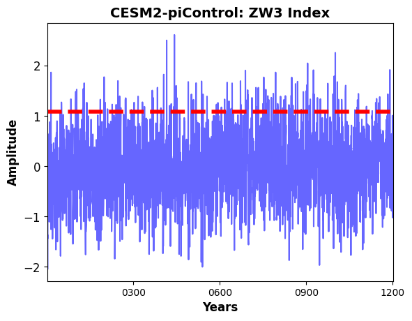
    


```python
# plotting a histogram
fig, ax = plt.subplots(1,1, figsize=(12,8))
sns.histplot(ZW3_df['ZW3-Index'],bins=50,
                  #kde=True,
                  #stat='probability',
#                   log_scale=True,
                  ax = ax,
                  color='darkgreen')

# ax.set(xlabel='Normal Distribution', ylabel='Probability')

plt.axvline(np.percentile(ZW3_df['ZW3-Index'],95),linestyle ="dashed",linewidth=3,color='black')
# plt.axvline(np.percentile(ZW3_df['ZW3-Index'],5),linestyle ="dashed",linewidth=3,color='black')

# plt.savefig('Threshold_Quantiles.png')

plt.show()
```


    
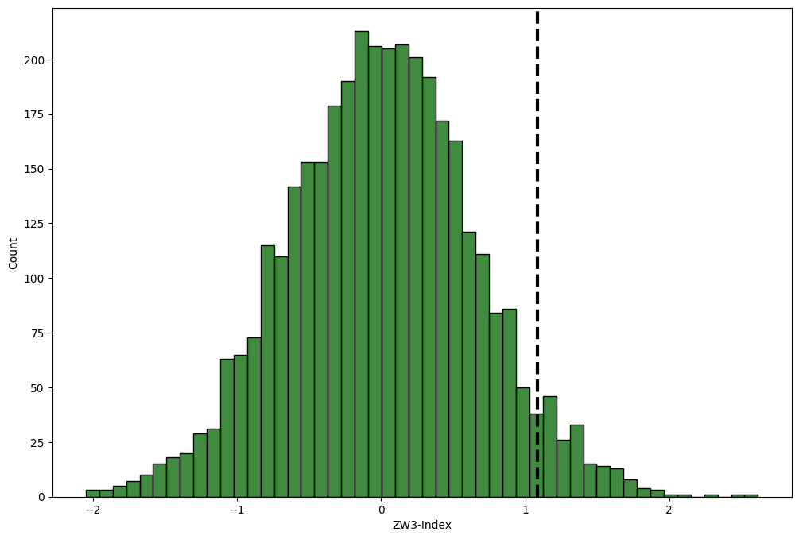
    


### Establishing relations only using the positive zw3 values first; before moving to extreme analyses:


```python
Positives = ZW3_df[(ZW3_df['ZW3-Index']>0)]
Positive_Dates = xr.Dataset.from_dataframe(Positives.set_index('time'))
```


```python
from scipy.stats import linregress
from scipy.stats import ttest_1samp
```


```python
# LExt_CESM_SIT_Anom = LExt_CESM_SIT.groupby('time.month') - CESM_SIT_SH.sithick.groupby('time.month').mean(dim='time')

# LExt_CESM_SIC_Anom = LExt_CESM_SIC.groupby('time.month') - CESM_SIC_SH.siconc.groupby('time.month').mean(dim='time')
# Posi_CESM_SIC_Anom = Posi_CESM_SIC.groupby('time.month') - CESM_SIC_SH.siconc.groupby('time.month').mean(dim='time')

# LExt_CESM_GPT500_Anom = LExt_CESM_GPT500.groupby('time.month') - CESM_GPT500_SH.groupby('time.month').mean(dim='time')
# HExt_CESM_GPT500_Anom = HExt_CESM_GPT500.groupby('time.month') - CESM_GPT500_SH.groupby('time.month').mean(dim='time')
```


```python
# #Selecting extreme events:

# #SIT:
Posi_CESM_SIT = CESM_SIT_SH.sel(time=Positive_Dates.time).sithick.load()
Posi_CESM_SIT_Anom = Posi_CESM_SIT.groupby('time.month') - CESM_SIT_SH.sithick.groupby('time.month').mean(dim='time')
```


```python
Positive_ZW3 = New_ZW3.where(New_ZW3>0,drop=True)
corr_zw3_sit =xr.corr(Posi_CESM_SIT_Anom,Positive_ZW3.zg,dim='time')
```


```python
statres_PSIT, pval_PSIT = ttest_1samp(Posi_CESM_SIT_Anom,0)
```


```python
fig = plt.figure(figsize=[10,8])

clevs = np.linspace(-20,20,20)

ax = plt.subplot(1,1,1,projection = ccrs.SouthPolarStereo())
ax.add_feature(cfeature.LAND,zorder=100,edgecolor='k')
ax.set_extent([0.005, 360, -90, -40], crs=ccrs.PlateCarree())
dmeridian = 30  # spacing for lines of meridian
dparallel = 15  # spacing for lines of parallel 
num_merid = int(360/dmeridian + 1)
num_parra = int(90/dparallel + 1)

gl = ax.gridlines(crs=ccrs.PlateCarree(), \
                  xlocs=np.linspace(-180, 180, num_merid), \
                  ylocs=np.linspace(0, -90, num_parra), \
                  linestyle="--", linewidth=1, color='k', alpha=0.5)

theta = np.linspace(0, 2*np.pi, 120)
verts = np.vstack([np.sin(theta), np.cos(theta)]).T
center, radius = [0.5, 0.5], 0.5
circle = mpath.Path(verts * radius + center)
ax.set_boundary(circle, transform=ax.transAxes)  #without this; get rect bound

CS = ax.contourf(CESM_GPT500_SH.lon,CESM_GPT500_SH.lat,HExt_CESM_GPT500_Anom.mean(dim='time'),clevs,
                   transform=ccrs.PlateCarree(),cmap = plt.cm.RdBu_r, extend='both')
# CS1 = ax.contour(CESM_SIC_SH_ASO.lon,
#                  CESM_SIT_SH.lat,CESM_SIC_SH_ASO.siconc,levels=[15],colors ='black',
#             transform=ccrs.PlateCarree(),linewidths=3);

# ax.clabel(CS1, inline=True, fontsize=10)

plt.title("ZW3 High-Extreme",fontsize=12,fontweight="bold")
    
#     cbar_ax = fig.add_axes([0.3, 0.05, 0.4, 0.02]) #[left, bottom, width, height]
#     cbar = fig.colorbar(CS, cax=cbar_ax,  orientation='horizontal',extend='both')
#     cbar.ax.tick_params(labelsize=10)
#     cbar.ax.set_title('SIV Mean',fontsize=10)
#     cbar.ax.set_ylabel('m^3/Year', fontsize=10)

# fig.suptitle("Geopotential Height Anomalies [500Hpa] (CESM2-piControl)",fontsize=25,y=0.75)
cbar_ax = fig.add_axes([0.3, 0.05, 0.4, 0.02]) #[left, bottom, width, height]
cbar = fig.colorbar(CS, cax=cbar_ax,  orientation='horizontal',extend='both')

cbar.ax.tick_params(labelsize=10)
cbar.ax.set_title('GPT Mean [m]',fontsize=12,fontweight='bold')

plt.show()
```


    
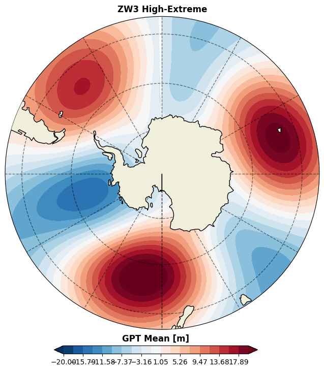
    


```python
div_cmap = sns.color_palette("Spectral_r", as_cmap=True)
```


```python
fig = plt.figure(figsize=[10,8])

ax = plt.subplot(1,1,1)


clevs = np.linspace(-65,65,15)
# clev  = np.round(np.linspace(-0.25,0.25,10),2)
clev = np.arange(-0.25, 0.25, 0.05)

m = Basemap(projection='splaea',boundinglat=-50,lon_0=180,resolution='l',round=True)
x, y = m(CESM_SIC_SH_ASO.lon.values, CESM_SIC_SH_ASO.lat.values)

m.fillcontinents(color='beige',lake_color='beige')
m.drawcoastlines()
m.drawparallels(np.arange(-80.,81.,20.))
m.drawmeridians(np.arange(-180.,181.,20.))
m.drawmapboundary(fill_color='white')

data = corr_zw3_sit.where(pval_PSIT<0.05)

CS = m.contourf(x,y,data,clev,cmap=plt.cm.get_cmap('PiYG_r'),extend='both');
# CS = m.contourf(x,y,data,clev,cmap=div_cmap,extend='both');

# plt.colorbar(label="Anomaly[%]")

m.contour(x, y,CESM_SIC_SH_ASO.siconc,colors ='red',levels=[0.15],linewidths=2.5);

# x1, y1 = m(*np.meshgrid(CESM_GPT500_SH.lon.values,CESM_GPT500_SH.lat.values))

# m.contour(x1,y1,HExt_CESM_GPT500_Anom.mean(dim='time'),clevs,colors='black',alpha=0.5);
# ax.clabel(CS1, inline=True, fontsize=10) 
plt.title("Positive ZW3 Events",fontsize=14,fontweight="bold")


# plt.suptitle("SIT-ZW3 Correlation ", fontsize=20, fontweight='bold',y=1);

cbar_ax = fig.add_axes([0.3, 0.05, 0.45, 0.02]) #[left, bottom, width, height]
cbar = fig.colorbar(CS, cax=cbar_ax,  orientation='horizontal',extend='both')

cbar.ax.tick_params(labelsize=10)
cbar.ax.set_title('Correlation Coeffiecient',fontsize=12,fontweight='bold')

# plt.savefig('SIT-ZW3-Correlation.png', dpi=300)

plt.show()
```


    
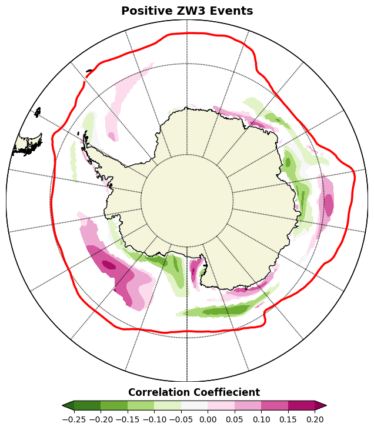
    


### Extreme Analyses


```python
statres_HSIC, pval_HSIC = ttest_1samp(HExt_CESM_SIC_Anom,0)
```


```python
fig = plt.figure(figsize=[10,8])

ax = plt.subplot(1,1,1)
clevs = np.linspace(-3,3,20)

m = Basemap(projection='splaea',boundinglat=-45,lon_0=180,resolution='l')
x, y = m(CESM_SIC_SH_ASO.lon.values, CESM_SIC_SH_ASO.lat.values)

m.fillcontinents(color='beige',lake_color='beige')
m.drawcoastlines()
m.drawparallels(np.arange(-80.,81.,20.))
m.drawmeridians(np.arange(-180.,181.,20.))
m.drawmapboundary(fill_color='white')

data = HExt_CESM_SIC_Anom#.where(pval_HSIC<0.05)

CS = m.contourf(x,y,data.mean('time'),clevs,cmap=plt.cm.get_cmap('RdBu_r'),extend='both');
# plt.colorbar(label="Anomaly[%]")

m.contour(x, y,CESM_SIC_SH_ASO.siconc,colors ='red',levels=[0.15],linewidths=2.5);

# x1, y1 = m(*np.meshgrid(CESM_GPT500_SH.lon.values,CESM_GPT500_SH.lat.values))

# m.contour(x1,y1,HExt_CESM_GPT500_Anom.mean(dim='time'),clevs,colors='black',alpha=0.5);
# ax.clabel(CS1, inline=True, fontsize=10) 
plt.title("Positive ZW3 Extremes",fontsize=12,fontweight="bold")


# plt.suptitle("SIC Anomaly Plot [CESM2: piControl]", fontsize=20, fontweight='bold',y=0.75);

cbar_ax = fig.add_axes([0.3, 0.25, 0.4, 0.02]) #[left, bottom, width, height]
cbar = fig.colorbar(CS, cax=cbar_ax,  orientation='horizontal',extend='both')

cbar.ax.tick_params(labelsize=10)
cbar.ax.set_title('SIC Anomaly [%]',fontsize=12,fontweight='bold')

# plt.tight_layout()

# # plt.savefig('Spatial_Trends_All_Parameters_SIV.pdf',bbox_inches='tight',dpi=200)

plt.show()
```


    
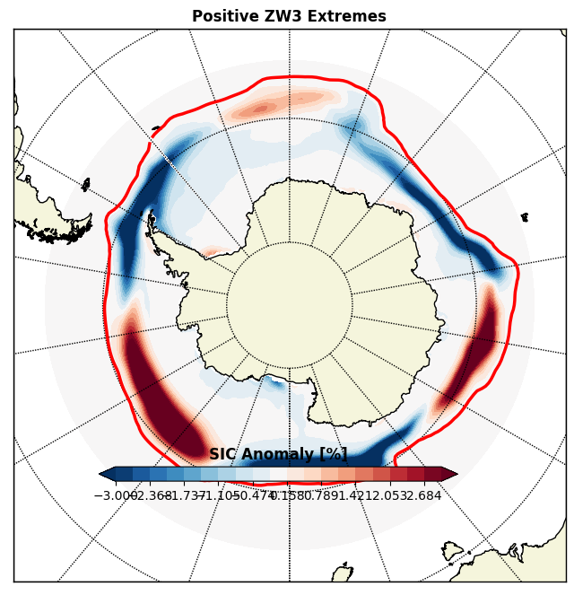
    


```python
High_extremes  = ZW3_df[(ZW3_df['ZW3-Index']>np.percentile(ZW3_df['ZW3-Index'],95))]
Low_extremes = ZW3_df[(ZW3_df['ZW3-Index']<np.percentile(ZW3_df['ZW3-Index'],5))]
```


```python
High_extremes_Dates = xr.Dataset.from_dataframe(High_extremes.set_index('time'))
Low_extremes_Dates = xr.Dataset.from_dataframe(Low_extremes.set_index('time'))
```


```python
#Selecting extreme events:

#GPT:
# HExt_CESM_GPT500 = CESM_GPT500_SH.sel(time=High_extremes_Dates.time)
# LExt_CESM_GPT500 = CESM_GPT500_SH.sel(time=Low_extremes_Dates.time)

#SIC:
HExt_CESM_SIC = CESM_SIC_SH.sel(time=High_extremes_Dates.time).siconc.load()
# LExt_CESM_SIC = CESM_SIC_SH.sel(time=Low_extremes_Dates.time).siconc.load()

#SIT:
HExt_CESM_SIT = CESM_SIT_SH.sel(time=High_extremes_Dates.time).sithick.load()
# LExt_CESM_SIT = CESM_SIT_SH.sel(time=Low_extremes_Dates.time).sithick.load()
```


```python
# LExt_CESM_SIT_Anom = LExt_CESM_SIT.groupby('time.month') - CESM_SIT_SH.sithick.groupby('time.month').mean(dim='time')
HExt_CESM_SIT_Anom = HExt_CESM_SIT.groupby('time.month') - CESM_SIT_SH.sithick.groupby('time.month').mean(dim='time')

# LExt_CESM_SIC_Anom = LExt_CESM_SIC.groupby('time.month') - CESM_SIC_SH.siconc.groupby('time.month').mean(dim='time')
HExt_CESM_SIC_Anom = HExt_CESM_SIC.groupby('time.month') - CESM_SIC_SH.siconc.groupby('time.month').mean(dim='time')

# LExt_CESM_GPT500_Anom = LExt_CESM_GPT500.groupby('time.month') - CESM_GPT500_SH.groupby('time.month').mean(dim='time')
# HExt_CESM_GPT500_Anom = HExt_CESM_GPT500.groupby('time.month') - CESM_GPT500_SH.groupby('time.month').mean(dim='time')
```

### Correlation between SIT-ZW3 during Extreme events: 


```python
High_extremes_ZW3 = New_ZW3.where(New_ZW3>(np.percentile(ZW3_df['ZW3-Index'],95)),drop=True)
corr_HEx_zw3_sit =xr.corr(HExt_CESM_SIT_Anom,High_extremes_ZW3.zg,dim='time')
```


```python
statres_PSIT, pval_PSIT = ttest_1samp(HExt_CESM_SIT_Anom,0)
```


```python
fig = plt.figure(figsize=[10,8])

ax = plt.subplot(1,1,1)

clev  = np.round(np.linspace(-0.25,0.25,10),2)

m = Basemap(projection='splaea',boundinglat=-50,lon_0=180,resolution='l',round=True)
x, y = m(CESM_SIC_SH_ASO.lon.values, CESM_SIC_SH_ASO.lat.values)

m.fillcontinents(color='beige',lake_color='beige')
m.drawcoastlines()
m.drawparallels(np.arange(-80.,81.,20.))
m.drawmeridians(np.arange(-180.,181.,20.))
m.drawmapboundary(fill_color='white')

data = corr_HEx_zw3_sit.where(pval_PSIT<0.05)

CS = m.contourf(x,y,data,clev,cmap=plt.cm.get_cmap('PiYG_r'),extend='both');
# CS = m.contourf(x,y,data,clev,cmap=div_cmap,extend='both');

# plt.colorbar(label="Anomaly[%]")

# m.contour(x, y,CESM_SIC_SH_ASO.siconc,colors ='red',levels=[0.15],linewidths=2.5);

# x1, y1 = m(*np.meshgrid(CESM_GPT500_SH.lon.values,CESM_GPT500_SH.lat.values))

# m.contour(x1,y1,HExt_CESM_GPT500_Anom.mean(dim='time'),clevs,colors='black',alpha=0.5);
# ax.clabel(CS1, inline=True, fontsize=10) 
plt.title("ZW3 Extreme Events",fontsize=14,fontweight="bold")


# plt.suptitle("SIT-ZW3 Correlation ", fontsize=20, fontweight='bold',y=1);

cbar_ax = fig.add_axes([0.3, 0.05, 0.45, 0.02]) #[left, bottom, width, height]
cbar = fig.colorbar(CS, cax=cbar_ax,  orientation='horizontal',extend='both')

cbar.ax.tick_params(labelsize=10)
cbar.ax.set_title('Correlation Coeffiecient',fontsize=12,fontweight='bold')

# plt.savefig('SIT-ZW3-Correlation.png', dpi=300)

plt.show()
```


    
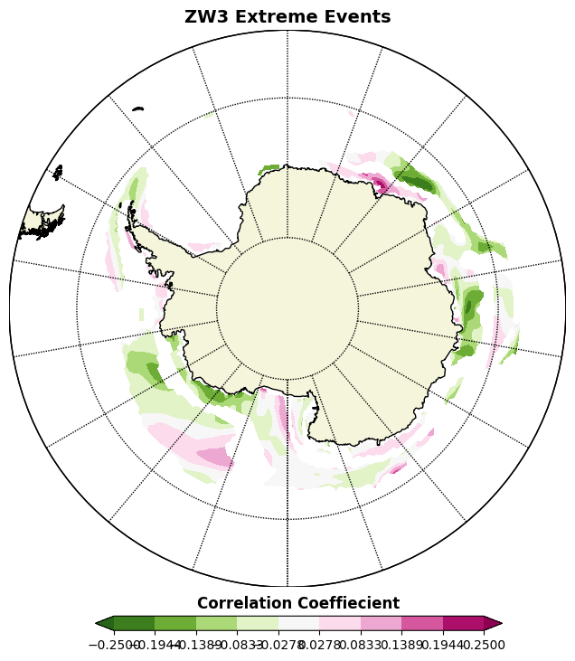
    


```python
from scipy.stats import ttest_1samp
# statres_LSIT, pval_LSIT = ttest_1samp(LExt_CESM_SIT_Anom,0)
statres_HSIT, pval_HSIT = ttest_1samp(HExt_CESM_SIT_Anom,0)
```


```python
fig = plt.figure(figsize=[16,15])


clevs  = np.linspace(-0.4,0.4,10)
clev  = np.linspace(-20,20,10)

ax = plt.subplot(1,2,1)

m = Basemap(projection='splaea',boundinglat=-45,lon_0=180,resolution='l')
x, y = m(CESM_SIC_SH_ASO.lon.values, CESM_SIC_SH_ASO.lat.values)

m.fillcontinents(color='beige',lake_color='beige')
m.drawcoastlines()
m.drawparallels(np.arange(-80.,81.,20.))
m.drawmeridians(np.arange(-180.,181.,20.))
m.drawmapboundary(fill_color='white')

data = HExt_CESM_SIT_Anom.where(pval_HSIT<0.05)

CS = m.contourf(x,y,data.mean('time'),clevs,cmap=plt.cm.get_cmap('seismic'),extend='both');
CS1 = m.contour(x, y,CESM_SIC_SH_ASO.siconc,colors ='red',levels=[15],linewidths=4);

ax.clabel(CS1, inline=True, fontsize=15) 

cbar = fig.colorbar(CS, ax=ax,  orientation='horizontal',extend='both',shrink=0.8)
cbar.ax.set_title('SIT Anomaly [m]',fontsize=12,fontweight='bold')
ax.set_title("Sea-ice Thickness", fontsize=18, fontweight='bold');

ax = plt.subplot(1,2,2)

m = Basemap(projection='splaea',boundinglat=-45,lon_0=180,resolution='l')
x, y = m(CESM_SIC_SH_ASO.lon.values, CESM_SIC_SH_ASO.lat.values)

m.fillcontinents(color='beige',lake_color='beige')
m.drawcoastlines()
m.drawparallels(np.arange(-80.,81.,20.))
m.drawmeridians(np.arange(-180.,181.,20.))
m.drawmapboundary(fill_color='white')

data = HExt_CESM_SIC_Anom.where(pval_HSIC<0.05)

CS = m.contourf(x,y,data.mean('time'),clev,cmap=plt.cm.get_cmap('RdBu_r'),extend='both');
CS1 = m.contour(x, y,CESM_SIC_SH_ASO.siconc,colors ='red',levels=[15],linewidths=4);

ax.clabel(CS1, inline=True, fontsize=15) 

ax.set_title("Sea-ice concentration", fontsize=18, fontweight='bold');

cbar = fig.colorbar(CS, ax=ax,  orientation='horizontal',extend='both',shrink=0.8)

cbar.ax.tick_params(labelsize=10)
cbar.ax.set_title('SIC Anomaly [%]',fontsize=12,fontweight='bold')

plt.tight_layout()

# plt.savefig('SIC_SIT_HighExt_ZW3.png',bbox_inches='tight',dpi=200)

plt.show()
```


    

    


```python
fig = plt.figure(figsize=[16,15])

ax = plt.subplot(1,2,1,projection = ccrs.SouthPolarStereo())
ax.add_feature(cfeature.LAND,zorder=100,edgecolor='k')
ax.set_extent([0.005, 360, -90, -50], crs=ccrs.PlateCarree())
dmeridian = 30  # spacing for lines of meridian
dparallel = 15  # spacing for lines of parallel 
num_merid = int(360/dmeridian + 1)
num_parra = int(90/dparallel + 1)

gl = ax.gridlines(crs=ccrs.PlateCarree(), \
                  xlocs=np.linspace(-180, 180, num_merid), \
                  ylocs=np.linspace(0, -90, num_parra), \
                  linestyle="--", linewidth=1, color='k', alpha=0.5)

theta = np.linspace(0, 2*np.pi, 120)
verts = np.vstack([np.sin(theta), np.cos(theta)]).T
center, radius = [0.5, 0.5], 0.5
circle = mpath.Path(verts * radius + center)
ax.set_boundary(circle, transform=ax.transAxes)  #without this; get rect bound

CS = ax.pcolormesh(CESM_SIC_SH.lon,CESM_SIC_SH.lat,(LExt_CESM_SIC_Anom.where(pval_LSIC<0.05)).mean(dim='time'),
                   transform=ccrs.PlateCarree(),cmap = plt.cm.RdBu_r,vmin=-12,vmax=12)
CS1 = ax.contour(LExt_CESM_GPT500_Anom.lon,LExt_CESM_GPT500_Anom.lat,LExt_CESM_GPT500_Anom.mean(dim='time'),clevs,colors='black',
                 transform=ccrs.PlateCarree());
ax.clabel(CS1, inline=True, fontsize=10)

plt.title("ZW3 Low-Extreme",fontsize=12,fontweight="bold")


ax = plt.subplot(1,2,2,projection = ccrs.SouthPolarStereo())
ax.add_feature(cfeature.LAND,zorder=100,edgecolor='k')
ax.set_extent([0.005, 360, -90, -50], crs=ccrs.PlateCarree())
dmeridian = 30  # spacing for lines of meridian
dparallel = 15  # spacing for lines of parallel 
num_merid = int(360/dmeridian + 1)
num_parra = int(90/dparallel + 1)

gl = ax.gridlines(crs=ccrs.PlateCarree(), \
                  xlocs=np.linspace(-180, 180, num_merid), \
                  ylocs=np.linspace(0, -90, num_parra), \
                  linestyle="--", linewidth=1, color='k', alpha=0.5)

theta = np.linspace(0, 2*np.pi, 120)
verts = np.vstack([np.sin(theta), np.cos(theta)]).T
center, radius = [0.5, 0.5], 0.5
circle = mpath.Path(verts * radius + center)
ax.set_boundary(circle, transform=ax.transAxes)  #without this; get rect bound

CS = ax.pcolormesh(CESM_SIC_SH.lon,CESM_SIC_SH.lat,(HExt_CESM_SIC_Anom.where(pval_HSIC<0.05)).mean(dim='time'),
                   transform=ccrs.PlateCarree(),cmap = plt.cm.RdBu_r,vmin=-12,vmax=12)
CS1 = ax.contour(HExt_CESM_GPT500_Anom.lon,HExt_CESM_GPT500_Anom.lat,HExt_CESM_GPT500_Anom.mean(dim='time'),clevs,colors='black',
                 transform=ccrs.PlateCarree());
ax.clabel(CS1, inline=True, fontsize=10)

plt.title("ZW3 High-Extreme",fontsize=12,fontweight="bold")
    
#     cbar_ax = fig.add_axes([0.3, 0.05, 0.4, 0.02]) #[left, bottom, width, height]
#     cbar = fig.colorbar(CS, cax=cbar_ax,  orientation='horizontal',extend='both')
#     cbar.ax.tick_params(labelsize=10)
#     cbar.ax.set_title('SIV Mean',fontsize=10)
#     cbar.ax.set_ylabel('m^3/Year', fontsize=10)

fig.suptitle("Sea-ice Concentration Anomalies (CESM2-piControl)",fontsize=25,y=0.8)
cbar_ax = fig.add_axes([0.3, 0.25, 0.4, 0.02]) #[left, bottom, width, height]
cbar = fig.colorbar(CS, cax=cbar_ax,  orientation='horizontal',extend='both')

cbar.ax.tick_params(labelsize=10)
cbar.ax.set_title('SIC Anomaly [%]',fontsize=12,fontweight='bold')

plt.tight_layout()

# plt.savefig('Spatial_Trends_All_Parameters_SIV.pdf',bbox_inches='tight',dpi=200)

plt.show()
```


    
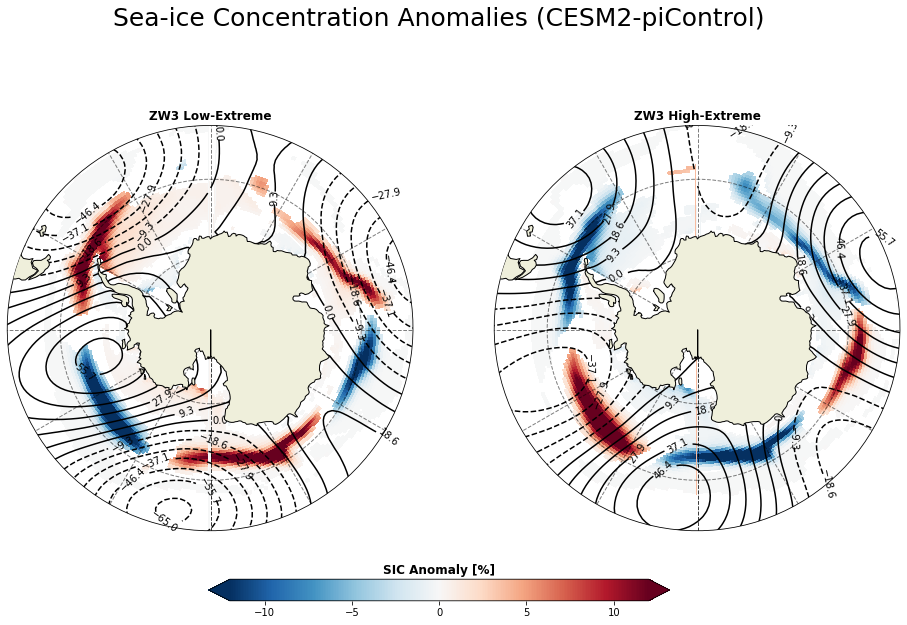
    


## Looking at trends in tendencies:


```python
ds_sidmassth  = xr.open_mfdataset(path+'piControl/sidmassth/*.nc',combine = 'nested', concat_dim="time")
ds_sidmassdyn = xr.open_mfdataset(path+'piControl/sidmassdyn/*.nc',combine='nested',concat_dim="time")

ds_sidconcth  = xr.open_mfdataset(path+'piControl/sidcocnth/*.nc',combine = 'nested', concat_dim="time")
ds_sidconcdyn = xr.open_mfdataset(path+'piControl/sidcocndyn/*.nc',combine='nested',concat_dim="time")

ds_sidmassmelttop = xr.open_mfdataset(path+'piControl/sidmassmelttop/*.nc',combine='nested',concat_dim="time")
```


```python
# Cropping the areas for SH: sidmass
CESM_sidmassth_SH  = ds_sidmassth.where((ds_sidmassth.lat<-50)&(ds_sidmassth.lat>-90),drop=True).squeeze()
CESM_sidmassdyn_SH = ds_sidmassdyn.where((ds_sidmassdyn.lat<-50)&(ds_sidmassdyn.lat>-90),drop=True).squeeze()
        

# Cropping the areas for SH: sidconc
CESM_sidconcth_SH  = ds_sidconcth.where((ds_sidmassth.lat<-50)&(ds_sidconcth.lat>-90),drop=True).squeeze()
CESM_sidconcdyn_SH = ds_sidconcdyn.where((ds_sidconcdyn.lat<-50)&(ds_sidconcdyn.lat>-90),drop=True).squeeze()

# Cropping the areas for SH: sidmassmelttop
CESM_sidmassmelttop_SH  = ds_sidmassmelttop.where((ds_sidmassmelttop.lat<-50)&(ds_sidmassmelttop.lat>-90),drop=True).squeeze()
```


```python
HExt_CESM_sidmassdyn = CESM_sidmassdyn_SH.sel(time=High_extremes_Dates.time).sidmassdyn.load()
# LExt_CESM_sidmassdyn = CESM_sidmassdyn_SH.sel(time=Low_extremes_Dates.time).sidmassdyn.load()

HExt_CESM_sidmassth = CESM_sidmassth_SH.sel(time=High_extremes_Dates.time).sidmassth.load()
# LExt_CESM_sidmassth = CESM_sidmassth_SH.sel(time=Low_extremes_Dates.time).sidmassth.load()

HExt_CESM_sidconcdyn = CESM_sidconcdyn_SH.sel(time=High_extremes_Dates.time).sidconcdyn.load()
# LExt_CESM_sidconcdyn = CESM_sidconcdyn_SH.sel(time=Low_extremes_Dates.time).sidconcdyn.load()

HExt_CESM_sidconcth = CESM_sidconcth_SH.sel(time=High_extremes_Dates.time).sidconcth.load()
# LExt_CESM_sidconcth = CESM_sidconcth_SH.sel(time=Low_extremes_Dates.time).sidconcth.load()

#for the top melt:
HExt_CESM_sidmassmelttop = CESM_sidmassmelttop_SH.sel(time=High_extremes_Dates.time).sidmassmelttop.load()
# LExt_CESM_sidmassmelttop = CESM_sidmassmelttop_SH.sel(time=Low_extremes_Dates.time).sidmassmelttop.load()
```


```python
# LExt_CESM_sidmassdyn_Anom = LExt_CESM_sidmassdyn.groupby('time.month') - CESM_sidmassdyn_SH.sidmassdyn.groupby('time.month').mean(dim='time')
HExt_CESM_sidmassdyn_Anom = HExt_CESM_sidmassdyn.groupby('time.month') - CESM_sidmassdyn_SH.sidmassdyn.groupby('time.month').mean(dim='time')

# LExt_CESM_sidmassth_Anom = LExt_CESM_sidmassth.groupby('time.month') - CESM_sidmassth_SH.sidmassth.groupby('time.month').mean(dim='time')
HExt_CESM_sidmassth_Anom = HExt_CESM_sidmassth.groupby('time.month') - CESM_sidmassth_SH.sidmassth.groupby('time.month').mean(dim='time')

# LExt_CESM_sidconcdyn_Anom = LExt_CESM_sidconcdyn.groupby('time.month') - CESM_sidconcdyn_SH.sidconcdyn.groupby('time.month').mean(dim='time')
HExt_CESM_sidconcdyn_Anom = HExt_CESM_sidconcdyn.groupby('time.month') - CESM_sidconcdyn_SH.sidconcdyn.groupby('time.month').mean(dim='time')

# LExt_CESM_sidconcth_Anom = LExt_CESM_sidconcth.groupby('time.month') - CESM_sidconcth_SH.sidconcth.groupby('time.month').mean(dim='time')
HExt_CESM_sidconcth_Anom = HExt_CESM_sidconcth.groupby('time.month') - CESM_sidconcth_SH.sidconcth.groupby('time.month').mean(dim='time')

#for the top melt:

# LExt_CESM_sidmassmelttop_Anom = LExt_CESM_sidmassmelttop.groupby('time.month') - CESM_sidmassmelttop_SH.sidmassmelttop.groupby('time.month').mean(dim='time')
HExt_CESM_sidmassmelttop_Anom = HExt_CESM_sidmassmelttop.groupby('time.month') - CESM_sidmassmelttop_SH.sidmassmelttop.groupby('time.month').mean(dim='time')
```


```python
HighExt_list  = [HExt_CESM_sidmassdyn_Anom,HExt_CESM_sidmassth_Anom,
                 HExt_CESM_sidconcdyn_Anom,HExt_CESM_sidconcth_Anom]
# LowExt_list   = [LExt_CESM_sidmassdyn_Anom,LExt_CESM_sidmassth_Anom,
#                  LExt_CESM_sidconcdyn_Anom,LExt_CESM_sidconcth_Anom]

titles = ["Dynamic component","Thermodynamic component"]
```


```python
fig = plt.figure(figsize=[16,8])
clevs = np.linspace(-65,65,15)

for i in range(1,3):
    ax = plt.subplot(1,2,i,projection = ccrs.SouthPolarStereo())
    ax.add_feature(cfeature.LAND,zorder=100,edgecolor='k')
    ax.set_extent([0.005, 360, -90, -45], crs=ccrs.PlateCarree())
    dmeridian = 30  # spacing for lines of meridian
    dparallel = 15  # spacing for lines of parallel 
    num_merid = int(360/dmeridian + 1)
    num_parra = int(90/dparallel + 1)

    gl = ax.gridlines(crs=ccrs.PlateCarree(), \
                      xlocs=np.linspace(-180, 180, num_merid), \
                      ylocs=np.linspace(0, -90, num_parra), \
                      linestyle="--", linewidth=1, color='k', alpha=0.5)

    theta = np.linspace(0, 2*np.pi, 120)
    verts = np.vstack([np.sin(theta), np.cos(theta)]).T
    center, radius = [0.5, 0.5], 0.5
    circle = mpath.Path(verts * radius + center)
    ax.set_boundary(circle, transform=ax.transAxes)  #without this; get rect bound

    data = HighExt_list[i-1]/919;
    data = data*3.154*10**7
    data = data.where(data!=0)

    CS = ax.pcolormesh(data.lon,data.lat,data.mean('time'),
                     transform=ccrs.PlateCarree(),cmap = plt.cm.RdBu_r,vmin=-2,vmax=2)
    plt.title(titles[i-1],fontsize=12,fontweight="bold")
    
    ax.contour(HExt_CESM_GPT500_Anom.lon,HExt_CESM_GPT500_Anom.lat,HExt_CESM_GPT500_Anom.mean(dim='time'),
               clevs,colors='black',transform=ccrs.PlateCarree(),alpha=0.5);

#     cbar_ax = fig.add_axes([0.3, 0.05, 0.4, 0.02]) #[left, bottom, width, height]

    cbar = fig.colorbar(CS, ax=ax,  orientation='horizontal',extend='both', pad=0.09)
    cbar.ax.tick_params(labelsize=11)
    cbar.ax.set_title('SIV Anomaly [m/Y]',fontsize=12,fontweight="bold")

plt.suptitle("Sea-ice Volume Changes (Anomalies) [High ZW3 Extremes]",fontsize=20,fontweight="bold",y=1)
# plt.savefig("CESM2_piControl_Volume_Changes.png")

plt.show()
```


    
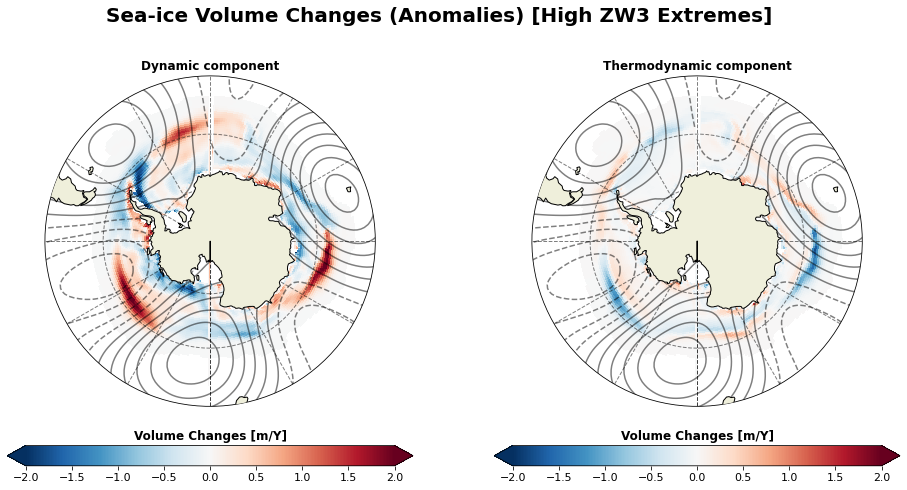
    


```python
statres_sidmassdyn, pval_sidmassdyn = ttest_1samp(HExt_CESM_sidmassdyn_Anom,0)
statres_sidconcdyn, pval_sidconcdyn = ttest_1samp(HExt_CESM_sidconcdyn_Anom,0)
```


```python
fig = plt.figure(figsize=[16,8])

clevs = np.round(np.linspace(-2,2,10),1)
# clevs = np.arange(-2, 2.1, 0.4)

ax = plt.subplot(1,2,1)

m = Basemap(projection='splaea',boundinglat=-45,lon_0=180,resolution='l',round=True)
x, y = m(HExt_CESM_sidmassdyn.lon.values, HExt_CESM_sidmassdyn.lat.values)

m.fillcontinents(color='beige',lake_color='beige')
m.drawcoastlines()
m.drawparallels(np.arange(-80.,81.,20.))
m.drawmeridians(np.arange(-180.,181.,20.))
m.drawmapboundary(fill_color='white')

data = HighExt_list[0]/919;
data = data*3.154*10**7
data = data.where(data!=0)

m.contourf(x,y,data.mean('time'),clevs,cmap = plt.cm.RdBu_r,extend='both')
ax.set_title("Dynamic Component", fontsize=18, fontweight='bold');
CS1 = m.contour(x, y,CESM_SIC_SH_ASO.siconc,colors ='red',levels=[15],linewidths=2.5);

ax = plt.subplot(1,2,2)

m = Basemap(projection='splaea',boundinglat=-45,lon_0=180,resolution='l',round=True)
x, y = m(HExt_CESM_sidmassdyn.lon.values, HExt_CESM_sidmassdyn.lat.values)

m.fillcontinents(color='beige',lake_color='beige')
m.drawcoastlines()
m.drawparallels(np.arange(-80.,81.,20.))
m.drawmeridians(np.arange(-180.,181.,20.))
m.drawmapboundary(fill_color='white')

data = HighExt_list[1]/919;
data = data*3.154*10**7
data = data.where(data!=0)

CS1 = m.contour(x, y,CESM_SIC_SH_ASO.siconc,colors ='red',levels=[15],linewidths=2.5);
CS2 = m.contourf(x,y,data.mean('time'),clevs,cmap = plt.cm.RdBu_r,extend='both')
ax.set_title("Thermodynamic Component", fontsize=18, fontweight='bold');


cbar_ax = fig.add_axes([0.3, 0.05, 0.4, 0.04]) #[left, bottom, width, height]
cbar = fig.colorbar(CS2, cax=cbar_ax,  orientation='horizontal',extend='both')
cbar.ax.tick_params(labelsize=10)
cbar.ax.set_title('SIV Anomaly [m/Y]',fontsize=12,fontweight='bold')

# fig.suptitle("Anomalies during ZW3 Extremes (CESM2-piControl)",fontsize=25,fontweight='bold',y=0.95)
cbar.ax.tick_params(labelsize=10)

# plt.savefig('Dyn_Thdy_Changes_HEXT_Basemap.png',dpi=200)
# plt.tight_layout()
plt.show()
```


    
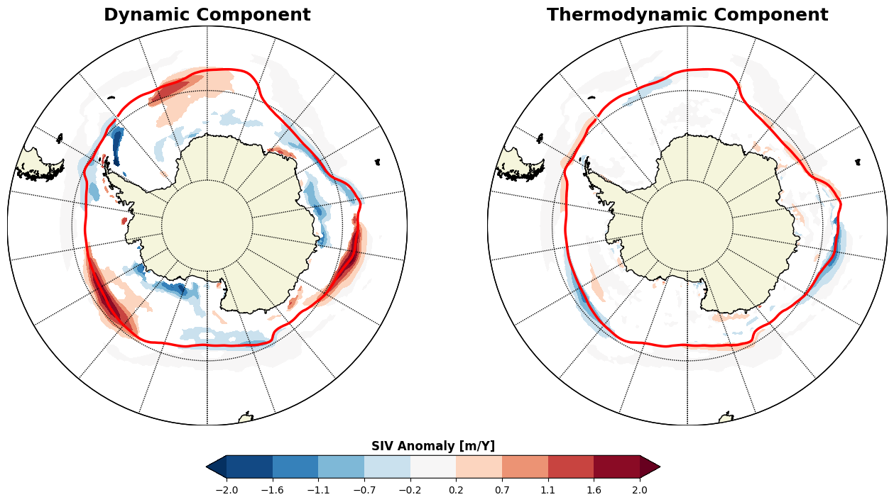
    


```python
fig = plt.figure(figsize=[16,8])

clevs = np.round(np.linspace(-2,2,10),1)

# -------------------- Dynamic component --------------------
ax = plt.subplot(1,2,1)
m = Basemap(projection='splaea',boundinglat=-45,lon_0=180,resolution='l',round=True)
x, y = m(HExt_CESM_sidmassdyn.lon.values, HExt_CESM_sidmassdyn.lat.values)

m.fillcontinents(color='beige',lake_color='beige')
m.drawcoastlines()
m.drawparallels(np.arange(-80.,81.,20.))
m.drawmeridians(np.arange(-180.,181.,20.))
m.drawmapboundary(fill_color='white')

data = HighExt_list[0]/919
data = data*3.154*10**7

# Plot main field (all values)
cf = m.contourf(x, y, data.mean('time'), clevs, cmap=plt.cm.RdBu_r, extend='both')

# significance mask
sig_mask = np.where(pval_sidmassdyn < 0.05, 1, np.nan)

# restrict to inside red contour (siconc >= 15%)
seaice_mask = np.where(CESM_SIC_SH_ASO.siconc >= 15, 1, np.nan)
sig_mask = sig_mask * seaice_mask

# overlay hatches
m.contourf(x, y, sig_mask, levels=[0.5, 1.5], hatches=['////'], alpha=0)

ax.set_title("Dynamic Component", fontsize=18, fontweight='bold')
m.contour(x, y, CESM_SIC_SH_ASO.siconc, colors='red', levels=[15], linewidths=2.5)


# -------------------- Thermodynamic component --------------------
ax = plt.subplot(1,2,2)
m = Basemap(projection='splaea',boundinglat=-45,lon_0=180,resolution='l',round=True)
x, y = m(HExt_CESM_sidmassdyn.lon.values, HExt_CESM_sidmassdyn.lat.values)

m.fillcontinents(color='beige',lake_color='beige')
m.drawcoastlines()
m.drawparallels(np.arange(-80.,81.,20.))
m.drawmeridians(np.arange(-180.,181.,20.))
m.drawmapboundary(fill_color='white')

data = HighExt_list[1]/919
data = data*3.154*10**7

# Plot main field (all values)
cf2 = m.contourf(x, y, data.mean('time'), clevs, cmap=plt.cm.RdBu_r, extend='both')

# Overlay hatching for significant regions
# significance mask
sig_mask = np.where(pval_sidconcdyn < 0.05, 1, np.nan)

# restrict to inside red contour (siconc >= 15%)
seaice_mask = np.where(CESM_SIC_SH_ASO.siconc >= 15, 1, np.nan)
sig_mask = sig_mask * seaice_mask

# overlay hatches
m.contourf(x, y, sig_mask, levels=[0.5, 1.5], hatches=['////'], alpha=0)

ax.set_title("Thermodynamic Component", fontsize=18, fontweight='bold')
m.contour(x, y, CESM_SIC_SH_ASO.siconc, colors='red', levels=[15], linewidths=2.5)


# -------------------- Colorbar --------------------
cbar_ax = fig.add_axes([0.3, 0.05, 0.4, 0.04])
cbar = fig.colorbar(cf2, cax=cbar_ax, orientation='horizontal', extend='both')
cbar.ax.tick_params(labelsize=10)
cbar.ax.set_title('SIV Anomaly [m/Y]', fontsize=12, fontweight='bold')

plt.show()
```


    
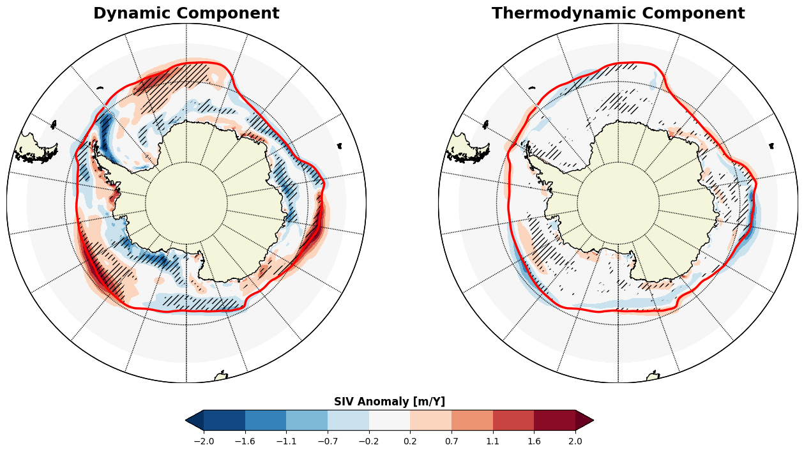
    


```python

```


```python

```


```python
fig = plt.figure(figsize=[16,8])
clevs = np.linspace(-65,65,15)

for i in range(1,3):
    ax = plt.subplot(1,2,i,projection = ccrs.SouthPolarStereo())
    ax.add_feature(cfeature.LAND,zorder=100,edgecolor='k')
    ax.set_extent([0.005, 360, -90, -45], crs=ccrs.PlateCarree())
    dmeridian = 30  # spacing for lines of meridian
    dparallel = 15  # spacing for lines of parallel 
    num_merid = int(360/dmeridian + 1)
    num_parra = int(90/dparallel + 1)

    gl = ax.gridlines(crs=ccrs.PlateCarree(), \
                      xlocs=np.linspace(-180, 180, num_merid), \
                      ylocs=np.linspace(0, -90, num_parra), \
                      linestyle="--", linewidth=1, color='k', alpha=0.5)

    theta = np.linspace(0, 2*np.pi, 120)
    verts = np.vstack([np.sin(theta), np.cos(theta)]).T
    center, radius = [0.5, 0.5], 0.5
    circle = mpath.Path(verts * radius + center)
    ax.set_boundary(circle, transform=ax.transAxes)  #without this; get rect bound

    data = LowExt_list[i-1]/919;
    data = data*3.154*10**7
    data = data.where(data!=0)

    CS = ax.pcolormesh(data.lon,data.lat,data.mean('time'),
                     transform=ccrs.PlateCarree(),cmap = plt.cm.RdBu_r,vmin=-2,vmax=2)
    plt.title(titles[i-1],fontsize=12,fontweight="bold")
    
    ax.contour(LExt_CESM_GPT500_Anom.lon,LExt_CESM_GPT500_Anom.lat,LExt_CESM_GPT500_Anom.mean(dim='time'),
               clevs,colors='black',transform=ccrs.PlateCarree(),alpha=0.5);

#     cbar_ax = fig.add_axes([0.3, 0.05, 0.4, 0.02]) #[left, bottom, width, height]

    cbar = fig.colorbar(CS, ax=ax,  orientation='horizontal',extend='both', pad=0.09)
    cbar.ax.tick_params(labelsize=11)
    cbar.ax.set_title('Volume Changes [m/Y]',fontsize=12,fontweight="bold")

plt.suptitle("Sea-ice Volume Changes (Anomalies) [Low ZW3 Extremes]",fontsize=20,fontweight="bold",y=1)
# plt.savefig("CESM2_piControl_Volume_Changes.png")

plt.show()
```


    
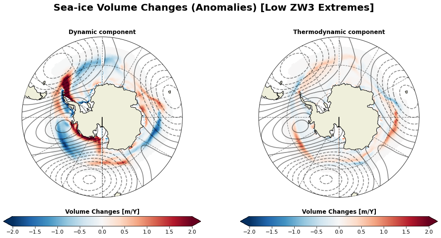
    


```python
fig = plt.figure(figsize=[16,8])

for i in range(1,3):
    ax = plt.subplot(1,2,i,projection = ccrs.SouthPolarStereo())
    ax.add_feature(cfeature.LAND,zorder=100,edgecolor='k')
    ax.set_extent([0.005, 360, -90, -45], crs=ccrs.PlateCarree())
    dmeridian = 30  # spacing for lines of meridian
    dparallel = 15  # spacing for lines of parallel 
    num_merid = int(360/dmeridian + 1)
    num_parra = int(90/dparallel + 1)

    gl = ax.gridlines(crs=ccrs.PlateCarree(), \
                      xlocs=np.linspace(-180, 180, num_merid), \
                      ylocs=np.linspace(0, -90, num_parra), \
                      linestyle="--", linewidth=1, color='k', alpha=0.5)

    theta = np.linspace(0, 2*np.pi, 120)
    verts = np.vstack([np.sin(theta), np.cos(theta)]).T
    center, radius = [0.5, 0.5], 0.5
    circle = mpath.Path(verts * radius + center)
    ax.set_boundary(circle, transform=ax.transAxes)  #without this; get rect bound

    data = LowExt_list[i+1];
    data = data*3.154*10**7
    data = data.where(data!=0)

    CS = ax.pcolormesh(data.lon,data.lat,data.mean('time'),
                     transform=ccrs.PlateCarree(),cmap = plt.cm.RdBu_r,vmin=-2,vmax=2)
    plt.title(titles[i-1],fontsize=12,fontweight="bold")

#     cbar_ax = fig.add_axes([0.3, 0.05, 0.4, 0.02]) #[left, bottom, width, height]

    cbar = fig.colorbar(CS, ax=ax,  orientation='horizontal',extend='both', pad=0.09)
    cbar.ax.tick_params(labelsize=11)
    cbar.ax.set_title('Area Changes [m/Y]',fontsize=12,fontweight="bold")

plt.suptitle("Sea-ice Area Changes (Anomalies) [Low ZW3 Extremes]",fontsize=20,fontweight="bold",y=1)
# plt.savefig("CESM2_piControl_Volume_Changes.png")

plt.show()
```


    
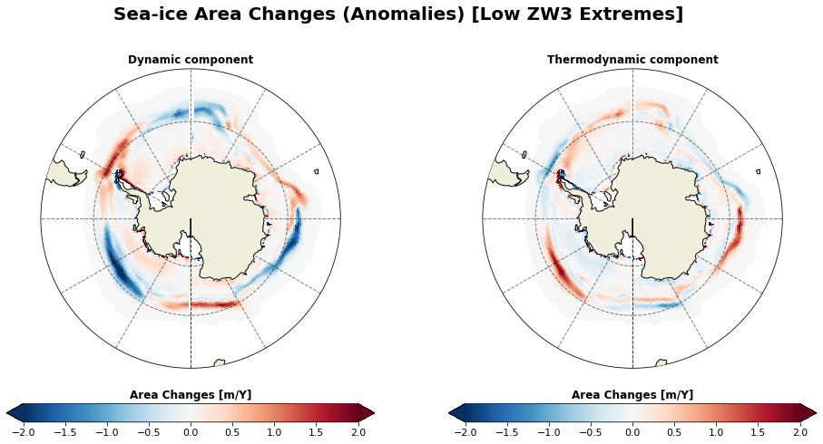
    


```python
fig = plt.figure(figsize=[16,8])

for i in range(1,3):
    ax = plt.subplot(1,2,i,projection = ccrs.SouthPolarStereo())
    ax.add_feature(cfeature.LAND,zorder=100,edgecolor='k')
    ax.set_extent([0.005, 360, -90, -45], crs=ccrs.PlateCarree())
    dmeridian = 30  # spacing for lines of meridian
    dparallel = 15  # spacing for lines of parallel 
    num_merid = int(360/dmeridian + 1)
    num_parra = int(90/dparallel + 1)

    gl = ax.gridlines(crs=ccrs.PlateCarree(), \
                      xlocs=np.linspace(-180, 180, num_merid), \
                      ylocs=np.linspace(0, -90, num_parra), \
                      linestyle="--", linewidth=1, color='k', alpha=0.5)

    theta = np.linspace(0, 2*np.pi, 120)
    verts = np.vstack([np.sin(theta), np.cos(theta)]).T
    center, radius = [0.5, 0.5], 0.5
    circle = mpath.Path(verts * radius + center)
    ax.set_boundary(circle, transform=ax.transAxes)  #without this; get rect bound

    data = HighExt_list[i+1];
    data = data*3.154*10**7
    data = data.where(data!=0)

    CS = ax.pcolormesh(data.lon,data.lat,data.mean('time'),
                     transform=ccrs.PlateCarree(),cmap = plt.cm.RdBu_r,vmin=-2,vmax=2)
    plt.title(titles[i-1],fontsize=12,fontweight="bold")

#     cbar_ax = fig.add_axes([0.3, 0.05, 0.4, 0.02]) #[left, bottom, width, height]

    cbar = fig.colorbar(CS, ax=ax,  orientation='horizontal',extend='both', pad=0.09)
    cbar.ax.tick_params(labelsize=11)
    cbar.ax.set_title('Area Changes [m/Y]',fontsize=12,fontweight="bold")

plt.suptitle("Sea-ice Area Changes (per unit area and time) [Anomalies]",fontsize=20,fontweight="bold",y=1)
# plt.savefig("CESM2_piControl_Volume_Changes.png")

plt.show()
```


    
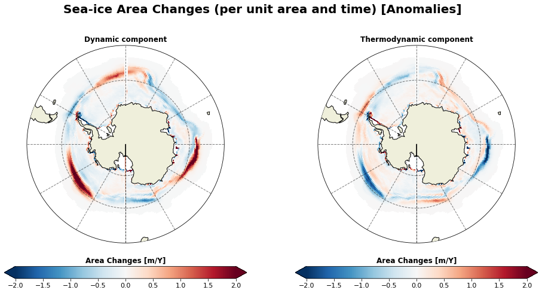
    


```python
fig = plt.figure(figsize=[16,15])

ax = plt.subplot(1,2,1,projection = ccrs.SouthPolarStereo())
ax.add_feature(cfeature.LAND,zorder=100,edgecolor='k')
ax.set_extent([0.005, 360, -90, -50], crs=ccrs.PlateCarree())
dmeridian = 30  # spacing for lines of meridian
dparallel = 15  # spacing for lines of parallel 
num_merid = int(360/dmeridian + 1)
num_parra = int(90/dparallel + 1)

gl = ax.gridlines(crs=ccrs.PlateCarree(), \
                  xlocs=np.linspace(-180, 180, num_merid), \
                  ylocs=np.linspace(0, -90, num_parra), \
                  linestyle="--", linewidth=1, color='k', alpha=0.5)

theta = np.linspace(0, 2*np.pi, 120)
verts = np.vstack([np.sin(theta), np.cos(theta)]).T
center, radius = [0.5, 0.5], 0.5
circle = mpath.Path(verts * radius + center)
ax.set_boundary(circle, transform=ax.transAxes)  #without this; get rect bound

data = LExt_CESM_sidmassmelttop_Anom/919
# data = data.where(data!=0)
data = data*3.154*10**7

CS = ax.pcolormesh(data.lon,data.lat,data.mean(dim='time'),
                   transform=ccrs.PlateCarree(),cmap = plt.cm.RdBu_r,vmin=-0.002,vmax=0.002)

plt.title("ZW3 Low-Extreme",fontsize=12,fontweight="bold")


ax = plt.subplot(1,2,2,projection = ccrs.SouthPolarStereo())
ax.add_feature(cfeature.LAND,zorder=100,edgecolor='k')
ax.set_extent([0.005, 360, -90, -50], crs=ccrs.PlateCarree())
dmeridian = 30  # spacing for lines of meridian
dparallel = 15  # spacing for lines of parallel 
num_merid = int(360/dmeridian + 1)
num_parra = int(90/dparallel + 1)

gl = ax.gridlines(crs=ccrs.PlateCarree(), \
                  xlocs=np.linspace(-180, 180, num_merid), \
                  ylocs=np.linspace(0, -90, num_parra), \
                  linestyle="--", linewidth=1, color='k', alpha=0.5)

theta = np.linspace(0, 2*np.pi, 120)
verts = np.vstack([np.sin(theta), np.cos(theta)]).T
center, radius = [0.5, 0.5], 0.5
circle = mpath.Path(verts * radius + center)
ax.set_boundary(circle, transform=ax.transAxes)  #without this; get rect bound

data = HExt_CESM_sidmassmelttop_Anom/919
# data = data.where(data!=0)
data = data*3.154*10**7

CS = ax.pcolormesh(data.lon,data.lat,data.mean(dim='time'),
                   transform=ccrs.PlateCarree(),cmap = plt.cm.RdBu_r,vmin=-0.002,vmax=0.002)

plt.title("ZW3 High-Extreme",fontsize=12,fontweight="bold")
    
#     cbar_ax = fig.add_axes([0.3, 0.05, 0.4, 0.02]) #[left, bottom, width, height]
#     cbar = fig.colorbar(CS, cax=cbar_ax,  orientation='horizontal',extend='both')
#     cbar.ax.tick_params(labelsize=10)
#     cbar.ax.set_title('SIV Mean',fontsize=10)
#     cbar.ax.set_ylabel('m^3/Year', fontsize=10)

fig.suptitle("Rate of change of SIV through surface melt (CESM2-piControl)",fontsize=25,y=0.8)
cbar_ax = fig.add_axes([0.3, 0.25, 0.4, 0.02]) #[left, bottom, width, height]
cbar = fig.colorbar(CS, cax=cbar_ax,  orientation='horizontal',extend='both')

cbar.ax.tick_params(labelsize=10)
cbar.ax.set_title('SIV Melt rate [m/Y]',fontsize=12,fontweight='bold')

plt.tight_layout()

# plt.savefig('Spatial_Trends_All_Parameters_SIV.pdf',bbox_inches='tight',dpi=200)

plt.show()
```


    
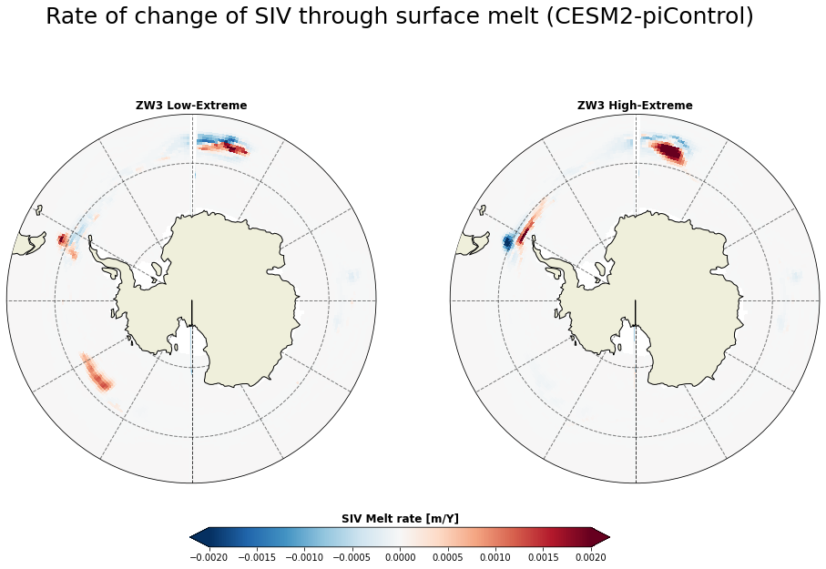
    


## Using sea-ice drifts and wind vectors:


```python
dataframe = intake.open_esm_datastore("https://raw.githubusercontent.com/NCAR/intake-esm-datastore/master/catalogs/pangeo-cmip6.json")
```


```python
# #Using va from CESM2:

cat4  = dataframe.search(experiment_id=['piControl'], table_id=['SImon'],source_id=['CESM2'], 
                         variable_id=['siu','siv'],
                 member_id = ['r1i1p1f1'], grid_label=['gn'])

z_kwargs = {'consolidated': True, 'use_cftime':True}

with dask.config.set(**{'array.slicing.split_large_chunks': True}):
    dset_dict4 = cat4.to_dataset_dict(zarr_kwargs=z_kwargs)
```

    
    --> The keys in the returned dictionary of datasets are constructed as follows:
    	'activity_id.institution_id.source_id.experiment_id.table_id.grid_label'


<style>
    /* Turns off some styling */
    progress {
        /* gets rid of default border in Firefox and Opera. */
        border: none;
        /* Needs to be in here for Safari polyfill so background images work as expected. */
        background-size: auto;
    }
    progress:not([value]), progress:not([value])::-webkit-progress-bar {
        background: repeating-linear-gradient(45deg, #7e7e7e, #7e7e7e 10px, #5c5c5c 10px, #5c5c5c 20px);
    }
    .progress-bar-interrupted, .progress-bar-interrupted::-webkit-progress-bar {
        background: #F44336;
    }
</style>


<div>
  <progress value='1' class='' max='1' style='width:300px; height:20px; vertical-align: middle;'></progress>
  100.00% [1/1 00:00&lt;00:00]
</div>


```python
Drifts = dset_dict4['CMIP.NCAR.CESM2.piControl.SImon.gn']
Drifts_SH = Drifts.where((Drifts.lat<-10)&(Drifts.lat>-90),drop=True).squeeze()#.load()
```


```python
HExt_CESM_drifts = Drifts_SH.sel(time=High_extremes_Dates.time)
# LExt_CESM_drifts = Drifts_SH.sel(time=Low_extremes_Dates.time)

# LExt_CESM_drifts_Anom = LExt_CESM_drifts.groupby('time.month') - Drifts_SH.groupby('time.month').mean(dim='time')
HExt_CESM_drifts_Anom = HExt_CESM_drifts.groupby('time.month') - Drifts_SH.groupby('time.month').mean(dim='time')

# LExt_CESM_drifts_Anom_M = LExt_CESM_drifts_Anom.mean('time')
HExt_CESM_drifts_Anom_M = HExt_CESM_drifts_Anom.mean('time').load()
```


```python
fig = plt.figure(figsize=[16,15])


clevs  = np.linspace(-0.4,0.4,10)
clev  = np.linspace(-20,20,10)

ax = plt.subplot(1,2,1)

m = Basemap(projection='splaea',boundinglat=-45,lon_0=180,resolution='l')
x, y = m(CESM_SIC_SH_ASO.lon.values, CESM_SIC_SH_ASO.lat.values)

m.fillcontinents(color='beige',lake_color='beige')
m.drawcoastlines()
m.drawparallels(np.arange(-80.,81.,20.))
m.drawmeridians(np.arange(-180.,181.,20.))
m.drawmapboundary(fill_color='white')

data = HExt_CESM_SIT_Anom.where(pval_HSIT<0.05)

CS = m.contourf(x,y,data.mean('time'),clevs,cmap=plt.cm.get_cmap('seismic'),extend='both');
CS1 = m.contour(x, y,CESM_SIC_SH_ASO.siconc,colors ='red',levels=[15],linewidths=4);

skip=(slice(None,None,4),slice(None,None,4))
u_rot, v_rot, x, y = m.rotate_vector(HExt_CESM_drifts_Anom_M.siu,HExt_CESM_drifts_Anom_M.siv, 
                                     HExt_CESM_drifts_Anom_M.lon.values, HExt_CESM_drifts_Anom_M.lat.values, 
                                     returnxy=True)
m.quiver(x[skip], y[skip], u_rot[skip], v_rot[skip], angles = "xy",scale=0.5,pivot='mid',units='width',alpha=0.5)

    
ax.clabel(CS1, inline=True, fontsize=15) 

cbar = fig.colorbar(CS, ax=ax,  orientation='horizontal',extend='both',shrink=0.8)
cbar.ax.set_title('SIT Anomaly [m]',fontsize=12,fontweight='bold')
ax.set_title("Sea-ice Thickness", fontsize=18, fontweight='bold');

ax = plt.subplot(1,2,2)

m = Basemap(projection='splaea',boundinglat=-45,lon_0=180,resolution='l')
x, y = m(CESM_SIC_SH_ASO.lon.values, CESM_SIC_SH_ASO.lat.values)

m.fillcontinents(color='beige',lake_color='beige')
m.drawcoastlines()
m.drawparallels(np.arange(-80.,81.,20.))
m.drawmeridians(np.arange(-180.,181.,20.))
m.drawmapboundary(fill_color='white')

data = HExt_CESM_SIC_Anom.where(pval_HSIC<0.05)

CS = m.contourf(x,y,data.mean('time'),clev,cmap=plt.cm.get_cmap('RdBu_r'),extend='both');
CS1 = m.contour(x, y,CESM_SIC_SH_ASO.siconc,colors ='red',levels=[15],linewidths=4);

skip=(slice(None,None,4),slice(None,None,4))
u_rot, v_rot, x, y = m.rotate_vector(HExt_CESM_drifts_Anom_M.siu,HExt_CESM_drifts_Anom_M.siv, 
                                     HExt_CESM_drifts_Anom_M.lon.values, HExt_CESM_drifts_Anom_M.lat.values, 
                                     returnxy=True)
m.quiver(x[skip], y[skip], u_rot[skip], v_rot[skip], angles = "xy",scale=0.5,pivot='mid',units='width',alpha=0.5)

ax.clabel(CS1, inline=True, fontsize=15) 

ax.set_title("Sea-ice concentration", fontsize=18, fontweight='bold');

cbar = fig.colorbar(CS, ax=ax,  orientation='horizontal',extend='both',shrink=0.8)

cbar.ax.tick_params(labelsize=10)
cbar.ax.set_title('SIC Anomaly [%]',fontsize=12,fontweight='bold')

plt.tight_layout()

# plt.savefig('SIC_SIT_Vectors_HighExt_ZW3.png',bbox_inches='tight',dpi=200)

plt.show()
```


    
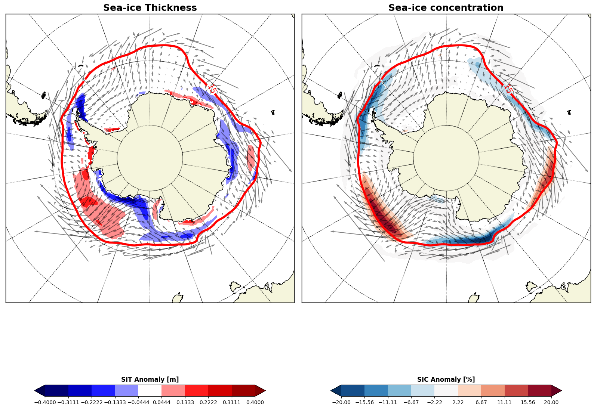
    


```python
data  = HExt_CESM_SIT_Anom.where(pval_HSIT<0.05)
data1 = HExt_CESM_SIC_Anom.where(pval_HSIC<0.05)
```


```python
plt.figure(figsize=[16,15])

clev1 = np.linspace(-20,20,8)
clev  = np.linspace(-0.4,0.4,10)

ax = plt.subplot(1,1,1,projection = ccrs.SouthPolarStereo())
m = Basemap(projection='splaea',boundinglat=-45,lon_0=180,resolution='l',round=True)
x, y = m(CESM_SIC_SH_ASO.lon.values, CESM_SIC_SH_ASO.lat.values)

m.fillcontinents(color='beige',lake_color='beige')
m.drawcoastlines()
m.drawparallels(np.arange(-80.,81.,20.))
m.drawmeridians(np.arange(-180.,181.,20.))
m.drawmapboundary(fill_color='white')

data  = HExt_CESM_SIT_Anom.where(pval_HSIT<0.05)
data1 = HExt_CESM_SIC_Anom.where(pval_HSIC<0.05)

CS  = m.contourf(x, y, data.mean('time'), clev, cmap=plt.cm.get_cmap('RdBu_r'), extend='both')
CS1 = m.contour(x, y, CESM_SIC_SH_ASO.siconc, colors='black', levels=[15], linewidths=5)
CS2 = m.contour(x, y, data1.mean('time'), clev1, colors='red', linewidths=2.5, alpha=1)

skip = (slice(None, None, 4), slice(None, None, 4))
u_rot, v_rot, x, y = m.rotate_vector(
    HExt_CESM_drifts_Anom_M.siu, HExt_CESM_drifts_Anom_M.siv, 
    HExt_CESM_drifts_Anom_M.lon.values, HExt_CESM_drifts_Anom_M.lat.values, 
    returnxy=True
)
m.quiver(x[skip], y[skip], u_rot[skip], v_rot[skip], angles="xy", scale=0.5, pivot='mid', units='width', alpha=0.4)

ax.clabel(CS1, inline=True, fontsize=15)

ax.set_title("Sea-ice Thickness", fontsize=18, fontweight='bold')

# Create a colorbar on the side of the figure
cbar = plt.colorbar(CS, ax=ax, orientation='vertical', extend='both', shrink=0.8)

cbar.ax.tick_params(labelsize=12)
cbar.ax.set_title('SIT Anomaly [m]', fontsize=12, fontweight='bold')

# plt.savefig('SIT_IceVector_Extremes.png',dpi=200) 

plt.show()
```


    
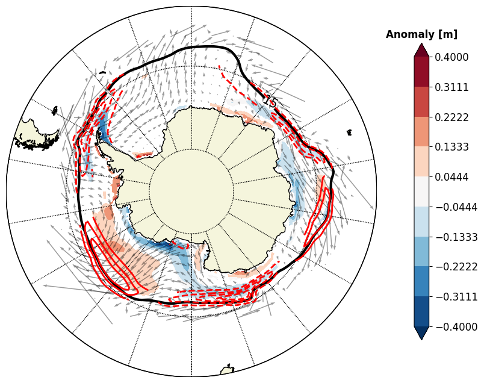
    


```python

```


```python
# Cropping the areas for SH: sidmassmelttop
ds_sidmassmelttop = xr.open_mfdataset(path+'piControl/sidmassmelttop/*.nc',combine='nested',concat_dim="time")
CESM_sidmassmelttop_SH  = ds_sidmassmelttop.where((ds_sidmassmelttop.lat<-50)&(ds_sidmassmelttop.lat>-90),drop=True).squeeze()
HExt_CESM_sidmassmelttop = CESM_sidmassmelttop_SH.sel(time=High_extremes_Dates.time).sidmassmelttop.load()
HExt_CESM_sidmassmelttop_Anom = HExt_CESM_sidmassmelttop.groupby('time.month') - CESM_sidmassmelttop_SH.sidmassmelttop.groupby('time.month').mean(dim='time')
```


```python
# Cropping the areas for SH: sidmassmeltbot
ds_sidmassmeltbot = xr.open_mfdataset(path+'piControl/sidmassmeltbot/*.nc',combine='nested',concat_dim="time")
CESM_sidmassmeltbot_SH  = ds_sidmassmeltbot.where((ds_sidmassmelttop.lat<-50)&(ds_sidmassmeltbot.lat>-90),drop=True).squeeze()
HExt_CESM_sidmassmeltbot = CESM_sidmassmeltbot_SH.sel(time=High_extremes_Dates.time).sidmassmeltbot.load()
HExt_CESM_sidmassmeltbot_Anom = HExt_CESM_sidmassmeltbot.groupby('time.month') - CESM_sidmassmeltbot_SH.sidmassmeltbot.groupby('time.month').mean(dim='time')
```


```python
fig = plt.figure(figsize=[16,15])

ax = plt.subplot(1,2,1,projection = ccrs.SouthPolarStereo())
ax.add_feature(cfeature.LAND,zorder=100,edgecolor='k')
ax.set_extent([0.005, 360, -90, -50], crs=ccrs.PlateCarree())
dmeridian = 30  # spacing for lines of meridian
dparallel = 15  # spacing for lines of parallel 
num_merid = int(360/dmeridian + 1)
num_parra = int(90/dparallel + 1)

gl = ax.gridlines(crs=ccrs.PlateCarree(), \
                  xlocs=np.linspace(-180, 180, num_merid), \
                  ylocs=np.linspace(0, -90, num_parra), \
                  linestyle="--", linewidth=1, color='k', alpha=0.5)

theta = np.linspace(0, 2*np.pi, 120)
verts = np.vstack([np.sin(theta), np.cos(theta)]).T
center, radius = [0.5, 0.5], 0.5
circle = mpath.Path(verts * radius + center)
ax.set_boundary(circle, transform=ax.transAxes)  #without this; get rect bound

#Top melting rates

data = LExt_CESM_sidmassmelttop_Anom/919
data = data.where(data!=0)
data = data*3.154*10**7

CS = ax.pcolormesh(data.lon,data.lat,data.mean(dim='time'),
                   transform=ccrs.PlateCarree(),cmap = plt.cm.RdBu_r,vmin=-0.002,vmax=0.002)

# Defining the quiver plot
data = LExt_CESM_drifts_Anom_M.isel(ni=slice(None, None, 5),
                              nj=slice(None, None, 5))

data.plot.quiver(x='lon', y='lat', u='siu', v='siv',cmap=plt.cm.get_cmap('gray'), angles = "xy",pivot='mid',
          scale=0.8,units='width',alpha=1,transform=ccrs.PlateCarree())

plt.title(" Low ZW3 Extremes",fontsize=12,fontweight="bold")


ax = plt.subplot(1,2,2,projection = ccrs.SouthPolarStereo())
ax.add_feature(cfeature.LAND,zorder=100,edgecolor='k')
ax.set_extent([0.005, 360, -90, -50], crs=ccrs.PlateCarree())
dmeridian = 30  # spacing for lines of meridian
dparallel = 15  # spacing for lines of parallel 
num_merid = int(360/dmeridian + 1)
num_parra = int(90/dparallel + 1)

gl = ax.gridlines(crs=ccrs.PlateCarree(), \
                  xlocs=np.linspace(-180, 180, num_merid), \
                  ylocs=np.linspace(0, -90, num_parra), \
                  linestyle="--", linewidth=1, color='k', alpha=0.5)

theta = np.linspace(0, 2*np.pi, 120)
verts = np.vstack([np.sin(theta), np.cos(theta)]).T
center, radius = [0.5, 0.5], 0.5
circle = mpath.Path(verts * radius + center)
ax.set_boundary(circle, transform=ax.transAxes)  #without this; get rect bound

#Top melting rates

data = HExt_CESM_sidmassmelttop_Anom/919
data = data.where(data!=0)
data = data*3.154*10**7

CS = ax.pcolormesh(data.lon,data.lat,data.mean(dim='time'),
                   transform=ccrs.PlateCarree(),cmap = plt.cm.RdBu_r,vmin=-0.002,vmax=0.002)

# Defining the quiver plot
data = HExt_CESM_drifts_Anom_M.isel(ni=slice(None, None, 5),
                              nj=slice(None, None, 5))

data.plot.quiver(x='lon', y='lat', u='siu', v='siv',cmap=plt.cm.get_cmap('gray'), angles = "xy",pivot='mid',
          scale=0.8,units='width',alpha=1,transform=ccrs.PlateCarree()) 

plt.title("High ZW3 Extremes",fontsize=12,fontweight="bold")

plt.suptitle("Sea-ice top melt rates and Vector Anomaly [CESM2 piControl]",fontsize=20,fontweight="bold",y=0.78)


cbar_ax = fig.add_axes([0.3, 0.25, 0.4, 0.02]) #[left, bottom, width, height]
cbar = fig.colorbar(CS, cax=cbar_ax,  orientation='horizontal',extend='both')

cbar.ax.tick_params(labelsize=10)
cbar.ax.set_title('SIV Melt rate [m/Y]',fontsize=12,fontweight='bold')

plt.show()
```


    
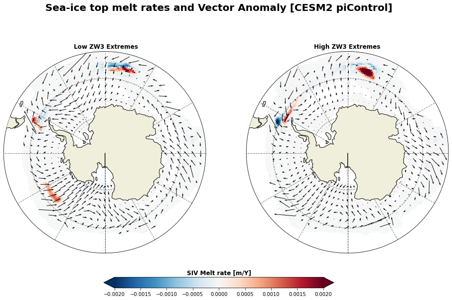
    


## Bottom sea-ice melt:


```python
ds_sidmassmeltbot_SH = xr.open_dataset('/Volumes/SHREYA/Ch3-ZW3_Extreme_Analysis/Extreme_ZW3-II/BOTMELT_CMIP.NCAR.CESM2.piControl.Amon.gn.nc').sidmassmeltbot.load()
```


```python
HExt_CESM_BOTMELT = ds_sidmassmeltbot_SH.sel(time=High_extremes_Dates.time)
# LExt_CESM_BOTMELT = ds_sidmassmeltbot_SH.sel(time=Low_extremes_Dates.time)
```


```python
#for the top melt:

# LExt_CESM_sidmassmeltbot_Anom = LExt_CESM_BOTMELT.groupby('time.month') - ds_sidmassmeltbot_SH.groupby('time.month').mean(dim='time')
HExt_CESM_sidmassmeltbot_Anom = HExt_CESM_BOTMELT.groupby('time.month') - ds_sidmassmeltbot_SH.groupby('time.month').mean(dim='time')
```


```python
fig = plt.figure(figsize=[16,15])

ax = plt.subplot(1,2,1,projection = ccrs.SouthPolarStereo())
ax.add_feature(cfeature.LAND,zorder=100,edgecolor='k')
ax.set_extent([0.005, 360, -90, -45], crs=ccrs.PlateCarree())
dmeridian = 30  # spacing for lines of meridian
dparallel = 15  # spacing for lines of parallel 
num_merid = int(360/dmeridian + 1)
num_parra = int(90/dparallel + 1)

gl = ax.gridlines(crs=ccrs.PlateCarree(), \
                  xlocs=np.linspace(-180, 180, num_merid), \
                  ylocs=np.linspace(0, -90, num_parra), \
                  linestyle="--", linewidth=1, color='k', alpha=0.5)

theta = np.linspace(0, 2*np.pi, 120)
verts = np.vstack([np.sin(theta), np.cos(theta)]).T
center, radius = [0.5, 0.5], 0.5
circle = mpath.Path(verts * radius + center)
ax.set_boundary(circle, transform=ax.transAxes)  #without this; get rect bound

#Top melting rates

data = LExt_CESM_sidmassmeltbot_Anom/919
data = data.where(data!=0)
data = data*3.154*10**7

CS = ax.pcolormesh(data.lon,data.lat,data.mean(dim='time'),
                   transform=ccrs.PlateCarree(),cmap = plt.cm.RdBu_r,vmin=-2,vmax=2)


# clev = np.linspace(-1.5,1.5,10)
# CS = ax.contourf(data.lon,data.lat,data.mean(dim='time'),clev,
#                    transform=ccrs.PlateCarree(),cmap = plt.cm.RdBu_r,extend='both')


# Defining the quiver plot
data = LExt_CESM_drifts_Anom_M.isel(ni=slice(None, None, 5),
                              nj=slice(None, None, 5))

data.plot.quiver(x='lon', y='lat', u='siu', v='siv',cmap=plt.cm.get_cmap('gray'), angles = "xy",pivot='mid',
          scale=0.8,units='width',alpha=1,transform=ccrs.PlateCarree())

plt.title("Negative ZW3 Extremes",fontsize=12,fontweight="bold")


ax = plt.subplot(1,2,2,projection = ccrs.SouthPolarStereo())
ax.add_feature(cfeature.LAND,zorder=100,edgecolor='k')
ax.set_extent([0.005, 360, -90, -45], crs=ccrs.PlateCarree())
dmeridian = 30  # spacing for lines of meridian
dparallel = 15  # spacing for lines of parallel 
num_merid = int(360/dmeridian + 1)
num_parra = int(90/dparallel + 1)

gl = ax.gridlines(crs=ccrs.PlateCarree(), \
                  xlocs=np.linspace(-180, 180, num_merid), \
                  ylocs=np.linspace(0, -90, num_parra), \
                  linestyle="--", linewidth=1, color='k', alpha=0.5)

theta = np.linspace(0, 2*np.pi, 120)
verts = np.vstack([np.sin(theta), np.cos(theta)]).T
center, radius = [0.5, 0.5], 0.5
circle = mpath.Path(verts * radius + center)
ax.set_boundary(circle, transform=ax.transAxes)  #without this; get rect bound

#Bottom melting rates

data = HExt_CESM_sidmassmeltbot_Anom/919
data = data.where(data!=0)
data = data*3.154*10**7

CS = ax.pcolormesh(data.lon,data.lat,data.mean(dim='time'),
                   transform=ccrs.PlateCarree(),cmap = plt.cm.RdBu_r,vmin=-1.5,vmax=1.5)

# CS = ax.contourf(data.lon,data.lat,data.mean(dim='time'),clev,
#                    transform=ccrs.PlateCarree(),cmap = plt.cm.RdBu_r,extend='both')

# Defining the quiver plot
data = HExt_CESM_drifts_Anom_M.isel(ni=slice(None, None, 5),
                              nj=slice(None, None, 5))

data.plot.quiver(x='lon', y='lat', u='siu', v='siv',cmap=plt.cm.get_cmap('gray'), angles = "xy",pivot='mid',
          scale=0.8,units='width',alpha=1,transform=ccrs.PlateCarree()) 

plt.title("Positive ZW3 Extremes",fontsize=12,fontweight="bold")

plt.suptitle("Sea-ice bottom melt rates and Vector Anomaly [CESM2 piControl]",fontsize=20,fontweight="bold",y=0.78)


cbar_ax = fig.add_axes([0.3, 0.25, 0.4, 0.02]) #[left, bottom, width, height]
cbar = fig.colorbar(CS, cax=cbar_ax,  orientation='horizontal',extend='both')

cbar.ax.tick_params(labelsize=10)
cbar.ax.set_title('SIV Melt rate [m/Y]',fontsize=12,fontweight='bold')

plt.show()
```


    
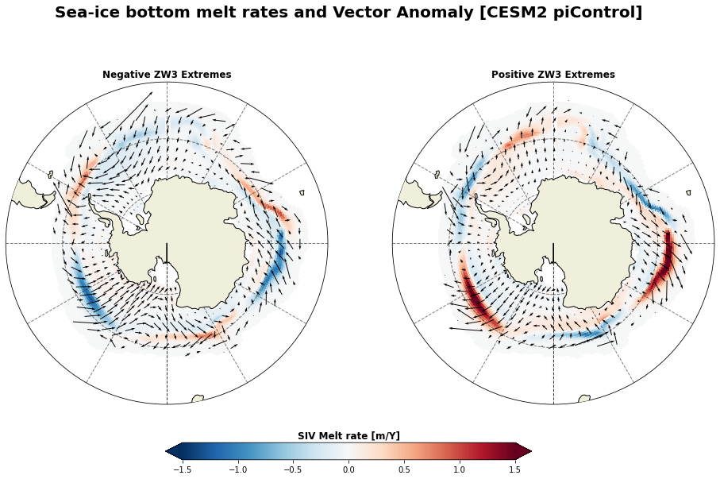
    


```python
fig = plt.figure(figsize=[16,15])

ax = plt.subplot(1,2,1,projection = ccrs.SouthPolarStereo())
ax.add_feature(cfeature.LAND,zorder=100,edgecolor='k')
ax.set_extent([0.005, 360, -90, -45], crs=ccrs.PlateCarree())
dmeridian = 30  # spacing for lines of meridian
dparallel = 15  # spacing for lines of parallel 
num_merid = int(360/dmeridian + 1)
num_parra = int(90/dparallel + 1)

gl = ax.gridlines(crs=ccrs.PlateCarree(), \
                  xlocs=np.linspace(-180, 180, num_merid), \
                  ylocs=np.linspace(0, -90, num_parra), \
                  linestyle="--", linewidth=1, color='k', alpha=0.5)

theta = np.linspace(0, 2*np.pi, 120)
verts = np.vstack([np.sin(theta), np.cos(theta)]).T
center, radius = [0.5, 0.5], 0.5
circle = mpath.Path(verts * radius + center)
ax.set_boundary(circle, transform=ax.transAxes)  #without this; get rect bound

#Top melting rates

data = (HExt_CESM_sidmassmelttop_Anom/919)*-1
data = data.where(data!=0)
data = data*3.154*10**7

CS = ax.pcolormesh(data.lon,data.lat,data.mean(dim='time'),
                   transform=ccrs.PlateCarree(),cmap = plt.cm.RdBu_r,vmin=-0.002,vmax=0.002)


# clev = np.linspace(-1.5,1.5,10)
# CS = ax.contourf(data.lon,data.lat,data.mean(dim='time'),clev,
#                    transform=ccrs.PlateCarree(),cmap = plt.cm.RdBu_r,extend='both')


# Defining the quiver plot
data = HExt_CESM_drifts_Anom_M.isel(ni=slice(None, None, 5),
                              nj=slice(None, None, 5))

data.plot.quiver(x='lon', y='lat', u='siu', v='siv',cmap=plt.cm.get_cmap('gray'), angles = "xy",pivot='mid',
          scale=0.8,units='width',alpha=1,transform=ccrs.PlateCarree())

# plt.title("Negative ZW3 Extremes",fontsize=12,fontweight="bold")

# cbar_ax = fig.add_axes([0.3, 0.25, 0.4, 0.02]) #[left, bottom, width, height]
cbar = fig.colorbar(CS, ax=ax,  orientation='horizontal',extend='both', pad=0.09)
cbar.ax.tick_params(labelsize=10)
cbar.ax.set_title('SIV Melt rate [m/Y]',fontsize=12,fontweight='bold')


ax = plt.subplot(1,2,2,projection = ccrs.SouthPolarStereo())
ax.add_feature(cfeature.LAND,zorder=100,edgecolor='k')
ax.set_extent([0.005, 360, -90, -45], crs=ccrs.PlateCarree())
dmeridian = 30  # spacing for lines of meridian
dparallel = 15  # spacing for lines of parallel 
num_merid = int(360/dmeridian + 1)
num_parra = int(90/dparallel + 1)

gl = ax.gridlines(crs=ccrs.PlateCarree(), \
                  xlocs=np.linspace(-180, 180, num_merid), \
                  ylocs=np.linspace(0, -90, num_parra), \
                  linestyle="--", linewidth=1, color='k', alpha=0.5)

theta = np.linspace(0, 2*np.pi, 120)
verts = np.vstack([np.sin(theta), np.cos(theta)]).T
center, radius = [0.5, 0.5], 0.5
circle = mpath.Path(verts * radius + center)
ax.set_boundary(circle, transform=ax.transAxes)  #without this; get rect bound

#Bottom melting rates

data = (HExt_CESM_sidmassmeltbot_Anom/919)*-1
data = data.where(data!=0)
data = data*3.154*10**7

CS = ax.pcolormesh(data.lon,data.lat,data.mean(dim='time'),
                   transform=ccrs.PlateCarree(),cmap = plt.cm.RdBu_r,vmin=-1.5,vmax=1.5)

# CS = ax.contourf(data.lon,data.lat,data.mean(dim='time'),clev,
#                    transform=ccrs.PlateCarree(),cmap = plt.cm.RdBu_r,extend='both')

# Defining the quiver plot
data = HExt_CESM_drifts_Anom_M.isel(ni=slice(None, None, 5),
                              nj=slice(None, None, 5))

data.plot.quiver(x='lon', y='lat', u='siu', v='siv',cmap=plt.cm.get_cmap('gray'), angles = "xy",pivot='mid',
          scale=0.8,units='width',alpha=1,transform=ccrs.PlateCarree()) 

# plt.title("Positive ZW3 Extremes",fontsize=12,fontweight="bold")

# plt.suptitle("Sea-ice bottom melt rates and Vector Anomaly [CESM2 piControl]",fontsize=20,fontweight="bold",y=0.78)


# cbar_ax = fig.add_axes([0.3, 0.25, 0.4, 0.02]) #[left, bottom, width, height]
cbar = fig.colorbar(CS, ax=ax,  orientation='horizontal',extend='both', pad=0.09)

cbar.ax.tick_params(labelsize=10)
cbar.ax.set_title('SIV Melt rate [m/Y]',fontsize=12,fontweight='bold')

plt.tight_layout()

plt.show()
```


    
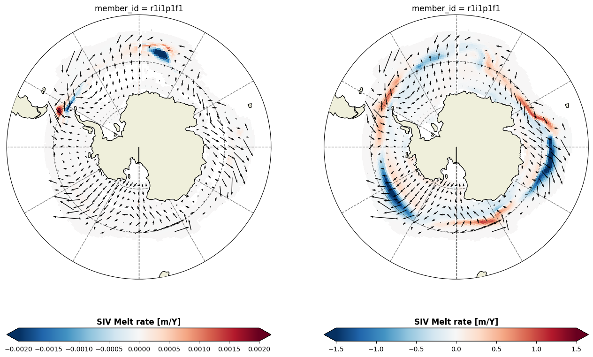
    


```python
HExt_CESM_sidmassmelttop_Anom1 = (HExt_CESM_sidmassmelttop_Anom/919)*-1
HExt_CESM_sidmassmeltbot_Anom1 = (HExt_CESM_sidmassmeltbot_Anom/919)*-1
```


```python
statres_sidmassmelttop, pval_sidmassmelttop = ttest_1samp(HExt_CESM_sidmassmelttop_Anom1,0)
statres_sidmassmeltbot, pval_sidmassmeltbot = ttest_1samp(HExt_CESM_sidmassmeltbot_Anom1,0)
```


```python
fig = plt.figure(figsize=[16,15])


# clevs  = np.arange(-2e-3, 2e-3, 0.3e-3)
clev   = np.round(np.linspace(-1.5,1.5,10),1)
clevs = np.linspace(-2e-3, 2e-3, 14)   # evenly spaced values
 

ax = plt.subplot(1,2,1)

#Bottom melting rates

m = Basemap(projection='splaea',boundinglat=-45,lon_0=180,resolution='l',round=True)
x, y = m(HExt_CESM_sidmassmeltbot.lon.values, HExt_CESM_sidmassmeltbot.lat.values)

m.fillcontinents(color='beige',lake_color='beige')
m.drawcoastlines()
m.drawparallels(np.arange(-80.,81.,20.))
m.drawmeridians(np.arange(-180.,181.,20.))
m.drawmapboundary(fill_color='white')

data = HExt_CESM_sidmassmelttop_Anom1 #(HExt_CESM_sidmassmelttop_Anom/919)*-1
data = data.where(data!=0)
data = data*3.154*10**7

CS = m.contourf(x,y,data.mean('time'),clevs,cmap=plt.cm.get_cmap('seismic'),extend='both');
CS1 = m.contour(x, y,CESM_SIC_SH_ASO.siconc,colors ='red',levels=[15],linewidths=2.5);


# significance mask
# sig_mask = np.where(statres_sidmassmelttop < 0.05, 1, np.nan)

# # restrict to inside red contour (siconc >= 15%)
# seaice_mask = np.where(CESM_SIC_SH_ASO.siconc >= 15, 1, np.nan)
# sig_mask = sig_mask * seaice_mask

# # overlay hatches
# m.contourf(x, y, sig_mask, levels=[0.5, 1.5], hatches=['////'], alpha=0)


# skip=(slice(None,None,4),slice(None,None,4))
# u_rot, v_rot, x, y = m.rotate_vector(HExt_CESM_drifts_Anom_M.siu,HExt_CESM_drifts_Anom_M.siv, 
#                                      HExt_CESM_drifts_Anom_M.lon.values, HExt_CESM_drifts_Anom_M.lat.values, 
#                                      returnxy=True)
# Q = m.quiver(x[skip], y[skip], u_rot[skip], v_rot[skip], angles = "xy",scale=0.5,pivot='mid',units='width',
#              alpha=0.5)
    
# ax.clabel(CS1, inline=True, fontsize=15) 

cbar = fig.colorbar(CS, ax=ax, orientation='horizontal', extend='both')
cbar.set_ticks([-0.002  , -0.00138,  -0.00077, -0.00015,  0.00015,    0.00077,    0.00138, 0.002])  

cbar.ax.tick_params(labelsize=13)

for t in cbar.ax.get_xticklabels():
    t.set_rotation(45)
    t.set_fontsize(13)
    
cbar.ax.set_title('SIV Melt rate [m/Y]', fontsize=13, fontweight='bold')

ax.set_title("Top sea-ice melt rate", fontsize=18, fontweight='bold')

# Set the colorbar tick labels to scientific notation
formatter = plt.ScalarFormatter(useMathText=True)
formatter.set_scientific(True)
formatter.set_powerlimits((-1, 1))
cbar.ax.xaxis.set_major_formatter(formatter)


ax = plt.subplot(1,2,2)

m = Basemap(projection='splaea',boundinglat=-45,lon_0=180,resolution='l',round=True)
x, y = m(HExt_CESM_sidmassmeltbot.lon.values, HExt_CESM_sidmassmeltbot.lat.values)

m.fillcontinents(color='beige',lake_color='beige')
m.drawcoastlines()
m.drawparallels(np.arange(-80.,81.,20.))
m.drawmeridians(np.arange(-180.,181.,20.))
m.drawmapboundary(fill_color='white')

# Bottom melting rates

data = HExt_CESM_sidmassmeltbot_Anom1 #(HExt_CESM_sidmassmeltbot_Anom/919)*-1
data = data.where(data!=0)
data = data*3.154*10**7

CS = m.contourf(x,y,data.mean('time'),clev,cmap=plt.cm.get_cmap('seismic'),extend='both');
CS1 = m.contour(x, y,CESM_SIC_SH_ASO.siconc,colors ='red',levels=[15],linewidths=2.5);

# significance mask
# sig_mask = np.where(statres_sidmassmeltbot < 0.05, 1, np.nan)

# # restrict to inside red contour (siconc >= 15%)
# seaice_mask = np.where(CESM_SIC_SH_ASO.siconc >= 15, 1, np.nan)
# sig_mask = sig_mask * seaice_mask

# overlay hatches
# m.contourf(x, y, sig_mask, levels=[0.5, 1.5], hatches=['////'], alpha=0)

# skip=(slice(None,None,4),slice(None,None,4))
# u_rot, v_rot, x, y = m.rotate_vector(HExt_CESM_drifts_Anom_M.siu,HExt_CESM_drifts_Anom_M.siv, 
#                                      HExt_CESM_drifts_Anom_M.lon.values, HExt_CESM_drifts_Anom_M.lat.values, 
#                                      returnxy=True)
# Q = m.quiver(x[skip], y[skip], u_rot[skip], v_rot[skip], angles = "xy",scale=0.5,pivot='mid',units='width',
#              alpha=0.5)
# qk = plt.quiverkey(Q, -0.1, 0.2, 0.05, '0.05 m/s', labelpos='N')

# ax.clabel(CS1, inline=True, fontsize=15) 

ax.set_title("Bottom sea-ice melt rate", fontsize=18, fontweight='bold');

cbar = fig.colorbar(CS, ax=ax,  orientation='horizontal',extend='both')

# cbar.ax.tick_params(labelsize=13)
for t in cbar.ax.get_xticklabels():
    t.set_rotation(45)
    t.set_fontsize(13)
    
cbar.ax.set_title('SIV Melt rate [m/Y]',fontsize=13,fontweight='bold')

plt.tight_layout()

# plt.savefig('BotTopMelt_Vectors_HighExt_ZW3.png',bbox_inches='tight',dpi=200)

plt.show()
```


    
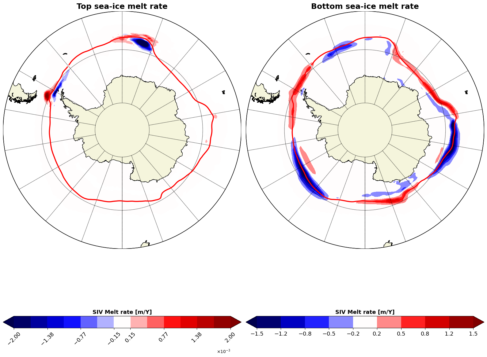
    


```python
## Combined overlayed plot:
```


```python
fig = plt.figure(figsize=[16,15])


clev1 = np.linspace(-20,20,8)
clev  = np.linspace(-0.3,0.3,10)


ax = plt.subplot(1,2,1,projection = ccrs.SouthPolarStereo())
ax.add_feature(cfeature.LAND,zorder=100,edgecolor='k')
ax.set_extent([0.005, 360, -90, -48], crs=ccrs.PlateCarree())
dmeridian = 30  # spacing for lines of meridian
dparallel = 15  # spacing for lines of parallel 
num_merid = int(360/dmeridian + 1)
num_parra = int(90/dparallel + 1)

gl = ax.gridlines(crs=ccrs.PlateCarree(), \
                  xlocs=np.linspace(-180, 180, num_merid), \
                  ylocs=np.linspace(0, -90, num_parra), \
                  linestyle="--", linewidth=1, color='k', alpha=0.5)

theta = np.linspace(0, 2*np.pi, 120)
verts = np.vstack([np.sin(theta), np.cos(theta)]).T
center, radius = [0.5, 0.5], 0.5
circle = mpath.Path(verts * radius + center)
ax.set_boundary(circle, transform=ax.transAxes)  #without this; get rect bound

#Top melting rates

SIT = LExt_CESM_SIT_Anom.where(pval_HSIT<0.05)
SIC = LExt_CESM_SIC_Anom.where(pval_HSIC<0.05)

CS = ax.contourf(SIT.lon,SIT.lat,SIT.mean('time'),clev,cmap=plt.cm.get_cmap('RdBu_r'),transform=ccrs.PlateCarree(),
                 extend='both');
ax.contour(SIC.lon,SIC.lat,SIC.mean('time'),clev1,colors='black',transform=ccrs.PlateCarree(),linewidth=2,
           alpha=1);

# Defining the quiver plot
data = LExt_CESM_drifts_Anom_M.isel(ni=slice(None, None, 5),
                              nj=slice(None, None, 5))

data.plot.quiver(x='lon', y='lat', u='siu', v='siv',cmap=plt.cm.get_cmap('gray'), angles = "xy",pivot='mid',
          scale=0.8,units='width',alpha=0.6,transform=ccrs.PlateCarree())

plt.title(" Negative ZW3 Extremes",fontsize=12,fontweight="bold")

################################################################################

ax = plt.subplot(1,2,2,projection = ccrs.SouthPolarStereo())
ax.add_feature(cfeature.LAND,zorder=100,edgecolor='k')
ax.set_extent([0.005, 360, -90, -48], crs=ccrs.PlateCarree())
dmeridian = 30  # spacing for lines of meridian
dparallel = 15  # spacing for lines of parallel 
num_merid = int(360/dmeridian + 1)
num_parra = int(90/dparallel + 1)

gl = ax.gridlines(crs=ccrs.PlateCarree(), \
                  xlocs=np.linspace(-180, 180, num_merid), \
                  ylocs=np.linspace(0, -90, num_parra), \
                  linestyle="--", linewidth=1, color='k', alpha=0.5)

theta = np.linspace(0, 2*np.pi, 120)
verts = np.vstack([np.sin(theta), np.cos(theta)]).T
center, radius = [0.5, 0.5], 0.5
circle = mpath.Path(verts * radius + center)
ax.set_boundary(circle, transform=ax.transAxes)  #without this; get rect bound

#Top melting rates

SIT = HExt_CESM_SIT_Anom.where(pval_HSIT<0.05)
SIC = HExt_CESM_SIC_Anom.where(pval_HSIC<0.05)

CS = ax.contourf(SIT.lon,SIT.lat,SIT.mean('time'),clev,cmap=plt.cm.get_cmap('RdBu_r'),transform=ccrs.PlateCarree(),
                 extend='both');
ax.contour(SIC.lon,SIC.lat,SIC.mean('time'),clev1,colors='black',transform=ccrs.PlateCarree(),linewidth=2,
           alpha=1);

# Defining the quiver plot
data = HExt_CESM_drifts_Anom_M.isel(ni=slice(None, None, 5),
                              nj=slice(None, None, 5))

data.plot.quiver(x='lon', y='lat', u='siu', v='siv',cmap=plt.cm.get_cmap('gray'), angles = "xy",pivot='mid',
          scale=0.8,units='width',alpha=0.6,transform=ccrs.PlateCarree()) 

plt.title("Positive ZW3 Extremes",fontsize=12,fontweight="bold")

plt.suptitle("Sea-ice thickness and Vector Anomaly [CESM2 piControl]",fontsize=20,fontweight="bold",y=0.78)


cbar_ax = fig.add_axes([0.3, 0.25, 0.4, 0.02]) #[left, bottom, width, height]
cbar = fig.colorbar(CS, cax=cbar_ax,  orientation='horizontal',extend='both')

cbar.ax.tick_params(labelsize=10)
cbar.ax.set_title('SIT [m]',fontsize=12,fontweight='bold')

plt.savefig('SIT-SIC_IceVector_Extremes.pdf',dpi=200)

plt.show()
```


    
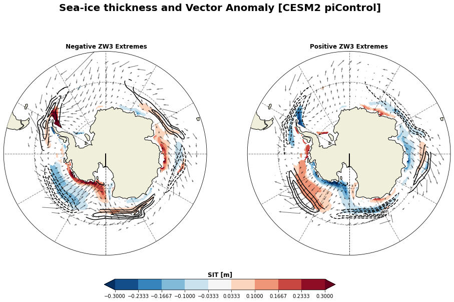
    


## Calculating the Meridioanl Energy Transport:

### AMET: 


```python
import sympy as sp
```


```python
from sympy.abc import *
from sympy import *
```


```python
# #Using va from CESM2:

cat5  = dataframe.search(experiment_id=['piControl'], table_id=['Amon'],source_id=['CESM2'], 
                         variable_id=['hus','ta','zg','ua','va','ps'],
                 member_id = ['r1i1p1f1'], grid_label=['gn'])

z_kwargs  = {'consolidated': True, 'use_cftime':True}
c_kwargs={"chunks": {"time": 1}}

# with dask.config.set(**{'array.slicing.split_large_chunks': True}):
#     dset_dict5 = cat5.to_dataset_dict(zarr_kwargs=z_kwargs)


dset_dict5 = cat5.to_dataset_dict(zarr_kwargs=z_kwargs,cdf_kwargs=c_kwargs)
```


```python
# Define symbols
T, q, z, u, v, ps, pt, g, cp, Lv,p = sp.symbols('T q z u v p_s p_t g c_p L_v p')
lon_min, lon_max = sp.symbols('phi_1 phi_2')
lon = sp.symbols('x')
```


```python
flux_eqn = ((1 - q) * cp * T + Lv * q + g * z + 0.5 * (v ** 2 + u ** 2)) * v/g
```


```python
# sp.Integral(flux_eqn,(p,ps,pt))
```


```python
flux_Ps_integrate = sp.integrate(flux_eqn,(p,ps,pt))


print("Symbolic expression for atmospheric meridional energy flux across atmosphere depth:")
sp.Integral(flux_eqn,(p,ps,pt),(lon,lon_min,lon_max))
```


```python
# Substitute the actual values for constants
cp_value = 1004.64  # Specific heat capacity of dry air at constant pressure (J/kg·K)
Lv_value = 2500000  # Specific heat of condensation (J/kg)
g_value = 9.80616  # Acceleration due to gravity (m/s^2)

# flux_Ps_integrate = flux_Ps_integrate.subs([(cp, cp_value), (Lv, Lv_value),(g, g_value)])
# flux_Ps_integrate
```


```python
## Using numpy
```


```python
Q = dset_dict5['CMIP.NCAR.CESM2.piControl.Amon.gn'].hus.squeeze()
TA = dset_dict5['CMIP.NCAR.CESM2.piControl.Amon.gn'].ta.squeeze()
zg = dset_dict5['CMIP.NCAR.CESM2.piControl.Amon.gn'].zg.squeeze()

VA = dset_dict5['CMIP.NCAR.CESM2.piControl.Amon.gn'].va.squeeze()
UA = dset_dict5['CMIP.NCAR.CESM2.piControl.Amon.gn'].ua.squeeze()

sp = dset_dict5['CMIP.NCAR.CESM2.piControl.Amon.gn'].ps.squeeze()
```


```python
# Calculate the terms of the equation for AMET:

internal_energy      = ((cp_value*(1-Q)*TA)/ g_value)*VA #*dp

latent_heat      = ((Lv_value*Q)/ g_value)*VA #*dp

potential_energy      = (zg / g_value)*VA #*dp

kinetic_energy      = (0.5 * (UA**2 + VA**2) / g_value)*VA #*dp

AMET = internal_energy + latent_heat + potential_energy + kinetic_energy
```


```python

```


```python
np.gradient(h)
```


```python
dp.sum()
```


```python
from tqdm import tqdm

h = np.array(Q.plev) # array for the different pressure levels: from surface to TOA
dp =abs(np.gradient(h)) #pressure level depths

# It took more than 2 hours!!
# for i in tqdm(np.arange(len(h))):
#     AMET[:,i,:,:] =  dp[i]*AMET[:,i,:,:]
```


```python

```

Use the AMET after pressure level differentiation: i.e. multiplying it with pressure depths


```python
# #extracting time-series: vertical integral
AMET_Flux = AMET.sum(dim='plev')

# #extracting time-series: Areal integral
AMET_Flux_TS = AMET.sum(dim='plev').sel(lat=-50,method='nearest').sum('lon')

# #time integral:
AMET_Flux_Longitude = AMET.sum(dim='plev').sel(lat=-50,method='nearest').sum('time')


# Selecting extremes: 
HighEx_AMET = AMET.sel(time=High_extremes_Dates.time)
LowEx_AMET  = AMET.sel(time=Low_extremes_Dates.time)

#extracting time-series: Areal integral
HighEx_AMET_Flux_TS = HighEx_AMET.sum(dim='plev').sel(lat=-50,method='nearest').sum('lon')
LowEx_AMET_Flux_TS  = LowEx_AMET.sum(dim='plev').sel(lat=-50,method='nearest').sum('lon')

#time integral:
HighEx_AMET_Flux_Longitude = HighEx_AMET.sum(dim='plev').sel(lat=-50,method='nearest').sum('time')
LowEx_AMET_Flux_Longitude  = LowEx_AMET.sum(dim='plev').sel(lat=-50,method='nearest').sum('time')
```


```python
# AMET Flux for the southern hemisphere:

AMET_Flux_SH        = AMET_Flux.sel(lat=slice(-90,-50))
HighEx_AMET_Flux_SH = HighEx_AMET.sum(dim='plev').sel(lat=slice(-90,-50))
LowEx_AMET_Flux_SH  = LowEx_AMET.sum(dim='plev').sel(lat=slice(-90,-50))
```

### Let's use the ncfiles which we created for AMET:


```python
AMET_SH = xr.open_dataset("/Volumes/SHREYA/Ch3-ZW3_Extreme_Analysis/Extreme_ZW3-II/New_NC_Files/AMET_Flux_SH_CMIP.NCAR.CESM2.piControl.Amon.gn.nc").rename(__xarray_dataarray_variable__='AMET').load()
```

### Should we do an integration like this?


```python
from tqdm import tqdm
```


```python
sic = CESM_SIC_SH_ASO
```


```python
#Regridded AMET:
regridder = xe.Regridder(AMET_SH,sic,'bilinear',ignore_degenerate=True)
AMET_regridded = regridder(AMET_SH, keep_attrs=True)
```


```python
Ice_edge_mask = sic.where((sic.siconc>15) & (sic.siconc<=16), drop=False)
Ice_edge_mask = Ice_edge_mask.drop_dims('nvertices')
Ice_edge_mask.siconc.plot()
```


    <matplotlib.collections.QuadMesh at 0x7f70597ef210>


    
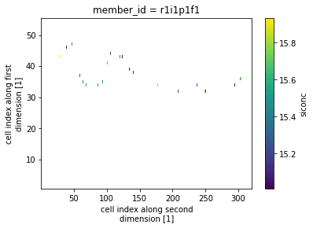
    


```python
ICE_Edge_AMET = AMET_regridded.AMET.where(Ice_edge_mask, drop=False)
ICE_Edge_AMET = ICE_Edge_AMET.rename(siconc='AMET')
```


```python
HExt_CESM_AMET = ICE_Edge_AMET.sel(time=High_extremes_Dates.time)
LExt_CESM_AMET = ICE_Edge_AMET.sel(time=Low_extremes_Dates.time)

LExt_CESM_AMET_Anom = LExt_CESM_AMET.groupby('time.month') - ICE_Edge_AMET.groupby('time.month').mean(dim='time',skipna=True)
HExt_CESM_AMET_Anom = HExt_CESM_AMET.groupby('time.month') - ICE_Edge_AMET.groupby('time.month').mean(dim='time',skipna=True)
```


```python
LExt_CESM_AMET_Anom.AMET.sum(('nj','time')).plot(color='red')
HExt_CESM_AMET_Anom.AMET.sum(('nj','time')).plot(color='black')
# LExt_CESM_AMET_Anom1.AMET.sel(lat=slice(-65,-54)).mean(('lat','time')).plot(color='black')
```


    [<matplotlib.lines.Line2D at 0x7f705ad7dbd0>]


    
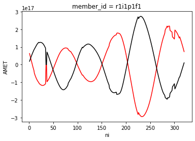
    


```python
## Without ice-edge cropping:
```


```python
HExt_CESM_AMET1 = AMET_SH.sel(time=High_extremes_Dates.time)
# LExt_CESM_AMET1 = AMET_SH.sel(time=Low_extremes_Dates.time)

# LExt_CESM_AMET_Anom1 = LExt_CESM_AMET1.groupby('time.month') - AMET_SH.groupby('time.month').mean(dim='time',skipna=True)
HExt_CESM_AMET_Anom1 = HExt_CESM_AMET1.groupby('time.month') - AMET_SH.groupby('time.month').mean(dim='time',skipna=True)
```


```python
LExt_CESM_AMET_Anom1.AMET.sel(lat=slice(-65,-54)).sum(('lat','time')).plot(color='red')
# HExt_CESM_AMET_Anom.AMET.mean(('nj','time')).plot(color='red')
HExt_CESM_AMET_Anom1.AMET.sel(lat=slice(-65,-54)).sum(('lat','time')).plot(color='black')
```


    [<matplotlib.lines.Line2D at 0x7f705aee3050>]


    
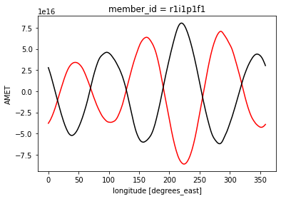
    


```python
LExt_CESM_AMET_Anom1.AMET.sel(lat=-50,method='nearest').sum(('time')).plot(color='red')
# HExt_CESM_AMET_Anom.AMET.mean(('nj','time')).plot(color='red')
HExt_CESM_AMET_Anom1.AMET.sel(lat=-50,method='nearest').sum(('time')).plot(color='black')

plt.title("AMET at lat=50S")

plt.show()
```


    
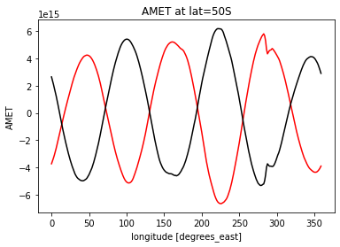
    


```python
## integrated over dx
```


```python
HExt_CESM_AMET11 = AMET_SH_Flux_ds.sel(time=High_extremes_Dates.time)
LExt_CESM_AMET11 = AMET_SH_Flux_ds.sel(time=Low_extremes_Dates.time)

LExt_CESM_AMET_Anom11 = LExt_CESM_AMET11.groupby('time.month') - AMET_SH_Flux_ds.groupby('time.month').mean(dim='time',skipna=True)
HExt_CESM_AMET_Anom11 = HExt_CESM_AMET11.groupby('time.month') - AMET_SH_Flux_ds.groupby('time.month').mean(dim='time',skipna=True)
```


```python
LExt_CESM_AMET_Anom11.sel(lat=slice(-65,-54)).sum(('lat','time')).plot(color='red')
# HExt_CESM_AMET_Anom.AMET.mean(('nj','time')).plot(color='red')
HExt_CESM_AMET_Anom11.sel(lat=slice(-65,-54)).sum(('lat','time')).plot(color='black')
```


```python
# Regressions:
```


```python
from sklearn.linear_model import LinearRegression
import statsmodels.api as sm
```


```python
AMET_SH_ASO = AMET_SH.where(AMET_SH.time.dt.month.isin([8,9,10]), drop=True)
# ICE_Edge_AMET_ASO = ICE_Edge_AMET.where(ICE_Edge_AMET.time.dt.month.isin([8,9,10]), drop=True)
```


```python
CESM_AMET_Anom = AMET_SH_ASO.groupby('time.month') - AMET_SH.groupby('time.month').mean(dim='time',skipna=True)
# ICE_Edge_AMET_Anom = ICE_Edge_AMET_ASO.groupby('time.month') - ICE_Edge_AMET.groupby('time.month').mean(dim='time',skipna=True)
```


```python
ZW3_AMET_DF = pd.DataFrame()
ZW3_AMET_DF['time'] = ZW3_df["time"]#.dt.strftime("%Y-%m-%d")
ZW3_AMET_DF['ZW3'] = ZW3_df["ZW3-Index"]
ZW3_AMET_DF['AMET'] = (CESM_AMET_Anom.AMET.sel(lat=-50,method='nearest').sum(('lon')))#/10**12
# ZW3_AMET_DF['AMET'] = ICE_Edge_AMET_Anom.AMET.mean(('nj','ni'))/10**12
```


```python
linear_regressor = LinearRegression()

x = ZW3_AMET_DF['ZW3'].values.reshape(-1, 1)
y = ZW3_AMET_DF['AMET'].values.reshape(-1, 1)
linear_regressor.fit(x, y)  # perform linear regression for SIT
pred = linear_regressor.predict(x)  # make predictions for SIT
```


```python
linear_regressor.score(x, y)
```


    0.010342014722031001


```python
# Fit the OLS (Ordinary Least Squares) model
model = sm.OLS(y, x)
results = model.fit()

# Retrieve the p-values
p_values = results.pvalues

# Print the p-values
print(p_values)

```

    [9.57533495e-10]


```python
results.summary()
```


<table class="simpletable">
<caption>OLS Regression Results</caption>
<tr>
  <th>Dep. Variable:</th>            <td>y</td>        <th>  R-squared (uncentered):</th>       <td>   0.010</td>  
</tr>
<tr>
  <th>Model:</th>                   <td>OLS</td>       <th>  Adj. R-squared (uncentered):</th>  <td>   0.010</td>  
</tr>
<tr>
  <th>Method:</th>             <td>Least Squares</td>  <th>  F-statistic:       </th>           <td>   37.61</td>  
</tr>
<tr>
  <th>Date:</th>             <td>Wed, 21 Jun 2023</td> <th>  Prob (F-statistic):</th>           <td>9.58e-10</td>  
</tr>
<tr>
  <th>Time:</th>                 <td>10:55:49</td>     <th>  Log-Likelihood:    </th>          <td>-1.2287e+05</td>
</tr>
<tr>
  <th>No. Observations:</th>      <td>  3600</td>      <th>  AIC:               </th>           <td>2.457e+05</td> 
</tr>
<tr>
  <th>Df Residuals:</th>          <td>  3599</td>      <th>  BIC:               </th>           <td>2.457e+05</td> 
</tr>
<tr>
  <th>Df Model:</th>              <td>     1</td>      <th>                     </th>               <td> </td>     
</tr>
<tr>
  <th>Covariance Type:</th>      <td>nonrobust</td>    <th>                     </th>               <td> </td>     
</tr>
</table>
<table class="simpletable">
<tr>
   <td></td>     <th>coef</th>     <th>std err</th>      <th>t</th>      <th>P>|t|</th>  <th>[0.025</th>    <th>0.975]</th>  
</tr>
<tr>
  <th>x1</th> <td>-2.538e+13</td> <td> 4.14e+12</td> <td>   -6.133</td> <td> 0.000</td> <td>-3.35e+13</td> <td>-1.73e+13</td>
</tr>
</table>
<table class="simpletable">
<tr>
  <th>Omnibus:</th>       <td>12.536</td> <th>  Durbin-Watson:     </th> <td>   1.732</td>
</tr>
<tr>
  <th>Prob(Omnibus):</th> <td> 0.002</td> <th>  Jarque-Bera (JB):  </th> <td>  12.548</td>
</tr>
<tr>
  <th>Skew:</th>          <td> 0.143</td> <th>  Prob(JB):          </th> <td> 0.00188</td>
</tr>
<tr>
  <th>Kurtosis:</th>      <td> 3.048</td> <th>  Cond. No.          </th> <td>    1.00</td>
</tr>
</table><br/><br/>Notes:<br/>[1] R² is computed without centering (uncentered) since the model does not contain a constant.<br/>[2] Standard Errors assume that the covariance matrix of the errors is correctly specified.


```python
fig, ax1 = plt.subplots(1,1,figsize=(12,8))

# fig.suptitle("Scatter plot: Meridional Winds vs. SIA (1850-2014)", fontweight ='bold',
#              fontsize=20, y=0.95)

# ax1.set_xlim(-3,3)
# ax1.set_ylim(-2,2)


sns.scatterplot(x='ZW3',y='AMET', data=ZW3_AMET_DF,
                s=50, alpha=0.4, color="black",ax=ax1)

plt.plot(x, pred, color='red',linewidth=3)

ax1.set_xlabel("ZW3 Index",fontsize=15,fontweight ='bold')
ax1.set_ylabel("AMET",fontsize=15,fontweight ='bold')

# ax1.set_title('Cirrcumpolar SIT',fontsize=20)

# ax1.get_legend().remove()
# ax1.axhline(y = 0, color='black')
# ax1.axvline(x = 0, color='black')

# ax1.legend(loc='upper center', bbox_to_anchor=(0.5, -0.08),
#           fancybox=True, shadow=True, ncol=6)

# plt.grid()
# plt.savefig('Bivariate_scatter_for_Model_Selection_SIV.pdf',dpi=300, bbox_inches='tight')

plt.show()
```


    
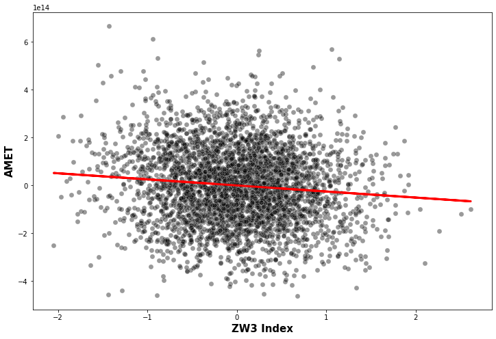
    


```python
fig = plt.figure(figsize=[16,8])

clevs = np.arange(-0.04,0.04,0.0025) #np.linspace(-0.04,0.04,20)
clevs = np.round(clevs,3)

clev = np.linspace(-65,65,15)

ax = plt.subplot(1,1,1,projection = ccrs.SouthPolarStereo())
ax.add_feature(cfeature.LAND,zorder=100,edgecolor='k')
ax.set_extent([0.005, 360, -90, -50], crs=ccrs.PlateCarree())
dmeridian = 30  # spacing for lines of meridian
dparallel = 15  # spacing for lines of parallel 
num_merid = int(360/dmeridian + 1)
num_parra = int(90/dparallel + 1)

gl = ax.gridlines(crs=ccrs.PlateCarree(), \
                  xlocs=np.linspace(-180, 180, num_merid), \
                  ylocs=np.linspace(0, -90, num_parra), \
                  linestyle="--", linewidth=1, color='k', alpha=0.5)

theta = np.linspace(0, 2*np.pi, 120)
verts = np.vstack([np.sin(theta), np.cos(theta)]).T
center, radius = [0.5, 0.5], 0.5
circle = mpath.Path(verts * radius + center)
ax.set_boundary(circle, transform=ax.transAxes)  #without this; get rect bound

#Top melting rates

data = HExt_CESM_AMET_Anom1/10**15

CS = ax.contourf(data.lon,data.lat,data.AMET.mean('time'),clevs,cmap=plt.cm.get_cmap('PiYG_r'),
                 transform=ccrs.PlateCarree(),
                 extend='both');

data1 = HExt_CESM_GPT500_Anom

CS1= ax.contour(data1.lon,data1.lat,data1.mean('time'),clev,colors='black',alpha=0.5,
                 transform=ccrs.PlateCarree(),
                 extend='both');
ax.clabel(CS1, inline=True, fontsize=10)

cbar_ax = fig.add_axes([0.3, 0.05, 0.4, 0.02]) #[left, bottom, width, height]
cbar = fig.colorbar(CS, cax=cbar_ax,  orientation='horizontal',extend='both')

cbar.ax.tick_params(labelsize=10)
cbar.ax.set_title('AMET [PW]',fontsize=12,fontweight='bold')

# plt.tight_layout()

# plt.savefig('AMET_HExtZW3.png',dpi=200)


plt.show()

```


    
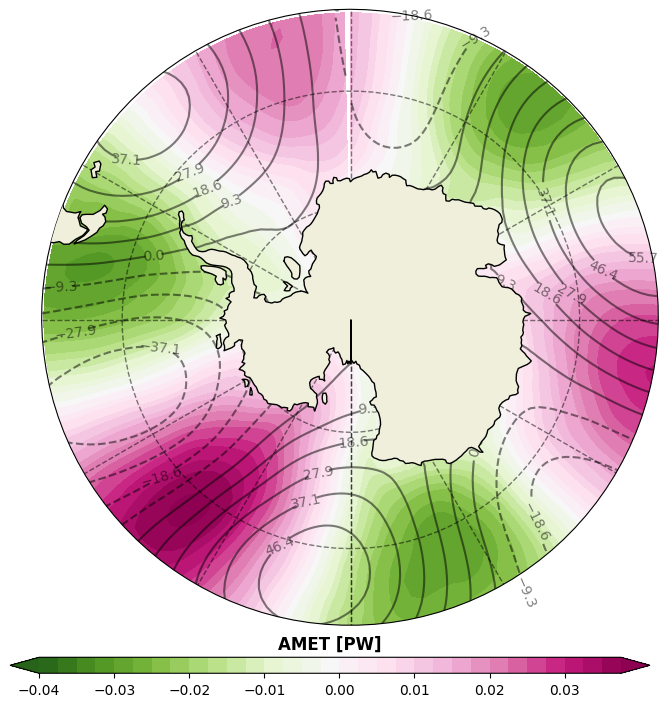
    


## Final plot with all the variables:


```python
fig = plt.figure(figsize=[16,15])
clevs = np.linspace(-8*10**15,8*10**15,20)
clev  = np.linspace(-0.3,0.3,10)
clevs1  = np.linspace(-20,20,10)
clevs3 = np.linspace(-65,65,15)

# Tick labels
x_tick_labels = [u'0\N{DEGREE SIGN}E', u'90\N{DEGREE SIGN}E',
                 u'180\N{DEGREE SIGN}E', u'90\N{DEGREE SIGN}W',
                 u'0\N{DEGREE SIGN}E']

y_tick_labels = [u'50\N{DEGREE SIGN}S', u'60\N{DEGREE SIGN}S',
                 u'70\N{DEGREE SIGN}S', u'80\N{DEGREE SIGN}S',
                 u'90\N{DEGREE SIGN}S']


ax = plt.subplot(3,2,1)
ax.set_ylim(-90,90)
data = LExt_CESM_AMET_Anom1/10**15

data.AMET.sel(lat=slice(-65,-54)).sum(('lat','time')).plot(color='red',linewidth=3)

ax.set_xticks([0, 90, 180, 270, 358])
ax.set_xticklabels(x_tick_labels,fontsize=12)

ax.set(xlabel=None)
ax.set_ylabel("AMET",fontsize=12,fontweight='bold')
ax.yaxis.set_tick_params(labelsize=12)

ax.set_title("Negative ZW3 Extremes",fontsize=18,fontweight='bold')

plt.margins(x=0)


ax = plt.subplot(3,2,2)
ax.set_ylim(-90,90)
data = HExt_CESM_AMET_Anom1/10**15

data.AMET.sel(lat=slice(-65,-54)).sum(('lat','time')).plot(color='red',linewidth=3)

ax.set_xticks([0, 90, 180, 270, 358])
ax.set_xticklabels(x_tick_labels,fontsize=12)
ax.yaxis.set_tick_params(labelsize=12)

ax.set(xlabel=None)
ax.set_ylabel("AMET",fontsize=12,fontweight='bold')

ax.set_title("Positive ZW3 Extremes",fontsize=18,fontweight='bold')

plt.margins(x=0)

ax = plt.subplot(3,2,3)
data = LExt_CESM_AMET_Anom1#.sel(lat=slice(-65,-54))
CS = ax.contourf(data.lon,data.lat,data.AMET.sum(dim='time',skipna=True),clevs,cmap = plt.cm.PiYG_r,extend='both')

GPT = LExt_CESM_GPT500_Anom.sel(lat=slice(-90,-50))
ax.contour(GPT.lon,GPT.lat,GPT.mean(dim='time'),clevs3,colors='black',alpha=0.5);

ax.set_xticks([0, 90, 180, 270, 358])
ax.set_xticklabels(x_tick_labels,fontsize=12)

ax.set_yticks([-50, -60, -70, -80, -90])
ax.set_yticklabels(y_tick_labels,fontsize=12)

ax = plt.subplot(3,2,4)
data = HExt_CESM_AMET_Anom1#.sel(lat=slice(-65,-54))
CS = plt.contourf(data.lon,data.lat,data.AMET.sum(dim='time',skipna=True),clevs,cmap = plt.cm.PiYG_r,extend='both')

GPT = HExt_CESM_GPT500_Anom.sel(lat=slice(-90,-50))
ax.contour(GPT.lon,GPT.lat,GPT.mean(dim='time'),clevs3,colors='black',alpha=0.5);

ax.set_xticks([0, 90, 180, 270, 358])
ax.set_xticklabels(x_tick_labels,fontsize=12)

ax.set_yticks([-50, -60, -70, -80, -90])
ax.set_yticklabels(y_tick_labels,fontsize=12)

cbar_ax = fig.add_axes([0.3, 0.001, 0.4, 0.02]) #[left, bottom, width, height]
cbar = fig.colorbar(CS, cax=cbar_ax,  orientation='horizontal',extend='both')


ax = plt.subplot(3,2,5)

SIT = LExt_CESM_SIT_Anom.where(pval_LSIT<0.05)
SIC = LExt_CESM_SIC_Anom.where(pval_LSIC<0.05)

CS = ax.contourf(SIT.ni,SIT.nj,SIT.mean('time'),clev,cmap=plt.cm.get_cmap('RdBu_r'),extend='both');
ax.contour(SIC.ni,SIC.nj,SIC.mean('time'),clevs1,colors ='black',linewidths=1.5);

ax.contour(SIC.ni,SIC.nj,CESM_SIC_SH_ASO.siconc,colors ='red',levels=[0.15],linewidths=2.5);

plt.margins(x=0)

ax.set_xticks([0, 85, 165, 245, 320])
ax.set_xticklabels(x_tick_labels,fontsize=12)

ax.set_yticks([60, 45, 30, 15, 0])
ax.set_yticklabels(y_tick_labels,fontsize=12)


ax = plt.subplot(3,2,6)

SIT = HExt_CESM_SIT_Anom.where(pval_LSIT<0.05)
SIC = HExt_CESM_SIC_Anom.where(pval_LSIC<0.05)

CS1 = ax.contourf(SIT.ni,SIT.nj,SIT.mean('time'),clev,cmap=plt.cm.get_cmap('RdBu_r'),extend='both');
ax.contour(SIC.ni,SIC.nj,SIC.mean('time'),clevs1,colors ='black',linewidths=1.5);

ax.contour(SIC.ni,SIC.nj,CESM_SIC_SH_ASO.siconc,colors ='red',levels=[0.15],linewidths=2.5);

plt.margins(x=0)

ax.set_xticks([0, 85, 165, 245, 320])
ax.set_xticklabels(x_tick_labels,fontsize=12)

ax.set_yticks([60, 45, 30, 15, 0])
ax.set_yticklabels(y_tick_labels,fontsize=12)


fig.suptitle("AMET Anomalies (CESM2-piControl)",fontsize=25,fontweight='bold',y=0.95)
cbar_ax = fig.add_axes([0.3, 0.05, 0.4, 0.02]) #[left, bottom, width, height]
cbar = fig.colorbar(CS1, cax=cbar_ax,  orientation='horizontal',extend='both')


cbar.ax.tick_params(labelsize=10)

plt.show()
```


    
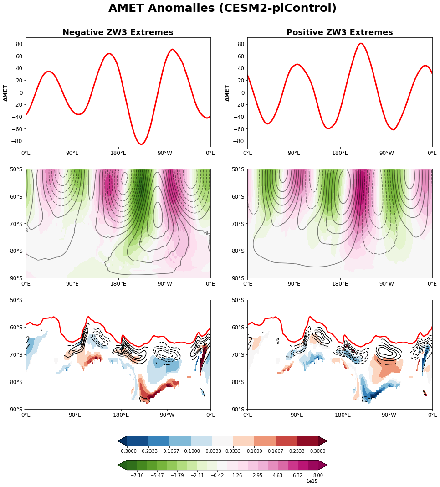
    


## Linear Regressions:


```python
 def linearRegress(var_x, var_y, lag=0):
        if var_y.ndim == 3 and var_x.ndim == 1:
            print("One time series is regressed on a 2D field.")
            if lag == 0:
                t,y,x  = var_y.shape
                slope = np.zeros((y, x), dtype=float)
                r_value = np.zeros((y, x),  dtype=float)
                p_value = np.zeros((y, x),  dtype=float)
                for i in np.arange(y):
                    for j in np.arange(x):
                        slope[i,j], _, r_value[i,j], p_value[i,j], _ = stats.linregress(var_x, var_y[:,i,j])
            elif type(lag) == int:
                print ("This is a regression with lead/lag analysis.")
                print ("Positive lag means 2nd input leads 1st, vice versa.")
                t, y, x  = var_y.shape
                slope = np.zeros((y, x), dtype=float)
                r_value = np.zeros((y, x), dtype=float)
                p_value = np.zeros((y, x), dtype=float)
                for i in np.arange(y):
                    for j in np.arange(x):
                        if lag > 0:
                            slope[i,j], _, r_value[i,j], p_value[i,j], _ = stats.linregress(var_x[lag:],
                                                                                            var_y[:-lag,i,j])
                        elif lag < 0:
                            slope[i,j], _, r_value[i,j], p_value[i,j], _ = stats.linregress(var_x[:lag],
                                                                                            var_y[-lag:,i,j])
        return slope, r_value, p_value
```

### Regressions between the bottom melt and AMET at different lags: 


```python
LinRegress_AMET_BMelt1 = linearRegress(AMET_SH_Ice_Edge,ds_sidmassmeltbot_SH,lag=1)

LinReg_AMET_BMelt1     = xr.DataArray(LinRegress_AMET_BMelt1[0], coords=[ds_sidmassmeltbot_SH.lat[:,0], 
                                                                   ds_sidmassmeltbot_SH.lon[0,:]],dims=['lat', 'lon'])


LinRegress_AMET_BMelt2 = linearRegress(AMET_SH_Ice_Edge,ds_sidmassmeltbot_SH,lag=2)

LinReg_AMET_BMelt2     = xr.DataArray(LinRegress_AMET_BMelt2[0], coords=[ds_sidmassmeltbot_SH.lat[:,0], 
                                                                ds_sidmassmeltbot_SH.lon[0,:]],dims=['lat', 'lon'])


LinRegress_AMET_BMelt3 = linearRegress(AMET_SH_Ice_Edge,ds_sidmassmeltbot_SH,lag=3)

LinReg_AMET_BMelt3     = xr.DataArray(LinRegress_AMET_BMelt3[0], coords=[ds_sidmassmeltbot_SH.lat[:,0], 
                                                                   ds_sidmassmeltbot_SH.lon[0,:]],dims=['lat', 'lon'])


LinRegress_AMET_BMelt4 = linearRegress(AMET_SH_Ice_Edge,ds_sidmassmeltbot_SH,lag=4)

LinReg_AMET_BMelt4     = xr.DataArray(LinRegress_AMET_BMelt4[0], coords=[ds_sidmassmeltbot_SH.lat[:,0], 
                                                                   ds_sidmassmeltbot_SH.lon[0,:]],dims=['lat', 'lon'])


LinRegress_AMET_BMelt5 = linearRegress(AMET_SH_Ice_Edge,ds_sidmassmeltbot_SH,lag=5)

LinReg_AMET_BMelt5     = xr.DataArray(LinRegress_AMET_BMelt5[0], coords=[ds_sidmassmeltbot_SH.lat[:,0], 
                                                                   ds_sidmassmeltbot_SH.lon[0,:]],dims=['lat', 'lon'])


LinRegress_AMET_BMelt6 = linearRegress(AMET_SH_Ice_Edge,ds_sidmassmeltbot_SH,lag=6)

LinReg_AMET_BMelt6     = xr.DataArray(LinRegress_AMET_BMelt6[0], coords=[ds_sidmassmeltbot_SH.lat[:,0], 
                                                                   ds_sidmassmeltbot_SH.lon[0,:]],dims=['lat', 'lon'])

```

    One time series is regressed on a 2D field.
    This is a regression with lead/lag analysis.
    Positive lag means 2nd input leads 1st, vice versa.
    One time series is regressed on a 2D field.
    This is a regression with lead/lag analysis.
    Positive lag means 2nd input leads 1st, vice versa.
    One time series is regressed on a 2D field.
    This is a regression with lead/lag analysis.
    Positive lag means 2nd input leads 1st, vice versa.
    One time series is regressed on a 2D field.
    This is a regression with lead/lag analysis.
    Positive lag means 2nd input leads 1st, vice versa.
    One time series is regressed on a 2D field.
    This is a regression with lead/lag analysis.
    Positive lag means 2nd input leads 1st, vice versa.
    One time series is regressed on a 2D field.
    This is a regression with lead/lag analysis.
    Positive lag means 2nd input leads 1st, vice versa.


```python
fig = plt.figure(figsize=[16,15])


clevs=np.linspace(-5*10**-17,5*10**-17,10)

ax = plt.subplot(3,2,1)

m = Basemap(projection='splaea',boundinglat=-50,lon_0=180,resolution='l')
x, y = m(ds_sidmassmeltbot_SH.lon.values, ds_sidmassmeltbot_SH.lat.values)

m.fillcontinents(color='beige',lake_color='beige')
m.drawcoastlines()
m.drawparallels(np.arange(-80.,81.,20.))
m.drawmeridians(np.arange(-180.,181.,20.))
m.drawmapboundary(fill_color='white')

data = LinReg_AMET_BMelt1.where(LinReg_AMET_BMelt1!=0)

CS = m.contourf(x,y,data,clevs,cmap=plt.cm.get_cmap('RdBu_r'),extend='both');

plt.title("LAG: 1-Month",fontsize=15,fontweight="bold")


ax = plt.subplot(3,2,2)

m = Basemap(projection='splaea',boundinglat=-50,lon_0=180,resolution='l')
x, y = m(ds_sidmassmeltbot_SH.lon.values, ds_sidmassmeltbot_SH.lat.values)

m.fillcontinents(color='beige',lake_color='beige')
m.drawcoastlines()
m.drawparallels(np.arange(-80.,81.,20.))
m.drawmeridians(np.arange(-180.,181.,20.))
m.drawmapboundary(fill_color='white')

data = LinReg_AMET_BMelt2.where(LinReg_AMET_BMelt2!=0)

CS = m.contourf(x,y,data,clevs,cmap=plt.cm.get_cmap('RdBu_r'),extend='both');

plt.title("LAG: 2-Months",fontsize=15,fontweight="bold")


ax = plt.subplot(3,2,3)

m = Basemap(projection='splaea',boundinglat=-50,lon_0=180,resolution='l')
x, y = m(ds_sidmassmeltbot_SH.lon.values, ds_sidmassmeltbot_SH.lat.values)

m.fillcontinents(color='beige',lake_color='beige')
m.drawcoastlines()
m.drawparallels(np.arange(-80.,81.,20.))
m.drawmeridians(np.arange(-180.,181.,20.))
m.drawmapboundary(fill_color='white')

data = LinReg_AMET_BMelt3.where(LinReg_AMET_BMelt3!=0)

CS = m.contourf(x,y,data,clevs,cmap=plt.cm.get_cmap('RdBu_r'),extend='both');

plt.title("LAG: 3-Months",fontsize=15,fontweight="bold")


ax = plt.subplot(3,2,4)

m = Basemap(projection='splaea',boundinglat=-50,lon_0=180,resolution='l')
x, y = m(ds_sidmassmeltbot_SH.lon.values, ds_sidmassmeltbot_SH.lat.values)

m.fillcontinents(color='beige',lake_color='beige')
m.drawcoastlines()
m.drawparallels(np.arange(-80.,81.,20.))
m.drawmeridians(np.arange(-180.,181.,20.))
m.drawmapboundary(fill_color='white')

data = LinReg_AMET_BMelt4.where(LinReg_AMET_BMelt4!=0)

CS = m.contourf(x,y,data,clevs,cmap=plt.cm.get_cmap('RdBu_r'),extend='both');

plt.title("LAG: 4-Months",fontsize=15,fontweight="bold")


ax = plt.subplot(3,2,5)

m = Basemap(projection='splaea',boundinglat=-50,lon_0=180,resolution='l')
x, y = m(ds_sidmassmeltbot_SH.lon.values, ds_sidmassmeltbot_SH.lat.values)

m.fillcontinents(color='beige',lake_color='beige')
m.drawcoastlines()
m.drawparallels(np.arange(-80.,81.,20.))
m.drawmeridians(np.arange(-180.,181.,20.))
m.drawmapboundary(fill_color='white')

data = LinReg_AMET_BMelt5.where(LinReg_AMET_BMelt5!=0)

CS = m.contourf(x,y,data,clevs,cmap=plt.cm.get_cmap('RdBu_r'),extend='both');

plt.title("LAG: 5-Months",fontsize=15,fontweight="bold")


ax = plt.subplot(3,2,6)

m = Basemap(projection='splaea',boundinglat=-50,lon_0=180,resolution='l')
x, y = m(ds_sidmassmeltbot_SH.lon.values, ds_sidmassmeltbot_SH.lat.values)

m.fillcontinents(color='beige',lake_color='beige')
m.drawcoastlines()
m.drawparallels(np.arange(-80.,81.,20.))
m.drawmeridians(np.arange(-180.,181.,20.))
m.drawmapboundary(fill_color='white')

data = LinReg_AMET_BMelt6.where(LinReg_AMET_BMelt6!=0)

CS = m.contourf(x,y,data,clevs,cmap=plt.cm.get_cmap('RdBu_r'),extend='both');

plt.title("LAG: 6-Months",fontsize=15,fontweight="bold")


plt.suptitle("Regression:Bottom Melt Vs. AMET [CESM2:piControl]", fontsize=20, fontweight='bold',y=1);

cbar_ax = fig.add_axes([0.3, 0.0001, 0.4, 0.02]) #[left, bottom, width, height]
cbar = fig.colorbar(CS, cax=cbar_ax,  orientation='horizontal',extend='both')

cbar.ax.tick_params(labelsize=10)
cbar.ax.set_title('Regression Coefficient',fontsize=12,fontweight='bold')

plt.tight_layout()

# # plt.savefig('Spatial_Trends_All_Parameters_SIV.pdf',bbox_inches='tight',dpi=200)

plt.show()
```


    
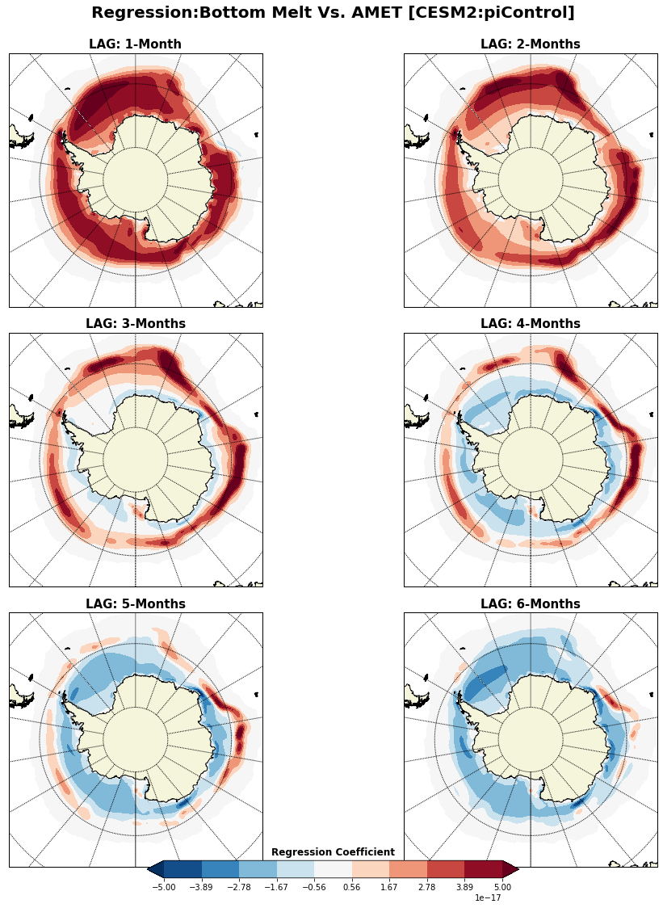
    


### Regressions between the top surface melt and AMET at different lags: 


```python
ds_sidmassmelttop_SH = CESM_sidmassmelttop_SH.sidmassmelttop.load()
```


```python
LinRegress_AMET_TMelt1 = linearRegress(AMET_SH_Ice_Edge,ds_sidmassmelttop_SH,lag=1)

LinReg_AMET_TMelt1     = xr.DataArray(LinRegress_AMET_TMelt1[0], coords=[ds_sidmassmelttop_SH.lat[:,0], 
                                                                   ds_sidmassmelttop_SH.lon[0,:]],dims=['lat', 'lon'])


LinRegress_AMET_TMelt2 = linearRegress(AMET_SH_Ice_Edge,ds_sidmassmelttop_SH,lag=2)

LinReg_AMET_TMelt2     = xr.DataArray(LinRegress_AMET_TMelt2[0], coords=[ds_sidmassmelttop_SH.lat[:,0],
                                                                ds_sidmassmelttop_SH.lon[0,:]],dims=['lat', 'lon'])


LinRegress_AMET_TMelt3 = linearRegress(AMET_SH_Ice_Edge,ds_sidmassmelttop_SH,lag=3)

LinReg_AMET_TMelt3     = xr.DataArray(LinRegress_AMET_TMelt3[0], coords=[ds_sidmassmelttop_SH.lat[:,0], 
                                                                   ds_sidmassmelttop_SH.lon[0,:]],dims=['lat', 'lon'])


LinRegress_AMET_TMelt4 = linearRegress(AMET_SH_Ice_Edge,ds_sidmassmelttop_SH,lag=4)

LinReg_AMET_TMelt4     = xr.DataArray(LinRegress_AMET_TMelt4[0], coords=[ds_sidmassmelttop_SH.lat[:,0], 
                                                                   ds_sidmassmelttop_SH.lon[0,:]],dims=['lat', 'lon'])


LinRegress_AMET_TMelt5 = linearRegress(AMET_SH_Ice_Edge,ds_sidmassmelttop_SH,lag=5)

LinReg_AMET_TMelt5     = xr.DataArray(LinRegress_AMET_TMelt5[0], coords=[ds_sidmassmelttop_SH.lat[:,0], 
                                                                   ds_sidmassmelttop_SH.lon[0,:]],dims=['lat', 'lon'])


LinRegress_AMET_TMelt6 = linearRegress(AMET_SH_Ice_Edge,ds_sidmassmelttop_SH,lag=6)

LinReg_AMET_TMelt6     = xr.DataArray(LinRegress_AMET_TMelt6[0], coords=[ds_sidmassmelttop_SH.lat[:,0], 
                                                                   ds_sidmassmelttop_SH.lon[0,:]],dims=['lat', 'lon'])

```


```python
fig = plt.figure(figsize=[16,15])


clevs=np.linspace(-3*10**-18,3*10**-18,10)

ax = plt.subplot(3,2,1)

m = Basemap(projection='splaea',boundinglat=-50,lon_0=180,resolution='l')
x, y = m(ds_sidmassmelttop_SH.lon.values, ds_sidmassmelttop_SH.lat.values)

m.fillcontinents(color='beige',lake_color='beige')
m.drawcoastlines()
m.drawparallels(np.arange(-80.,81.,20.))
m.drawmeridians(np.arange(-180.,181.,20.))
m.drawmapboundary(fill_color='white')

data = LinReg_AMET_TMelt1.where(LinReg_AMET_TMelt1!=0)

CS = m.contourf(x,y,data,clevs,cmap=plt.cm.get_cmap('RdBu_r'),extend='both');

plt.title("LAG: 1-Month",fontsize=15,fontweight="bold")


ax = plt.subplot(3,2,2)

m = Basemap(projection='splaea',boundinglat=-50,lon_0=180,resolution='l')
x, y = m(ds_sidmassmelttop_SH.lon.values, ds_sidmassmelttop_SH.lat.values)

m.fillcontinents(color='beige',lake_color='beige')
m.drawcoastlines()
m.drawparallels(np.arange(-80.,81.,20.))
m.drawmeridians(np.arange(-180.,181.,20.))
m.drawmapboundary(fill_color='white')

data = LinReg_AMET_TMelt2.where(LinReg_AMET_TMelt2!=0)

CS = m.contourf(x,y,data,clevs,cmap=plt.cm.get_cmap('RdBu_r'),extend='both');

plt.title("LAG: 2-Months",fontsize=15,fontweight="bold")


ax = plt.subplot(3,2,3)

m = Basemap(projection='splaea',boundinglat=-50,lon_0=180,resolution='l')
x, y = m(ds_sidmassmelttop_SH.lon.values, ds_sidmassmelttop_SH.lat.values)

m.fillcontinents(color='beige',lake_color='beige')
m.drawcoastlines()
m.drawparallels(np.arange(-80.,81.,20.))
m.drawmeridians(np.arange(-180.,181.,20.))
m.drawmapboundary(fill_color='white')

data = LinReg_AMET_TMelt3.where(LinReg_AMET_TMelt3!=0)

CS = m.contourf(x,y,data,clevs,cmap=plt.cm.get_cmap('RdBu_r'),extend='both');

plt.title("LAG: 3-Months",fontsize=15,fontweight="bold")


ax = plt.subplot(3,2,4)

m = Basemap(projection='splaea',boundinglat=-50,lon_0=180,resolution='l')
x, y = m(ds_sidmassmelttop_SH.lon.values, ds_sidmassmelttop_SH.lat.values)

m.fillcontinents(color='beige',lake_color='beige')
m.drawcoastlines()
m.drawparallels(np.arange(-80.,81.,20.))
m.drawmeridians(np.arange(-180.,181.,20.))
m.drawmapboundary(fill_color='white')

data = LinReg_AMET_TMelt4.where(LinReg_AMET_TMelt4!=0)

CS = m.contourf(x,y,data,clevs,cmap=plt.cm.get_cmap('RdBu_r'),extend='both');

plt.title("LAG: 4-Months",fontsize=15,fontweight="bold")


ax = plt.subplot(3,2,5)

m = Basemap(projection='splaea',boundinglat=-50,lon_0=180,resolution='l')
x, y = m(ds_sidmassmelttop_SH.lon.values, ds_sidmassmelttop_SH.lat.values)

m.fillcontinents(color='beige',lake_color='beige')
m.drawcoastlines()
m.drawparallels(np.arange(-80.,81.,20.))
m.drawmeridians(np.arange(-180.,181.,20.))
m.drawmapboundary(fill_color='white')

data = LinReg_AMET_TMelt5.where(LinReg_AMET_TMelt5!=0)

CS = m.contourf(x,y,data,clevs,cmap=plt.cm.get_cmap('RdBu_r'),extend='both');

plt.title("LAG: 5-Months",fontsize=15,fontweight="bold")


ax = plt.subplot(3,2,6)

m = Basemap(projection='splaea',boundinglat=-50,lon_0=180,resolution='l')
x, y = m(ds_sidmassmelttop_SH.lon.values, ds_sidmassmelttop_SH.lat.values)

m.fillcontinents(color='beige',lake_color='beige')
m.drawcoastlines()
m.drawparallels(np.arange(-80.,81.,20.))
m.drawmeridians(np.arange(-180.,181.,20.))
m.drawmapboundary(fill_color='white')

data = LinReg_AMET_TMelt6.where(LinReg_AMET_TMelt6!=0)

CS = m.contourf(x,y,data,clevs,cmap=plt.cm.get_cmap('RdBu_r'),extend='both');

plt.title("LAG: 6-Months",fontsize=15,fontweight="bold")


plt.suptitle("Regression: Surface Melt Vs. AMET [CESM2:piControl]", fontsize=20, fontweight='bold',y=1);

cbar_ax = fig.add_axes([0.3, 0.001, 0.4, 0.02]) #[left, bottom, width, height]
cbar = fig.colorbar(CS, cax=cbar_ax,  orientation='horizontal',extend='both')

cbar.ax.tick_params(labelsize=10)
cbar.ax.set_title('Regression Coefficient',fontsize=12,fontweight='bold')

plt.tight_layout()

# # plt.savefig('Spatial_Trends_All_Parameters_SIV.pdf',bbox_inches='tight',dpi=200)

plt.show()
```


    
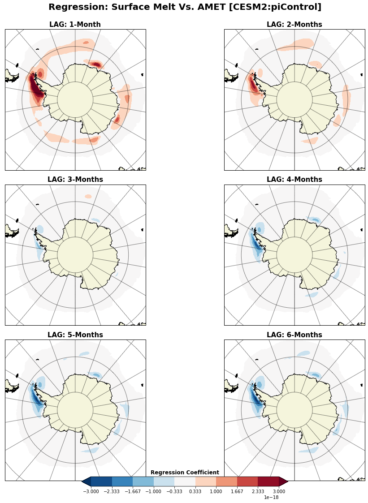
    


## Using observational Reanalysis data: 


```python
zw3_ds = xr.open_dataset('/Volumes/SHREYA/Quarters_UCLA/Research_Work/zw3index-ERAI-MONTHLY-1979-2017.nc')
zw3_ds = zw3_ds.where(zw3_ds.time.dt.month.isin([8,9,10]), drop=True)

GPT_500_ERA = xr.open_dataset('/Volumes/SHREYA/Ch3-ZW3_Extreme_Analysis/Extreme_ZW3-II/GPT_500_ERA-MONTHLY_1979-2017.nc')
```


```python
# Funstion for regridding the datasets:
ds = xr.open_dataset('/Volumes/SHREYA/Advanced_Climatology/All_Models/seaice_conc_monthly_sh_NASA_Bootstrap.nsidc.v03r01.197811-201702.nc')

Obs_NSIDC = ds.where(ds.time.dt.month.isin([8,9,10]), drop=True)

# Obs_NSIDC_SIC = Obs_NSIDC.SIC.where((Obs_NSIDC.SIC>0.2)) #removing SICs below 20%
# Obs_NSIDC_AREA = Obs_NSIDC.AREA.where((Obs_NSIDC.AREA != 0)) #masking area equal to zero 
```


```python
#GIOMAS:
GIOMAS = xr.open_dataset('/Volumes/SHREYA/Advanced_Climatology/All_Models/Weighted_SIT/Reanalysis/GIOMAS_heff_1979-2021.nc')
GIOMAS = promote_empty_dims(GIOMAS) #setting the empty coordinates to coords
GIOMAS = GIOMAS.rename({'lon_scaler': 'lon', 'lat_scaler': 'lat'})

#Regridded:
regridder = xe.Regridder(GIOMAS,Obs_NSIDC,'bilinear',ignore_degenerate=True)
GIOMAS_regridded = regridder(GIOMAS, keep_attrs=True)
```


```python
# ENVISAT-CS2:
# ENV_SIT = xr.open_dataset('/Volumes/SHREYA/Advanced_Climatology/All_Models/SIT_SH_SIRAL-SH50KMEASE2-200206-201704.nc')
```


```python
zw3_OG = zw3_ds.sel(time=slice('1979-01-01','2017-01-01'))
```


```python
zw3_OG1 = xr.DataArray(zw3_OG.zw3daily, coords=[Obs_NSIDC.time], dims=['time'])
```


```python
ZW3_df1 = pd.DataFrame()
ZW3_df1['time'] = zw3_OG1["time"]#.dt.strftime("%Y-%m-%d")
ZW3_df1['ZW3-Index'] = zw3_OG1
```


```python
# plotting a histogram
fig, ax = plt.subplots(1,1, figsize=(12,8))
sns.histplot(ZW3_df1['ZW3-Index'],bins=50,
                  #kde=True,
                  #stat='probability',
#                   log_scale=True,
                  ax = ax,
                  color='darkgreen')

# ax.set(xlabel='Normal Distribution', ylabel='Probability')

plt.axvline(np.percentile(ZW3_df1['ZW3-Index'],95),linestyle ="dashed",linewidth=3,color='black')
plt.axvline(np.percentile(ZW3_df1['ZW3-Index'],5),linestyle ="dashed",linewidth=3,color='black')

plt.show()
```


    
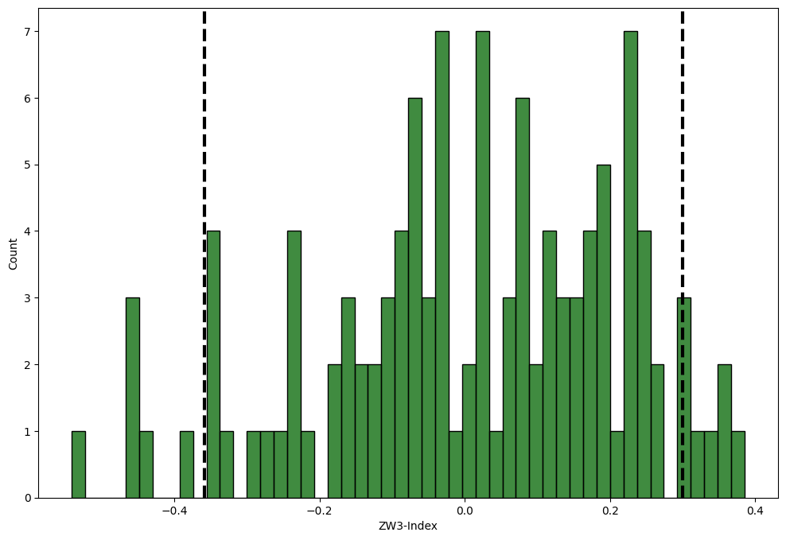
    


```python
High_extremes1  = ZW3_df1[(ZW3_df1['ZW3-Index']>np.percentile(ZW3_df1['ZW3-Index'],95))]
Low_extremes1 = ZW3_df1[(ZW3_df1['ZW3-Index']<np.percentile(ZW3_df1['ZW3-Index'],5))]
```


```python
High_extremes_Dates1 = xr.Dataset.from_dataframe(High_extremes1.set_index('time'))
Low_extremes_Dates1 = xr.Dataset.from_dataframe(Low_extremes1.set_index('time'))
```


```python
# Selecting extremes: 
HighEx_GPT_ERA = GPT_500_ERA.sel(time=High_extremes_Dates1.time)
LowEx_GPT_ERA  = GPT_500_ERA.sel(time=Low_extremes_Dates1.time)

HighEx_SIC = Obs_NSIDC.sel(time=High_extremes_Dates1.time)
LowEx_SIC  = Obs_NSIDC.sel(time=Low_extremes_Dates1.time)

HighEx_SIT = GIOMAS_regridded.sel(time=High_extremes_Dates1.time)
LowEx_SIT  = GIOMAS_regridded.sel(time=Low_extremes_Dates1.time)
```


```python
HExt_ERA_SIC_Anom = (HighEx_SIC.groupby('time.month') - Obs_NSIDC.groupby('time.month').mean(dim='time',skipna=True))*100
# LExt_ERA_SIC_Anom = (LowEx_SIC.groupby('time.month') - Obs_NSIDC.groupby('time.month').mean(dim='time',skipna=True))*100

HExt_ERA_GPT_Anom = (HighEx_GPT_ERA.groupby('time.month') - GPT_500_ERA.groupby('time.month').mean(dim='time',skipna=True))/9.8
# LExt_ERA_GPT_Anom = (LowEx_GPT_ERA.groupby('time.month') - GPT_500_ERA.groupby('time.month').mean(dim='time',skipna=True))/9.8

HExt_ERA_SIT_Anom = (HighEx_SIT.groupby('time.month') - GIOMAS_regridded.groupby('time.month').mean(dim='time',skipna=True))
# LExt_ERA_SIT_Anom = (LowEx_SIT.groupby('time.month') - GIOMAS_regridded.groupby('time.month').mean(dim='time',skipna=True))
```


```python
i=5

fig = plt.figure(figsize=[16,15])

ax = plt.subplot(1,2,1,projection = ccrs.SouthPolarStereo())
ax.add_feature(cfeature.LAND,zorder=100,edgecolor='k')
ax.set_extent([0.005, 360, -90, -45], crs=ccrs.PlateCarree())
dmeridian = 30  # spacing for lines of meridian
dparallel = 15  # spacing for lines of parallel 
num_merid = int(360/dmeridian + 1)
num_parra = int(90/dparallel + 1)

gl = ax.gridlines(crs=ccrs.PlateCarree(), \
                  xlocs=np.linspace(-180, 180, num_merid), \
                  ylocs=np.linspace(0, -90, num_parra), \
                  linestyle="--", linewidth=1, color='k', alpha=0.5)

theta = np.linspace(0, 2*np.pi, 120)
verts = np.vstack([np.sin(theta), np.cos(theta)]).T
center, radius = [0.5, 0.5], 0.5
circle = mpath.Path(verts * radius + center)
ax.set_boundary(circle, transform=ax.transAxes)  #without this; get rect bound

clevs = np.linspace(4800,5400,10)

data = LowEx_GPT_ERA/9.8

CS = ax.contourf(data.longitude,data.latitude,data.z[i],clevs,
                   transform=ccrs.PlateCarree(),cmap = plt.cm.Reds, extend='both')
# CS1 = ax.contour(CESM_SIC_SH.lon,CESM_SIC_SH.lat,CESM_SIC_SH_ASO.siconc,levels=[15],colors ='black',
#             transform=ccrs.PlateCarree(),linewidths=3);
# ax.clabel(CS1, inline=True, fontsize=10)
plt.title("ZW3 Low-Extreme",fontsize=12,fontweight="bold")


ax = plt.subplot(1,2,2,projection = ccrs.SouthPolarStereo())
ax.add_feature(cfeature.LAND,zorder=100,edgecolor='k')
ax.set_extent([0.005, 360, -90, -45], crs=ccrs.PlateCarree())
dmeridian = 30  # spacing for lines of meridian
dparallel = 15  # spacing for lines of parallel 
num_merid = int(360/dmeridian + 1)
num_parra = int(90/dparallel + 1)

gl = ax.gridlines(crs=ccrs.PlateCarree(), \
                  xlocs=np.linspace(-180, 180, num_merid), \
                  ylocs=np.linspace(0, -90, num_parra), \
                  linestyle="--", linewidth=1, color='k', alpha=0.5)

theta = np.linspace(0, 2*np.pi, 120)
verts = np.vstack([np.sin(theta), np.cos(theta)]).T
center, radius = [0.5, 0.5], 0.5
circle = mpath.Path(verts * radius + center)
ax.set_boundary(circle, transform=ax.transAxes)  #without this; get rect bound

data = HighEx_GPT_ERA/9.8

CS = ax.contourf(data.longitude,data.latitude,data.z[i],clevs,
                   transform=ccrs.PlateCarree(),cmap = plt.cm.Reds, extend='both')
# CS1 = ax.contour(CESM_SIC_SH.lon,CESM_SIC_SH.lat,CESM_SIC_SH_ASO.siconc,levels=[15],colors ='black',
#             transform=ccrs.PlateCarree(),linewidths=3);
# ax.clabel(CS1, inline=True, fontsize=10)
plt.title("ZW3 High-Extreme",fontsize=12,fontweight="bold")

cbar_ax = fig.add_axes([0.3, 0.25, 0.4, 0.02]) #[left, bottom, width, height]
cbar = fig.colorbar(CS, cax=cbar_ax,  orientation='horizontal',extend='both')

cbar.ax.tick_params(labelsize=10)
cbar.ax.set_title('GPT [m]',fontsize=12,fontweight='bold')

plt.show()
```


    
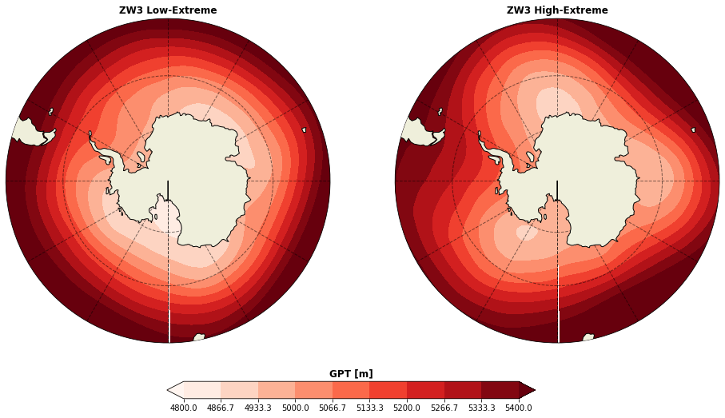
    


```python
fig = plt.figure(figsize=[16,15])

ax = plt.subplot(1,2,1,projection = ccrs.SouthPolarStereo())
ax.add_feature(cfeature.LAND,zorder=100,edgecolor='k')
ax.set_extent([0.005, 360, -90, -40], crs=ccrs.PlateCarree())
dmeridian = 30  # spacing for lines of meridian
dparallel = 15  # spacing for lines of parallel 
num_merid = int(360/dmeridian + 1)
num_parra = int(90/dparallel + 1)

gl = ax.gridlines(crs=ccrs.PlateCarree(), \
                  xlocs=np.linspace(-180, 180, num_merid), \
                  ylocs=np.linspace(0, -90, num_parra), \
                  linestyle="--", linewidth=1, color='k', alpha=0.5)

theta = np.linspace(0, 2*np.pi, 120)
verts = np.vstack([np.sin(theta), np.cos(theta)]).T
center, radius = [0.5, 0.5], 0.5
circle = mpath.Path(verts * radius + center)
ax.set_boundary(circle, transform=ax.transAxes)  #without this; get rect bound

clevs = np.linspace(-90,90,20)

CS = ax.contourf(HExt_ERA_GPT_Anom.longitude,HExt_ERA_GPT_Anom.latitude,HExt_ERA_GPT_Anom.z.mean(dim='time'),clevs,
                   transform=ccrs.PlateCarree(),cmap = plt.cm.RdBu_r, extend='both')
# CS1 = ax.contour(CESM_SIC_SH.lon,CESM_SIC_SH.lat,CESM_SIC_SH_ASO.siconc,levels=[15],colors ='black',
#             transform=ccrs.PlateCarree(),linewidths=3);
# ax.clabel(CS1, inline=True, fontsize=10)
plt.title("ZW3 High-Extreme",fontsize=12,fontweight="bold")


ax = plt.subplot(1,2,2,projection = ccrs.SouthPolarStereo())
ax.add_feature(cfeature.LAND,zorder=100,edgecolor='k')
ax.set_extent([0.005, 360, -90, -40], crs=ccrs.PlateCarree())
dmeridian = 30  # spacing for lines of meridian
dparallel = 15  # spacing for lines of parallel 
num_merid = int(360/dmeridian + 1)
num_parra = int(90/dparallel + 1)

gl = ax.gridlines(crs=ccrs.PlateCarree(), \
                  xlocs=np.linspace(-180, 180, num_merid), \
                  ylocs=np.linspace(0, -90, num_parra), \
                  linestyle="--", linewidth=1, color='k', alpha=0.5)

theta = np.linspace(0, 2*np.pi, 120)
verts = np.vstack([np.sin(theta), np.cos(theta)]).T
center, radius = [0.5, 0.5], 0.5
circle = mpath.Path(verts * radius + center)
ax.set_boundary(circle, transform=ax.transAxes)  #without this; get rect bound


CS = ax.contourf(LExt_ERA_GPT_Anom.longitude,LExt_ERA_GPT_Anom.latitude,LExt_ERA_GPT_Anom.z.mean(dim='time'),clevs,
                   transform=ccrs.PlateCarree(),cmap = plt.cm.RdBu_r, extend='both')

plt.title("ZW3 Low-Extreme",fontsize=12,fontweight="bold")
    
#     cbar_ax = fig.add_axes([0.3, 0.05, 0.4, 0.02]) #[left, bottom, width, height]
#     cbar = fig.colorbar(CS, cax=cbar_ax,  orientation='horizontal',extend='both')
#     cbar.ax.tick_params(labelsize=10)
#     cbar.ax.set_title('SIV Mean',fontsize=10)
#     cbar.ax.set_ylabel('m^3/Year', fontsize=10)

fig.suptitle("Geopotential Ht. Anomalies [500Hpa] (ERA-INTERIM: 1979-2016)",fontsize=25,y=0.75)
cbar_ax = fig.add_axes([0.3, 0.25, 0.4, 0.02]) #[left, bottom, width, height]
cbar = fig.colorbar(CS, cax=cbar_ax,  orientation='horizontal',extend='both')

cbar.ax.tick_params(labelsize=10)
cbar.ax.set_title('GPT Mean [m]',fontsize=12,fontweight='bold')

# plt.tight_layout()

# plt.savefig('Spatial_Trends_All_Parameters_SIV.pdf',bbox_inches='tight',dpi=200)

plt.show()
```


    
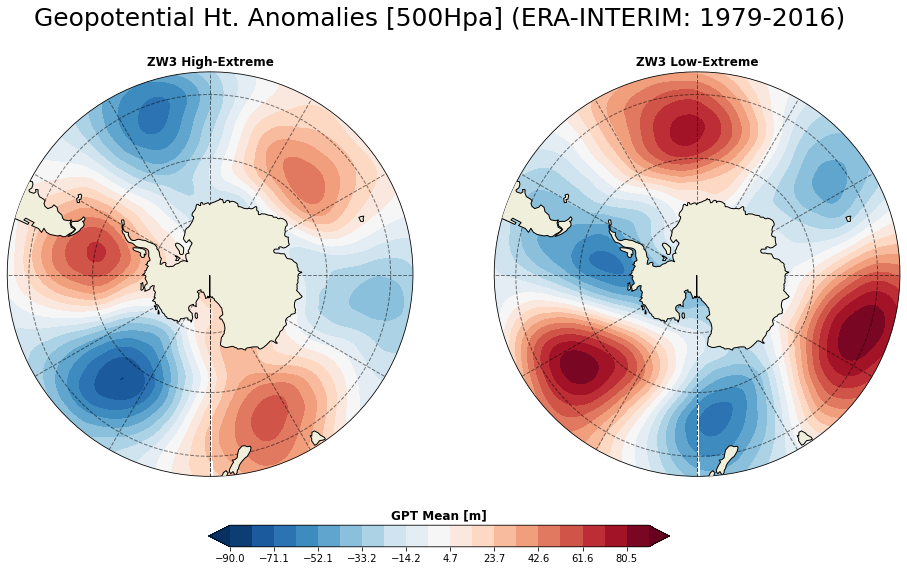
    


```python
fig = plt.figure(figsize=[16,15])

clevs = np.linspace(-90,90,15)

ax = plt.subplot(1,2,1,projection = ccrs.SouthPolarStereo())
ax.add_feature(cfeature.LAND,zorder=100,edgecolor='k')
ax.set_extent([0.005, 360, -90, -45], crs=ccrs.PlateCarree())
dmeridian = 30  # spacing for lines of meridian
dparallel = 15  # spacing for lines of parallel 
num_merid = int(360/dmeridian + 1)
num_parra = int(90/dparallel + 1)

gl = ax.gridlines(crs=ccrs.PlateCarree(), \
                  xlocs=np.linspace(-180, 180, num_merid), \
                  ylocs=np.linspace(0, -90, num_parra), \
                  linestyle="--", linewidth=1, color='k', alpha=0.5)

theta = np.linspace(0, 2*np.pi, 120)
verts = np.vstack([np.sin(theta), np.cos(theta)]).T
center, radius = [0.5, 0.5], 0.5
circle = mpath.Path(verts * radius + center)
ax.set_boundary(circle, transform=ax.transAxes)  #without this; get rect bound

data_SIC = Obs_NSIDC.mean('time')
data = LExt_ERA_SIC_Anom.where(LExt_ERA_SIC_Anom!=0)

CS = ax.pcolormesh(data.longitude,data.latitude,
                   data.SIC.mean(dim='time'),
                   transform=ccrs.PlateCarree(),cmap = plt.cm.RdBu_r,vmin=-20,vmax=20)
ax.contour(LExt_ERA_GPT_Anom.longitude,LExt_ERA_GPT_Anom.latitude,LExt_ERA_GPT_Anom.z.mean(dim='time'),
                 clevs,colors='black',alpha=0.4,
                 transform=ccrs.PlateCarree());
# ax.clabel(CS1, inline=True, fontsize=10)

plt.title("ZW3 Low-Extreme",fontsize=12,fontweight="bold")


ax = plt.subplot(1,2,2,projection = ccrs.SouthPolarStereo())
ax.add_feature(cfeature.LAND,zorder=100,edgecolor='k')
ax.set_extent([0.005, 360, -90, -45], crs=ccrs.PlateCarree())
dmeridian = 30  # spacing for lines of meridian
dparallel = 15  # spacing for lines of parallel 
num_merid = int(360/dmeridian + 1)
num_parra = int(90/dparallel + 1)

gl = ax.gridlines(crs=ccrs.PlateCarree(), \
                  xlocs=np.linspace(-180, 180, num_merid), \
                  ylocs=np.linspace(0, -90, num_parra), \
                  linestyle="--", linewidth=1, color='k', alpha=0.5)

theta = np.linspace(0, 2*np.pi, 120)
verts = np.vstack([np.sin(theta), np.cos(theta)]).T
center, radius = [0.5, 0.5], 0.5
circle = mpath.Path(verts * radius + center)
ax.set_boundary(circle, transform=ax.transAxes)  #without this; get rect bound

data = HExt_ERA_SIC_Anom.where(HExt_ERA_SIC_Anom!=0)

CS = ax.pcolormesh(data.longitude,data.latitude,data.SIC.mean(dim='time'),
                   transform=ccrs.PlateCarree(),cmap = plt.cm.RdBu_r,vmin=-20,vmax=20)

CS1 = ax.contour(HExt_ERA_GPT_Anom.longitude,HExt_ERA_GPT_Anom.latitude,HExt_ERA_GPT_Anom.z.mean(dim='time'),
                 clevs,colors='black',alpha=0.4,
                 transform=ccrs.PlateCarree());
# ax.clabel(CS1, inline=True, fontsize=10)

plt.title("ZW3 High-Extreme",fontsize=12,fontweight="bold")
    
# #     cbar_ax = fig.add_axes([0.3, 0.05, 0.4, 0.02]) #[left, bottom, width, height]
# #     cbar = fig.colorbar(CS, cax=cbar_ax,  orientation='horizontal',extend='both')
# #     cbar.ax.tick_params(labelsize=10)
# #     cbar.ax.set_title('SIV Mean',fontsize=10)
# #     cbar.ax.set_ylabel('m^3/Year', fontsize=10)

# fig.suptitle("Sea-ice Concentration Anomalies (ERA2-piControl)",fontsize=25,y=0.8)
cbar_ax = fig.add_axes([0.3, 0.25, 0.4, 0.02]) #[left, bottom, width, height]
cbar = fig.colorbar(CS, cax=cbar_ax,  orientation='horizontal',extend='both')

cbar.ax.tick_params(labelsize=10)
cbar.ax.set_title('SIC Anomaly',fontsize=12,fontweight='bold')

# plt.tight_layout()

# # plt.savefig('Spatial_Trends_All_Parameters_SIV.pdf',bbox_inches='tight',dpi=200)

plt.show()
```


    
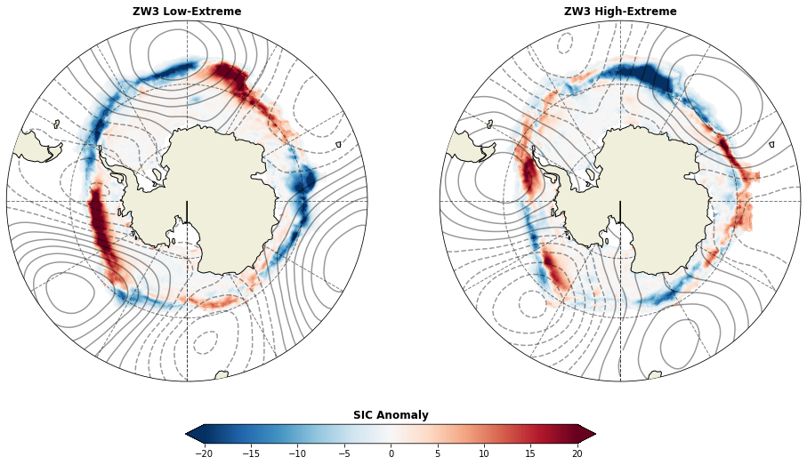
    


```python
fig = plt.figure(figsize=[16,15])


clevs = np.linspace(-900,900,15)
clev  = np.linspace(-20,20,10)

ax = plt.subplot(1,2,1)

m = Basemap(projection='splaea',boundinglat=-50,lon_0=180,resolution='l')
x, y = m(Obs_NSIDC.longitude.values, Obs_NSIDC.latitude.values)

m.fillcontinents(color='beige',lake_color='beige')
m.drawcoastlines()
m.drawparallels(np.arange(-80.,81.,20.))
m.drawmeridians(np.arange(-180.,181.,20.))
m.drawmapboundary(fill_color='white')

data = LExt_ERA_SIC_Anom.where(LExt_ERA_SIC_Anom!=0)
data_SIC = Obs_NSIDC.mean('time')

m.contourf(x,y,data.SIC.mean('time'),clev,cmap=plt.cm.get_cmap('RdBu_r'),extend='both');
# plt.colorbar(label="Anomaly[%]")

m.contour(x, y,data_SIC.SIC,colors ='black',levels=[0.15],linewidths=3.5);

x1, y1 = m(*np.meshgrid(GPT_500_ERA.longitude.values,GPT_500_ERA.latitude.values))

m.contour(x1,y1,LExt_ERA_GPT_Anom.z.mean(dim='time'),clevs,colors='black',alpha=0.4);
# ax.clabel(CS1, inline=True, fontsize=10) 
plt.title("Negative ZW3 Extremes",fontsize=12,fontweight="bold")


ax = plt.subplot(1,2,2)

m = Basemap(projection='splaea',boundinglat=-50,lon_0=180,resolution='l')

m.fillcontinents(color='beige',lake_color='beige')
m.drawcoastlines()
m.drawparallels(np.arange(-80.,81.,20.))
m.drawmeridians(np.arange(-180.,181.,20.))
m.drawmapboundary(fill_color='white')

data = HExt_ERA_SIC_Anom.where(HExt_ERA_SIC_Anom!=0)

CS = m.contourf(x,y,data.SIC.mean('time'),clev,cmap=plt.cm.get_cmap('RdBu_r'),extend='both');
# plt.colorbar(label="Anomaly[%]")

m.contour(x, y,data_SIC.SIC,colors ='black',levels=[0.15],linewidths=3.5);

m.contour(x1,y1,HExt_ERA_GPT_Anom.z.mean(dim='time'),clevs,colors='black',alpha=0.4);
# ax.clabel(CS1, inline=True, fontsize=10) 
plt.title("Positive ZW3 Extremes",fontsize=12,fontweight="bold")


plt.suptitle("SIC Anomaly Plot [ERA-INTRIM: 1979-2016]", fontsize=20, fontweight='bold',y=0.75);

cbar_ax = fig.add_axes([0.3, 0.25, 0.4, 0.02]) #[left, bottom, width, height]
cbar = fig.colorbar(CS, cax=cbar_ax,  orientation='horizontal',extend='both')

cbar.ax.tick_params(labelsize=10)
cbar.ax.set_title('SIC Anomaly [%]',fontsize=12,fontweight='bold')

# plt.tight_layout()

# # plt.savefig('Spatial_Trends_All_Parameters_SIV.pdf',bbox_inches='tight',dpi=200)

plt.show()
```


    
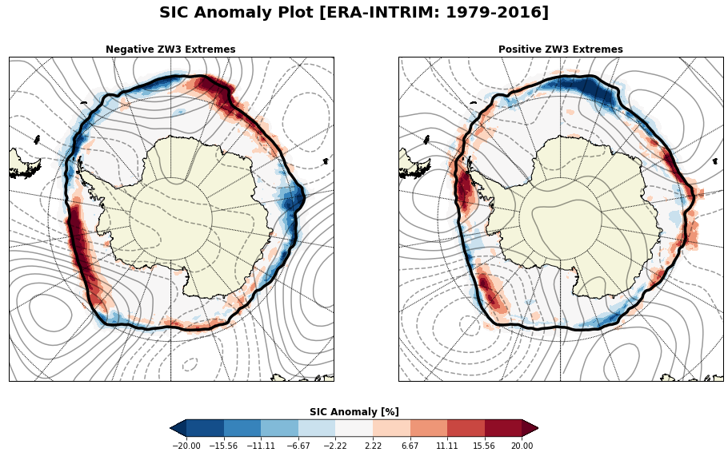
    


## SIT

#### GIOMAS:


```python
fig = plt.figure(figsize=[16,15])


clevs = np.linspace(-900,900,15)
clev  = np.linspace(-0.4,0.4,10)

ax = plt.subplot(1,2,1)

m = Basemap(projection='splaea',boundinglat=-50,lon_0=180,resolution='l')
x, y = m(Obs_NSIDC.longitude.values, Obs_NSIDC.latitude.values)

m.fillcontinents(color='beige',lake_color='beige')
m.drawcoastlines()
m.drawparallels(np.arange(-80.,81.,20.))
m.drawmeridians(np.arange(-180.,181.,20.))
m.drawmapboundary(fill_color='white')

data = LExt_ERA_SIT_Anom.where(LExt_ERA_SIT_Anom!=0)
# data = data.where(pval_LSIT_ERA<0.1)
data_SIC = Obs_NSIDC.mean('time')

m.contourf(x,y,data.heff.mean('time'),clev,cmap=plt.cm.get_cmap('RdBu_r'),extend='both');
# plt.colorbar(label="Anomaly[%]")

m.contour(x, y,data_SIC.SIC,colors ='black',levels=[0.15],linewidths=3.5);

x1, y1 = m(*np.meshgrid(GPT_500_ERA.longitude.values,GPT_500_ERA.latitude.values))

m.contour(x1,y1,LExt_ERA_GPT_Anom.z.mean(dim='time'),clevs,colors='black',alpha=0.4);
# ax.clabel(CS1, inline=True, fontsize=10) 
plt.title("Negative ZW3 Extremes",fontsize=12,fontweight="bold")


ax = plt.subplot(1,2,2)

m = Basemap(projection='splaea',boundinglat=-50,lon_0=180,resolution='l')

m.fillcontinents(color='beige',lake_color='beige')
m.drawcoastlines()
m.drawparallels(np.arange(-80.,81.,20.))
m.drawmeridians(np.arange(-180.,181.,20.))
m.drawmapboundary(fill_color='white')

data = HExt_ERA_SIT_Anom.where(HExt_ERA_SIT_Anom!=0)
# data = data.where(pval_HSIT_ERA<0.1)

CS = m.contourf(x,y,data.heff.mean('time'),clev,cmap=plt.cm.get_cmap('RdBu_r'),extend='both');
# plt.colorbar(label="Anomaly[%]")

m.contour(x, y,data_SIC.SIC,colors ='black',levels=[0.15],linewidths=3.5);

m.contour(x1,y1,HExt_ERA_GPT_Anom.z.mean(dim='time'),clevs,colors='black',alpha=0.4);
# ax.clabel(CS1, inline=True, fontsize=10) 
plt.title("Positive ZW3 Extremes",fontsize=12,fontweight="bold")


plt.suptitle("SIT Anomaly Plot [ERA-INTRIM]", fontsize=20, fontweight='bold',y=0.75);

cbar_ax = fig.add_axes([0.3, 0.25, 0.4, 0.02]) #[left, bottom, width, height]
cbar = fig.colorbar(CS, cax=cbar_ax,  orientation='horizontal',extend='both')

cbar.ax.tick_params(labelsize=10)
cbar.ax.set_title('SIT Anomaly [m]',fontsize=12,fontweight='bold')

# plt.tight_layout()

# # plt.savefig('Spatial_Trends_All_Parameters_SIV.pdf',bbox_inches='tight',dpi=200)

plt.show()
```


    
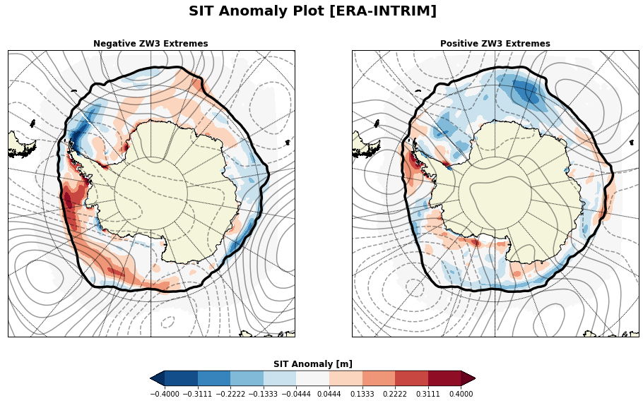
    


```python

```

## Sea-ice vectors:


```python
Ice_Vector_daily = xr.open_mfdataset('SI_Vectors_1979_2017/*.nc',combine = 'nested', concat_dim="time")
Ice_Vector = Ice_Vector_daily.resample(time='1M').mean()#.load()
Ice_Vector['time'] = GPT_500_ERA['time']
```


```python
#Regridded:
# regridder = xe.Regridder(Ice_Vector1,Obs_NSIDC,'bilinear',ignore_degenerate=True)
# Ice_Vector_regridded = regridder(Ice_Vector, keep_attrs=True)
```


```python
# Selecting extremes: 
HighEx_SIVec = Ice_Vector.sel(time=High_extremes_Dates1.time)
LowEx_SIVec  = Ice_Vector.sel(time=Low_extremes_Dates1.time)

LExt_SIVec_Anom = (LowEx_SIVec.groupby('time.month') - Ice_Vector.groupby('time.month').mean(dim='time',skipna=True)).load()
HExt_SIVec_Anom = (HighEx_SIVec.groupby('time.month') - Ice_Vector.groupby('time.month').mean(dim='time',skipna=True)).load()
```


```python
#Sea-ice drift:
UDrift = HExt_SIVec_Anom.variables['u'][:]
VDrift = HExt_SIVec_Anom.variables['v'][:]
lat2 = Ice_Vector['latitude'].mean('time').values
lon2 = Ice_Vector['longitude'].mean('time').values
```


```python
m = Basemap(projection='splaea',boundinglat=-40,lon_0=180,resolution='l')
x, y = m(lon2, lat2)
fig = plt.figure(figsize=(15,10))
m.fillcontinents(color='white',lake_color='white')
m.drawcoastlines()
m.drawparallels(np.arange( -90., 90.,20.),labels=[1,0,0,0],fontsize=10)
m.drawmeridians(np.arange(-180.,180.,20.),labels=[0,0,0,1],fontsize=10)
m.drawmapboundary(fill_color='skyblue')

skip=(slice(None,None,8),slice(None,None,8))
u_rot, v_rot, x, y = m.rotate_vector(UDrift.mean('time'),VDrift.mean('time'), 
                                     lon2, lat2, returnxy=True)
m.quiver(x[skip], y[skip], u_rot[skip], v_rot[skip], angles = "xy",scale=100,pivot='mid',units='width',alpha=0.6)
plt.title("Wind Vectors and SIT Anomaly: High-Mean ZW3 Extremes")

plt.show()
```

## Wind Vectors:


```python
Wind_Vector = xr.open_dataset('/Volumes/SHREYA/Ch3-ZW3_Extreme_Analysis/Extreme_ZW3-II/UV_850_ERA-MONTHLY_1979-2017.nc')
```


```python
# Selecting extremes: 
HighEx_WindVec = Wind_Vector.sel(time=High_extremes_Dates1.time)
LowEx_WindVec  = Wind_Vector.sel(time=Low_extremes_Dates1.time)

LExt_WindVec_Anom = (LowEx_WindVec.groupby('time.month') - Wind_Vector.groupby('time.month').mean(dim='time',skipna=True)).load()
HExt_WindVec_Anom = (HighEx_WindVec.groupby('time.month') - Wind_Vector.groupby('time.month').mean(dim='time',skipna=True)).load()
```


```python
fig = plt.figure(figsize=[16,15])


# clev1 = np.linspace(-20,20,8)
clev  = np.linspace(-0.4,0.4,10)


ax = plt.subplot(1,2,1,projection = ccrs.SouthPolarStereo())
ax.add_feature(cfeature.LAND,zorder=100,edgecolor='k')
ax.set_extent([0.005, 360, -90, -45], crs=ccrs.PlateCarree())
dmeridian = 30  # spacing for lines of meridian
dparallel = 15  # spacing for lines of parallel 
num_merid = int(360/dmeridian + 1)
num_parra = int(90/dparallel + 1)

gl = ax.gridlines(crs=ccrs.PlateCarree(), \
                  xlocs=np.linspace(-180, 180, num_merid), \
                  ylocs=np.linspace(0, -90, num_parra), \
                  linestyle="--", linewidth=1, color='k', alpha=0.5)

theta = np.linspace(0, 2*np.pi, 120)
verts = np.vstack([np.sin(theta), np.cos(theta)]).T
center, radius = [0.5, 0.5], 0.5
circle = mpath.Path(verts * radius + center)
ax.set_boundary(circle, transform=ax.transAxes)  #without this; get rect bound


SIT = LExt_ERA_SIT_Anom#.where(pval_HSIT<0.05)
# SIC = LExt_ERA_SIC_Anom.where(pval_HSIC<0.05)

CS = ax.pcolormesh(SIT.longitude,SIT.latitude,SIT.heff.mean('time'),cmap=plt.cm.get_cmap('RdBu_r'),
                   transform=ccrs.PlateCarree(),vmin=-0.3,vmax=0.3);
# ax.contour(SIC.lon,SIC.lat,SIC.mean('time'),clev1,colors='black',transform=ccrs.PlateCarree(),linewidth=2,
#            alpha=1);

# Defining the quiver plot
data = LExt_WindVec_Anom.mean('time').isel(longitude=slice(None, None, 5),
                              latitude=slice(None, None, 5))

data.plot.quiver(x='longitude', y='latitude', u='u', v='v',cmap=plt.cm.get_cmap('gray'), angles = "xy",pivot='mid',
          scale=50,units='width',alpha=0.5,transform=ccrs.PlateCarree())

plt.title(" Low ZW3 Extremes",fontsize=12,fontweight="bold")

################################################################################

ax = plt.subplot(1,2,2,projection = ccrs.SouthPolarStereo())
ax.add_feature(cfeature.LAND,zorder=100,edgecolor='k')
ax.set_extent([0.005, 360, -90, -45], crs=ccrs.PlateCarree())
dmeridian = 30  # spacing for lines of meridian
dparallel = 15  # spacing for lines of parallel 
num_merid = int(360/dmeridian + 1)
num_parra = int(90/dparallel + 1)

gl = ax.gridlines(crs=ccrs.PlateCarree(), \
                  xlocs=np.linspace(-180, 180, num_merid), \
                  ylocs=np.linspace(0, -90, num_parra), \
                  linestyle="--", linewidth=1, color='k', alpha=0.5)

theta = np.linspace(0, 2*np.pi, 120)
verts = np.vstack([np.sin(theta), np.cos(theta)]).T
center, radius = [0.5, 0.5], 0.5
circle = mpath.Path(verts * radius + center)
ax.set_boundary(circle, transform=ax.transAxes)  #without this; get rect bound

SIT = HExt_ERA_SIT_Anom

CS = ax.pcolormesh(SIT.longitude,SIT.latitude,SIT.heff.mean('time'),cmap=plt.cm.get_cmap('RdBu_r'),
                   transform=ccrs.PlateCarree(),vmin=-0.3,vmax=0.3);
# ax.contour(SIC.lon,SIC.lat,SIC.mean('time'),clev1,colors='black',transform=ccrs.PlateCarree(),linewidth=2,
#            alpha=1);

# Defining the quiver plot
data = HExt_WindVec_Anom.mean('time').isel(longitude=slice(None, None, 5),
                              latitude=slice(None, None, 5))

data.plot.quiver(x='longitude', y='latitude', u='u', v='v',cmap=plt.cm.get_cmap('gray'), angles = "xy",pivot='mid',
          scale=50,units='width',alpha=0.5,transform=ccrs.PlateCarree()) 

plt.title("High ZW3 Extremes",fontsize=12,fontweight="bold")

plt.suptitle("SIT [GIOMAS] and Vector [ERA-INTRIM] Anomaly (1979-2016)",fontsize=20,fontweight="bold",y=0.78)


cbar_ax = fig.add_axes([0.3, 0.25, 0.4, 0.02]) #[left, bottom, width, height]
cbar = fig.colorbar(CS, cax=cbar_ax,  orientation='horizontal',extend='both')

cbar.ax.tick_params(labelsize=10)
cbar.ax.set_title('SIT [m]',fontsize=12,fontweight='bold')

plt.show()
```


    
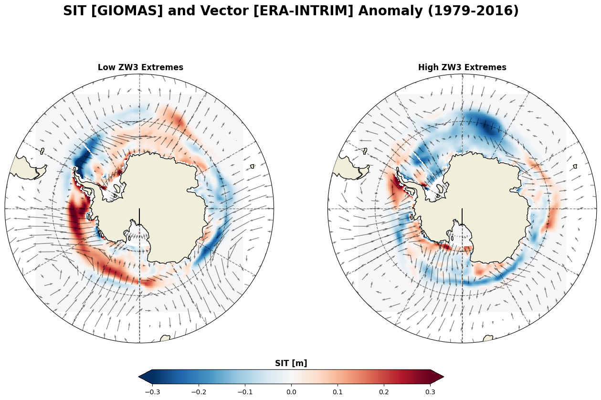
    


## Comprehensive positive extreme plot:


```python
fig = plt.figure(figsize=[16,15])

clevs = np.arange(-75,75,10)
clev  = np.linspace(-0.5,0.5,10)
clev1  = np.arange(-20,20,2)

ax = plt.subplot(1,2,1,projection = ccrs.SouthPolarStereo())
ax.add_feature(cfeature.LAND,zorder=100,edgecolor='k')
ax.set_extent([0.005, 360, -90, -40], crs=ccrs.PlateCarree())
dmeridian = 30  # spacing for lines of meridian
dparallel = 15  # spacing for lines of parallel 
num_merid = int(360/dmeridian + 1)
num_parra = int(90/dparallel + 1)

gl = ax.gridlines(crs=ccrs.PlateCarree(), \
                  xlocs=np.linspace(-180, 180, num_merid), \
                  ylocs=np.linspace(0, -90, num_parra), \
                  linestyle="--", linewidth=1, color='k', alpha=0.5)

theta = np.linspace(0, 2*np.pi, 120)
verts = np.vstack([np.sin(theta), np.cos(theta)]).T
center, radius = [0.5, 0.5], 0.5
circle = mpath.Path(verts * radius + center)
ax.set_boundary(circle, transform=ax.transAxes)  #without this; get rect bound


CS = ax.contourf(HExt_ERA_GPT_Anom.longitude,HExt_ERA_GPT_Anom.latitude,HExt_ERA_GPT_Anom.z.mean(dim='time'),clevs,
                   transform=ccrs.PlateCarree(),cmap = plt.cm.RdBu_r, extend='both')

cbar_ax = fig.add_axes([0.15, 0.25, 0.3, 0.02]) #[left, bottom, width, height]
cbar = fig.colorbar(CS, cax=cbar_ax,  orientation='horizontal',extend='both')
cbar.ax.tick_params(labelsize=10)
cbar.ax.set_title('GPT Anomaly [m]',fontsize=12,fontweight='bold')

ax = plt.subplot(1,2,2)

m = Basemap(projection='splaea',boundinglat=-50,lon_0=180,resolution='l', round=True)
x, y = m(Obs_NSIDC.longitude.values, Obs_NSIDC.latitude.values)

m.fillcontinents(color='beige',lake_color='beige')
m.drawcoastlines()
m.drawparallels(np.arange(-80.,81.,20.))
m.drawmeridians(np.arange(-180.,181.,20.))
m.drawmapboundary(fill_color='white')

SIT = HExt_ERA_SIT_Anom.where(HExt_ERA_SIT_Anom!=0)
SIC = HExt_ERA_SIC_Anom.where(HExt_ERA_SIC_Anom!=0)

# data = data.where(pval_HSIT_ERA<0.1)

CS = m.contour(x,y,SIT.heff.mean('time'),clev,alpha=1,colors='black',extend='both');
# plt.colorbar(label="Anomaly[%]")

data_SIC = Obs_NSIDC.mean('time')
CS = m.contourf(x,y,SIC.SIC.mean('time'),clev1,alpha=0.8,cmap=plt.cm.get_cmap('RdBu_r'),extend='both');
m.contour(x, y,data_SIC.SIC,colors ='black',levels=[0.15],linewidths=3.5);

# ax.clabel(CS1, inline=True, fontsize=10) 
# plt.title("Positive ZW3 Extremes",fontsize=12,fontweight="bold")


cbar_ax = fig.add_axes([0.57, 0.25, 0.3, 0.02]) #[left, bottom, width, height]
cbar = fig.colorbar(CS, cax=cbar_ax,  orientation='horizontal',extend='both')

cbar.ax.tick_params(labelsize=10)
cbar.ax.set_title('SIC Anomaly [%]',fontsize=12,fontweight='bold')

# plt.tight_layout()

# plt.savefig('Spatial_Patterns_ERA.pdf',bbox_inches='tight',dpi=200)

plt.show()
```


    
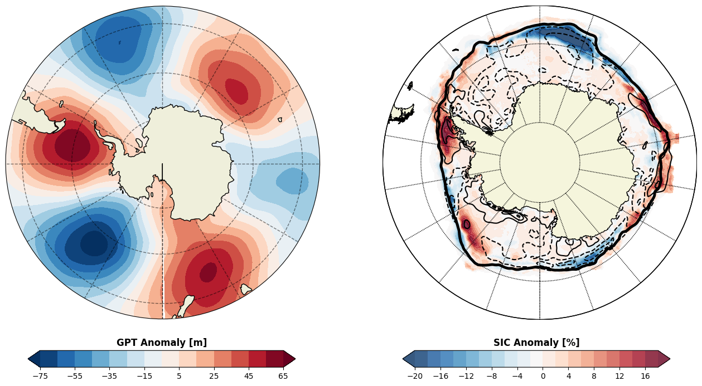
    


### For ENVISAT:


```python
HighEx_ENV_SIT = ENV_SIT.sel(time=High_extremes_Dates1.sel(time=slice('2002-06-01','2017-12-01')).time)
LowEx_ENV_SIT  = ENV_SIT.sel(time=Low_extremes_Dates1.sel(time=slice('2002-06-01','2017-12-01')).time)

HExt_ENV_SIT_Anom = (HighEx_ENV_SIT.groupby('time.month') - ENV_SIT.groupby('time.month').mean(dim='time',skipna=True))
LExt_ENV_SIT_Anom = (LowEx_ENV_SIT.groupby('time.month') - ENV_SIT.groupby('time.month').mean(dim='time',skipna=True))
```


```python
## Slicing all variables for the same time-period:

HExt_ERA_SIC_Anom2 = HExt_ERA_SIC_Anom.sel(time=High_extremes_Dates1.sel(time=slice('2002-06-01','2017-12-01')).time) 
LExt_ERA_SIC_Anom2 = LExt_ERA_SIC_Anom.sel(time=Low_extremes_Dates1.sel(time=slice('2002-06-01','2017-12-01')).time) 

HExt_ERA_GPT_Anom2 = HExt_ERA_GPT_Anom.sel(time=High_extremes_Dates1.sel(time=slice('2002-06-01','2017-12-01')).time) 
LExt_ERA_GPT_Anom2 = LExt_ERA_GPT_Anom.sel(time=Low_extremes_Dates1.sel(time=slice('2002-06-01','2017-12-01')).time) 

HExt_WindVec_Anom2 = HExt_WindVec_Anom.sel(time=High_extremes_Dates1.sel(time=slice('2002-06-01','2017-12-01')).time)
LExt_WindVec_Anom2 = LExt_WindVec_Anom.sel(time=Low_extremes_Dates1.sel(time=slice('2002-06-01','2017-12-01')).time)
```


```python
statres_LSIT_ENV, pval_LSIT_ENV = ttest_1samp(HExt_ENV_SIT_Anom.sea_ice_thickness,0)
statres_HSIT_ENV, pval_HSIT_ENV = ttest_1samp(HExt_ENV_SIT_Anom.sea_ice_thickness,0)
```


```python
fig = plt.figure(figsize=[16,15])


clevs = np.linspace(-900,900,15)
clev  = np.linspace(-2,2,10)

ax = plt.subplot(1,2,1)

m = Basemap(projection='splaea',boundinglat=-50,lon_0=180,resolution='l')
x, y = m(Obs_NSIDC.longitude.values, Obs_NSIDC.latitude.values)
xx, yy = m(ENV_SIT.lon.values, ENV_SIT.lat.values)

m.fillcontinents(color='beige',lake_color='beige')
m.drawcoastlines()
m.drawparallels(np.arange(-80.,81.,20.))
m.drawmeridians(np.arange(-180.,181.,20.))
m.drawmapboundary(fill_color='white')

data = LExt_ENV_SIT_Anom.where(LExt_ENV_SIT_Anom!=0)

data_SIC = Obs_NSIDC.mean('time')

m.contourf(xx,yy,data.sea_ice_thickness.mean('time'),clev,cmap=plt.cm.get_cmap('RdBu_r'),extend='both');
# plt.colorbar(label="Anomaly[%]")

m.contour(x, y,data_SIC.SIC,colors ='black',levels=[0.15],linewidths=3.5);

x1, y1 = m(*np.meshgrid(GPT_500_ERA.longitude.values,GPT_500_ERA.latitude.values))

m.contour(x1,y1,LExt_ERA_GPT_Anom2.z.mean(dim='time'),clevs,colors='black',alpha=0.4);
# ax.clabel(CS1, inline=True, fontsize=10) 
plt.title("Negative ZW3 Extremes",fontsize=12,fontweight="bold")


ax = plt.subplot(1,2,2)

m = Basemap(projection='splaea',boundinglat=-50,lon_0=180,resolution='l')

m.fillcontinents(color='beige',lake_color='beige')
m.drawcoastlines()
m.drawparallels(np.arange(-80.,81.,20.))
m.drawmeridians(np.arange(-180.,181.,20.))
m.drawmapboundary(fill_color='white')

data = HExt_ENV_SIT_Anom.where(HExt_ENV_SIT_Anom!=0)


CS = m.contourf(xx,yy,data.sea_ice_thickness.mean('time'),clev,cmap=plt.cm.get_cmap('RdBu_r'),extend='both');
# plt.colorbar(label="Anomaly[%]")

m.contour(x, y,data_SIC.SIC,colors ='black',levels=[0.15],linewidths=3.5);

m.contour(x1,y1,HExt_ERA_GPT_Anom2.z.mean(dim='time'),clevs,colors='black',alpha=0.4);
# ax.clabel(CS1, inline=True, fontsize=10) 
plt.title("Positive ZW3 Extremes",fontsize=12,fontweight="bold")


plt.suptitle("SIT Anomaly Plot [ENVISAT-CRYOSAT2]", fontsize=20, fontweight='bold',y=0.75);

cbar_ax = fig.add_axes([0.3, 0.25, 0.4, 0.02]) #[left, bottom, width, height]
cbar = fig.colorbar(CS, cax=cbar_ax,  orientation='horizontal',extend='both')

cbar.ax.tick_params(labelsize=10)
cbar.ax.set_title('SIT Anomaly [m]',fontsize=12,fontweight='bold')

# plt.tight_layout()

# # plt.savefig('Spatial_Trends_All_Parameters_SIV.pdf',bbox_inches='tight',dpi=200)

plt.show()
```


    
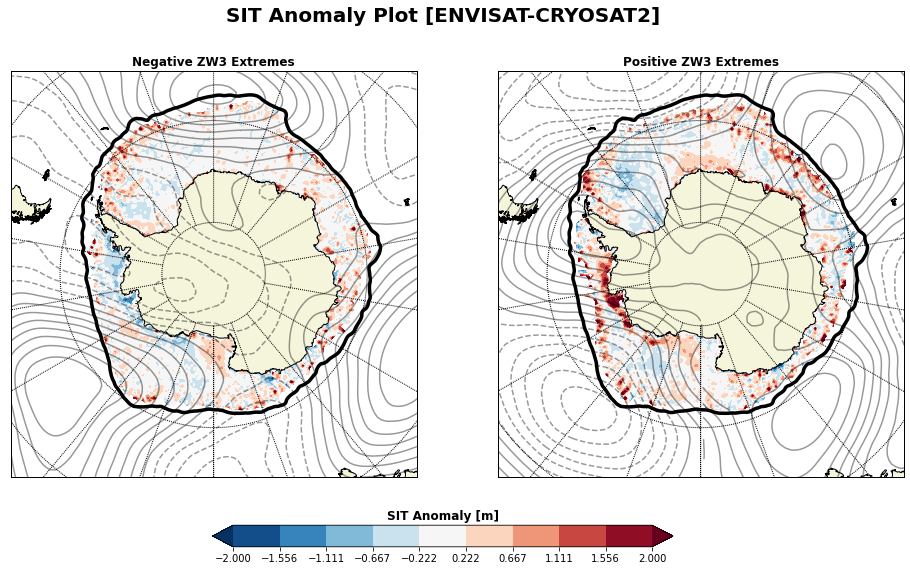
    


```python
fig = plt.figure(figsize=[16,15])

clevs = np.linspace(-900,900,10)
clev  = np.linspace(-2,2,6)

ax = plt.subplot(2,2,1)

m = Basemap(projection='splaea',boundinglat=-50,lon_0=180,resolution='l')
x, y = m(Obs_NSIDC.longitude.values, Obs_NSIDC.latitude.values)
xx, yy = m(ENV_SIT.lon.values, ENV_SIT.lat.values)

m.fillcontinents(color='beige',lake_color='beige')
m.drawcoastlines()
m.drawparallels(np.arange(-80.,81.,20.))
m.drawmeridians(np.arange(-180.,181.,20.))
m.drawmapboundary(fill_color='white')

data = LExt_ENV_SIT_Anom.where(LExt_ENV_SIT_Anom!=0)

data_SIC = Obs_NSIDC.mean('time')

m.contourf(xx,yy,data.sea_ice_thickness[0],clev,cmap=plt.cm.get_cmap('RdBu_r'),extend='both');
# plt.colorbar(label="Anomaly[%]")

m.contour(x, y,data_SIC.SIC,colors ='black',levels=[0.15],linewidths=3.5);

x1, y1 = m(*np.meshgrid(GPT_500_ERA.longitude.values,GPT_500_ERA.latitude.values))

m.contour(x1,y1,LExt_ERA_GPT_Anom2.z[0],clevs,colors='black',alpha=0.4);
# ax.clabel(CS1, inline=True, fontsize=10) 
plt.title("Negative ZW3 Extremes",fontsize=12,fontweight="bold")


ax = plt.subplot(2,2,2)

m = Basemap(projection='splaea',boundinglat=-50,lon_0=180,resolution='l')

m.fillcontinents(color='beige',lake_color='beige')
m.drawcoastlines()
m.drawparallels(np.arange(-80.,81.,20.))
m.drawmeridians(np.arange(-180.,181.,20.))
m.drawmapboundary(fill_color='white')

data = HExt_ENV_SIT_Anom


CS = m.contourf(xx,yy,data.sea_ice_thickness[0],clev,cmap=plt.cm.get_cmap('RdBu_r'),extend='both');
# plt.colorbar(label="Anomaly[%]")

m.contour(x, y,data_SIC.SIC,colors ='black',levels=[0.15],linewidths=3.5);

m.contour(x1,y1,HExt_ERA_GPT_Anom2.z[0],clevs,colors='black',alpha=0.4);
# ax.clabel(CS1, inline=True, fontsize=10) 
plt.title("Positive ZW3 Extremes",fontsize=12,fontweight="bold")


ax = plt.subplot(2,2,3)

m = Basemap(projection='splaea',boundinglat=-50,lon_0=180,resolution='l')

m.fillcontinents(color='beige',lake_color='beige')
m.drawcoastlines()
m.drawparallels(np.arange(-80.,81.,20.))
m.drawmeridians(np.arange(-180.,181.,20.))
m.drawmapboundary(fill_color='white')

data = LExt_ENV_SIT_Anom


CS = m.contourf(xx,yy,data.sea_ice_thickness[1],clev,cmap=plt.cm.get_cmap('RdBu_r'),extend='both');
# plt.colorbar(label="Anomaly[%]")

m.contour(x, y,data_SIC.SIC,colors ='black',levels=[0.15],linewidths=3.5);

m.contour(x1,y1,LExt_ERA_GPT_Anom2.z[1],clevs,colors='black',alpha=0.4);
# ax.clabel(CS1, inline=True, fontsize=10) 


ax = plt.subplot(2,2,4)

m = Basemap(projection='splaea',boundinglat=-50,lon_0=180,resolution='l')

m.fillcontinents(color='beige',lake_color='beige')
m.drawcoastlines()
m.drawparallels(np.arange(-80.,81.,20.))
m.drawmeridians(np.arange(-180.,181.,20.))
m.drawmapboundary(fill_color='white')

data = HExt_ENV_SIT_Anom


CS = m.contourf(xx,yy,data.sea_ice_thickness[1],clev,cmap=plt.cm.get_cmap('RdBu_r'),extend='both');
# plt.colorbar(label="Anomaly[%]")

m.contour(x, y,data_SIC.SIC,colors ='black',levels=[0.15],linewidths=3.5);

m.contour(x1,y1,HExt_ERA_GPT_Anom2.z[1],clevs,colors='black',alpha=0.4);
# ax.clabel(CS1, inline=True, fontsize=10) 


plt.suptitle("SIT Anomaly Plot [ENVISAT-CRYOSAT2]", fontsize=20, fontweight='bold',y=1);

cbar_ax = fig.add_axes([0.3, 0.05, 0.4, 0.02]) #[left, bottom, width, height]
cbar = fig.colorbar(CS, cax=cbar_ax,  orientation='horizontal',extend='both')

cbar.ax.tick_params(labelsize=10)
cbar.ax.set_title('SIT Anomaly [m]',fontsize=12,fontweight='bold')

# plt.tight_layout()

# # plt.savefig('Spatial_Trends_All_Parameters_SIV.pdf',bbox_inches='tight',dpi=200)

plt.show()
```


    
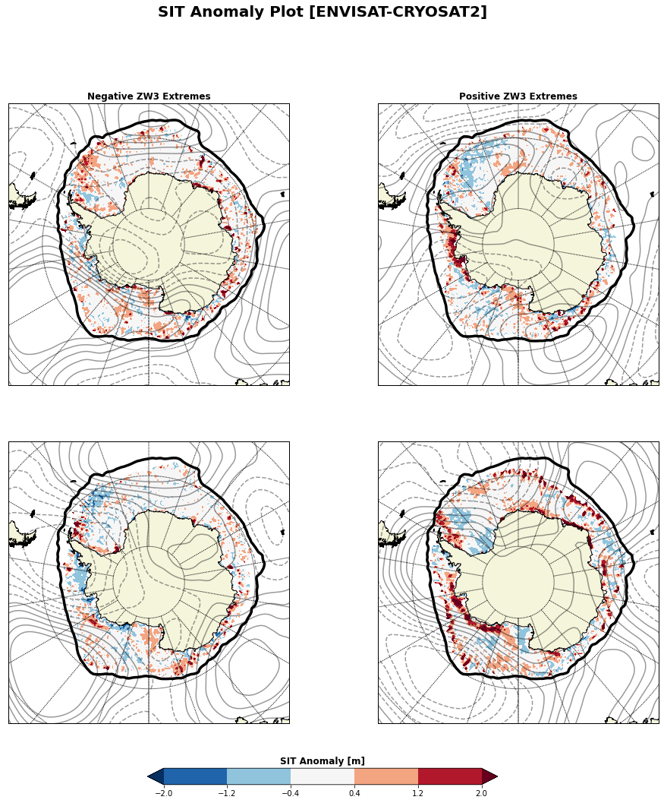
    


```python
fig = plt.figure(figsize=[16,15])


# clev1 = np.linspace(-20,20,8)
clev  = np.linspace(-2,2,6)


ax = plt.subplot(1,2,1,projection = ccrs.SouthPolarStereo())
ax.add_feature(cfeature.LAND,zorder=100,edgecolor='k')
ax.set_extent([0.005, 360, -90, -45], crs=ccrs.PlateCarree())
dmeridian = 30  # spacing for lines of meridian
dparallel = 15  # spacing for lines of parallel 
num_merid = int(360/dmeridian + 1)
num_parra = int(90/dparallel + 1)

gl = ax.gridlines(crs=ccrs.PlateCarree(), \
                  xlocs=np.linspace(-180, 180, num_merid), \
                  ylocs=np.linspace(0, -90, num_parra), \
                  linestyle="--", linewidth=1, color='k', alpha=0.5)

theta = np.linspace(0, 2*np.pi, 120)
verts = np.vstack([np.sin(theta), np.cos(theta)]).T
center, radius = [0.5, 0.5], 0.5
circle = mpath.Path(verts * radius + center)
ax.set_boundary(circle, transform=ax.transAxes)  #without this; get rect bound


SIT = LExt_ENV_SIT_Anom.where(LExt_ENV_SIT_Anom!=0)

CS = ax.pcolormesh(SIT.lon,SIT.lat,SIT.sea_ice_thickness.mean('time'),cmap=plt.cm.get_cmap('RdBu_r'),
                   transform=ccrs.PlateCarree(),vmin=-1.5,vmax=1.5);


# Defining the quiver plot
data = LExt_WindVec_Anom2.mean('time').isel(longitude=slice(None, None, 5),
                              latitude=slice(None, None, 5))

data.plot.quiver(x='longitude', y='latitude', u='u', v='v',cmap=plt.cm.get_cmap('gray'), angles = "xy",pivot='mid',
          scale=50,units='width',alpha=0.5,transform=ccrs.PlateCarree())

plt.title(" Low ZW3 Extremes",fontsize=12,fontweight="bold")

################################################################################

ax = plt.subplot(1,2,2,projection = ccrs.SouthPolarStereo())
ax.add_feature(cfeature.LAND,zorder=100,edgecolor='k')
ax.set_extent([0.005, 360, -90, -45], crs=ccrs.PlateCarree())
dmeridian = 30  # spacing for lines of meridian
dparallel = 15  # spacing for lines of parallel 
num_merid = int(360/dmeridian + 1)
num_parra = int(90/dparallel + 1)

gl = ax.gridlines(crs=ccrs.PlateCarree(), \
                  xlocs=np.linspace(-180, 180, num_merid), \
                  ylocs=np.linspace(0, -90, num_parra), \
                  linestyle="--", linewidth=1, color='k', alpha=0.5)

theta = np.linspace(0, 2*np.pi, 120)
verts = np.vstack([np.sin(theta), np.cos(theta)]).T
center, radius = [0.5, 0.5], 0.5
circle = mpath.Path(verts * radius + center)
ax.set_boundary(circle, transform=ax.transAxes)  #without this; get rect bound

SIT = HExt_ENV_SIT_Anom.where(HExt_ENV_SIT_Anom!=0)

CS = ax.pcolormesh(SIT.lon,SIT.lat,SIT.sea_ice_thickness.mean('time'),cmap=plt.cm.get_cmap('RdBu_r'),
                   transform=ccrs.PlateCarree(),vmin=-1.5,vmax=1.5);


# Defining the quiver plot
data = HExt_WindVec_Anom2.mean('time').isel(longitude=slice(None, None, 5),
                              latitude=slice(None, None, 5))

data.plot.quiver(x='longitude', y='latitude', u='u', v='v',cmap=plt.cm.get_cmap('gray'), angles = "xy",pivot='mid',
          scale=50,units='width',alpha=0.5,transform=ccrs.PlateCarree()) 

plt.title("High ZW3 Extremes",fontsize=12,fontweight="bold")

plt.suptitle("SIT [Envisat-CRYOSAT2 (2002-2016)] and Vector [ERA (1979-2016)] Anom2aly",fontsize=20,fontweight="bold",y=0.78)


cbar_ax = fig.add_axes([0.3, 0.25, 0.4, 0.02]) #[left, bottom, width, height]
cbar = fig.colorbar(CS, cax=cbar_ax,  orientation='horizontal',extend='both')

cbar.ax.tick_params(labelsize=10)
cbar.ax.set_title('SIT [m]',fontsize=12,fontweight='bold')

plt.show()
```


    
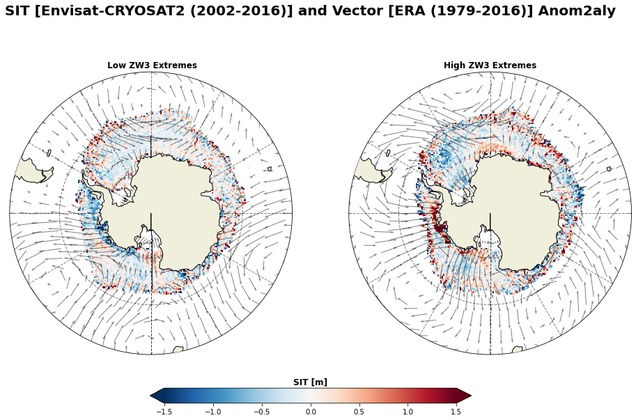
    


### Calculating the frequency of ZW3 Extremes: 


```python
ZW3_Historical = xr.open_dataset(path+'ZW3_Index_Historical_CMIP.NCAR.CESM2.piControl.Amon.gn.nc').zg.load()
ZW3_SSP585 = xr.open_dataset(path+'ZW3_Index_SSP585_CMIP.NCAR.CESM2.piControl.Amon.gn.nc').zg.load()
ZW3_SSP370 = xr.open_dataset('zw3_Index_CMIP.NCAR.CESM2.ssp370.Amon.gn.nc').zg.load()

ZW3_SSP585 = ZW3_SSP585.where(ZW3_SSP585.time.dt.month.isin([8,9,10]), drop=True)
ZW3_SSP370 = ZW3_SSP370.where(ZW3_SSP585.time.dt.month.isin([8,9,10]), drop=True)
ZW3_Historical = ZW3_Historical.where(ZW3_Historical.time.dt.month.isin([8,9,10]), drop=True)
```


```python
ZW3_SSP585_Anom = ZW3_SSP585.groupby('time.month')-ZW3_SSP585.groupby('time.month').mean('time')
ZW3_SSP370_Anom = ZW3_SSP370.groupby('time.month')-ZW3_SSP370.groupby('time.month').mean('time')
ZW3_Historical_Anom = ZW3_Historical.groupby('time.month')-ZW3_Historical.groupby('time.month').mean('time')
```


```python
# Simulated data
data = New_ZW3.zg  # ZW3 piControl Data

# Parameters
num_iterations = 10000
chunk_size = 258 #For 86 years (since only ASO is considered here)
threshold = np.percentile(ZW3_df['ZW3-Index'],95) #This is 95th Percentile calculated from piControl ZW3

# Empty array to store total event counts
event_occurrences = np.zeros(num_iterations)
 
# Monte Carlo simulation
for i in range(num_iterations):
    # Randomly select a starting index for the chunk
    start_index = np.random.randint(0, len(data) - chunk_size)
    
    # Extract the chunk of data
    chunk = data[start_index : start_index + chunk_size]
    
    # Count the number of events that exceed the threshold
    event_count = np.sum(chunk > threshold)
    
    # Save the total count to the array
    event_occurrences[i] = event_count

# Plotting the probability density function (PDF)
sns.kdeplot(data=event_occurrences, shade=True)
plt.xlabel('Number of Events')
plt.ylabel('Probability Density')
plt.title('Probability Density Function')
plt.show()

```


    

    


```python
# Simulated data
data = ZW3_SSP585  # Replace with your actual data

# Parameters
num_iterations = 10000
chunk_size = 225 #75 years
threshold = np.percentile(ZW3_df['ZW3-Index'],95)

# Empty array to store total event counts
event_occurrences0 = np.zeros(num_iterations)

# Monte Carlo simulation
for i in range(num_iterations):
    # Randomly select a starting index for the chunk
    start_index = np.random.randint(0, len(data) - chunk_size)
    
    # Extract the chunk of data
    chunk = data[start_index : start_index + chunk_size]
    
    # Count the number of events that exceed the threshold
    event_count = np.sum(chunk > threshold)
    
    # Save the total count to the array
    event_occurrences0[i] = event_count

# Plotting the probability density function (PDF)
sns.kdeplot(data=event_occurrences0, shade=True)
plt.xlabel('Number of Events')
plt.ylabel('Probability Density')
plt.title('Probability Density Function')
plt.show()
```


    
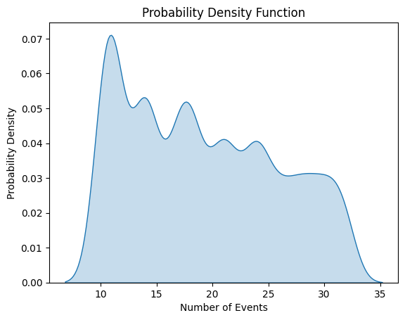
    


```python
# Simulated data
data = ZW3_Historical  # Replace with your actual data

# Parameters
num_iterations = 10000
chunk_size = 225
threshold = np.percentile(ZW3_df['ZW3-Index'],95)

# Empty array to store total event counts
event_occurrences1 = np.zeros(num_iterations)

# Monte Carlo simulation
for i in range(num_iterations):
    # Randomly select a starting index for the chunk
    start_index = np.random.randint(0, len(data) - chunk_size)
    
    # Extract the chunk of data
    chunk = data[start_index : start_index + chunk_size]
    
    # Count the number of events that exceed the threshold
    event_count = np.sum(chunk > threshold)
    
    # Save the total count to the array
    event_occurrences1[i] = event_count

# Plotting the probability density function (PDF)
sns.kdeplot(data=event_occurrences1, shade=True)
# plt.hist(event_occurrences, bins=30, density=True, alpha=0.75)
plt.xlabel('Number of Events')
plt.ylabel('Probability Density')
plt.title('Probability Density Function')
plt.show()
```


    
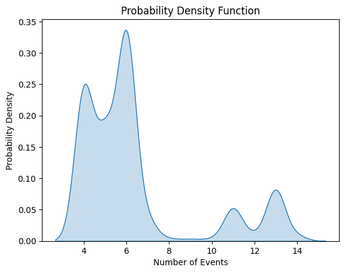
    


```python
print(event_occurrences.mean()) #For piControl
print(event_occurrences1.mean()) #For Historical
print(event_occurrences0.mean()) #For SSP5-8.5 
```

    13.4067
    6.4026
    19.1827


```python
print(np.sum(ZW3_Historical[-258:] > threshold))
print(np.sum(ZW3_SSP585 > threshold))
print(np.sum(ZW3_SSP370 > threshold))
```

    <xarray.DataArray 'zg' ()>
    array(15)
    <xarray.DataArray 'zg' ()>
    array(33)
    <xarray.DataArray 'zg' ()>
    array(23)


```python
fig = plt.figure(figsize=[12,7])

# Create KDE plot
sns.kdeplot(data=event_occurrences, shade=True, linewidth=2)

#Add percentiles:
# plt.axvline(np.percentile(event_occurrences,5),linestyle ="dotted",linewidth=2,color='steelblue')
# plt.axvline(np.percentile(event_occurrences,95),linestyle ="dotted",linewidth=2,color='steelblue')


plt.axvline(np.sum(ZW3_SSP585 > threshold),linestyle ="dashed",linewidth=3,color='red')
plt.axvline(np.sum(ZW3_SSP370 > threshold),linestyle ="dashed",linewidth=3,color='limegreen')
plt.axvline(np.sum(ZW3_Historical[-258:] > threshold),linestyle ="dashed",linewidth=3,color='black')

# plt.axvline(event_occurrences0.mean(),linestyle ="dashed",linewidth=3,color='red')
# plt.axvline(event_occurrences1.mean(),linestyle ="dashed",linewidth=3,color='black')

# Set labels and title
plt.xlabel('Number of Events (ZW3)',fontsize=15,fontweight='bold')
plt.ylabel('Probability of occurance',fontsize=15,fontweight='bold')
# plt.title('Frequency of Positive ZW3 Extremes: piControl vs. Historical and SSP5-8.5',fontsize=15,
#fontweight='bold')
plt.xticks(fontsize=12)
plt.yticks(fontsize=12)

# plt.text(-0.88, 0.9, "(a)", transform=ax.transAxes, fontsize=14, fontweight="bold", va='top', ha='left')

plt.tight_layout()
plt.savefig('Extreme_Freq_MonteCarlo_3scenarios.png',dpi=200)

# Display the plot
plt.show()
```


    
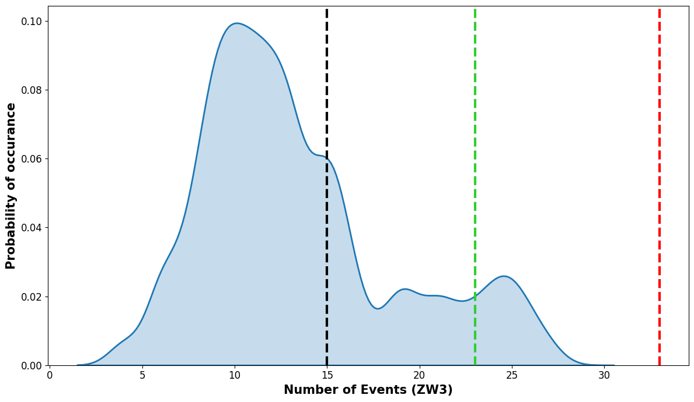
    


```python

```


```python
fig = plt.figure(figsize=[12,7])

# Create KDE plot
sns.kdeplot(data=event_occurrences, shade=True,linewidth=2)
sns.kdeplot(data=event_occurrences0, shade=True,linewidth=2)
sns.kdeplot(data=event_occurrences1, shade=True,linewidth=2)

# plt.axvline(np.sum(ZW3_SSP585 > threshold),linestyle ="dashed",linewidth=3,color='orange')
# plt.axvline(np.sum(ZW3_Historical > threshold),linestyle ="dashed",linewidth=3,color='limegreen')

plt.axvline(event_occurrences0.mean(),linestyle ="dashed",linewidth=3,color='orange')
plt.axvline(event_occurrences1.mean(),linestyle ="dashed",linewidth=3,color='green')

# Set labels and title
plt.xlabel('Number of Events (Per 75 Years)',fontsize=12,fontweight='bold')
plt.ylabel('Probability of occurance',fontsize=12,fontweight='bold')
plt.title('Frequency of Positive ZW3 Extremes: piControl vs. Historical and SSP5-8.5',fontsize=15,fontweight='bold')

plt.xticks(fontsize=12)
plt.yticks(fontsize=12)

# Display the plot
plt.show()
```


    
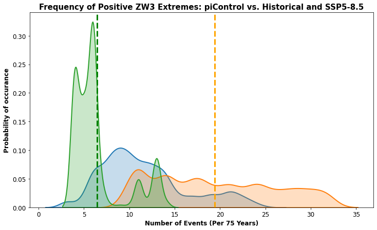
    


```python

```

## Wind Speeds


```python
# Using va from CESM2:

cat_wind  = dataframe.search(experiment_id=['piControl'], table_id=['Amon'],source_id=['CESM2'], 
                             variable_id=['sfcWind'],member_id = ['r1i1p1f1'], grid_label=['gn'])

z_kwargs = {'consolidated': True, 'use_cftime':True}

with dask.config.set(**{'array.slicing.split_large_chunks': True}):
    dset_dict_wind = cat_wind.to_dataset_dict(zarr_kwargs=z_kwargs)
```

    
    --> The keys in the returned dictionary of datasets are constructed as follows:
    	'activity_id.institution_id.source_id.experiment_id.table_id.grid_label'


<style>
    /* Turns off some styling */
    progress {
        /* gets rid of default border in Firefox and Opera. */
        border: none;
        /* Needs to be in here for Safari polyfill so background images work as expected. */
        background-size: auto;
    }
    progress:not([value]), progress:not([value])::-webkit-progress-bar {
        background: repeating-linear-gradient(45deg, #7e7e7e, #7e7e7e 10px, #5c5c5c 10px, #5c5c5c 20px);
    }
    .progress-bar-interrupted, .progress-bar-interrupted::-webkit-progress-bar {
        background: #F44336;
    }
</style>


<div>
  <progress value='1' class='' max='1' style='width:300px; height:20px; vertical-align: middle;'></progress>
  100.00% [1/1 00:00&lt;00:00]
</div>


```python
WSPD = dset_dict_wind['CMIP.NCAR.CESM2.piControl.Amon.gn']
WSPD_SH = WSPD.where((WSPD.lat<-10)&(WSPD.lat>-90),drop=True).squeeze()#.load()
```


```python
HExt_CESM_WSPD = WSPD_SH.sel(time=High_extremes_Dates.time)
# LExt_CESM_WSPD = WSPD_SH.sel(time=Low_extremes_Dates.time)

HExt_CESM_WSPD_M = HExt_CESM_WSPD.mean('time').load()

# LExt_CESM_WSPD_Anom = LExt_CESM_WSPD.groupby('time.month') - WSPD_SH.groupby('time.month').mean(dim='time')
HExt_CESM_WSPD_Anom = HExt_CESM_WSPD.groupby('time.month') - WSPD_SH.groupby('time.month').mean(dim='time')

# LExt_CESM_WSPD_Anom_M = LExt_CESM_WSPD_Anom.mean('time')
HExt_CESM_WSPD_Anom_M = HExt_CESM_WSPD_Anom.mean('time').load()
```


```python
import matplotlib.pyplot as plt
import numpy as np
from mpl_toolkits.basemap import Basemap

fig = plt.figure(figsize=[12, 8])
ax = plt.subplot(1, 1, 1)

# Define color levels
clev =  np.arange(-0.7, 0.8, 0.1)

m = Basemap(projection='splaea', boundinglat=-50, lon_0=180, resolution='l',round=True)

# Define the data
data = HExt_CESM_WSPD_Anom_M

lon2d, lat2d = np.meshgrid(data.lon.values, data.lat.values)
x, y = m(lon2d, lat2d)

# Initialize the map

# Draw features
m.fillcontinents(color='beige', lake_color='beige')
m.drawcoastlines()
m.drawparallels(np.arange(-80., 81., 20.))
m.drawmeridians(np.arange(-180., 181., 20.))
m.drawmapboundary(fill_color='white')

# Plot anomaly field
CS = m.contourf(x, y, data.sfcWind, clev, cmap=plt.cm.get_cmap('RdBu_r'), extend='both')

# # Overlay sea-ice concentration contour (15% threshold)
# x1, y1 = m(CESM_SIC_SH.lon.values, CESM_SIC_SH.lat.values)
# m.contour(x1, y1, CESM_SIC_SH_ASO.siconc, colors='red', levels=[0.15], linewidths=3)

# Colorbar
cbar_ax = fig.add_axes([0.3, 0.05, 0.45, 0.02])  # [left, bottom, width, height]
cbar = fig.colorbar(CS, cax=cbar_ax, orientation='horizontal', extend='both')
cbar.set_ticks(clev)  # <-- This line ensures regular spacing
cbar.ax.tick_params(labelsize=10)
cbar.ax.set_title('WSPD Anomaly [m/s]',fontsize=12,fontweight='bold')


# Optional titles
# plt.title("ZW3 High-Extreme", fontsize=12, fontweight="bold")
# plt.suptitle("Net Downward Shortwave Radiation at Sea Water Surface", fontsize=20, fontweight="bold", y=0.86)

plt.show()

```


    
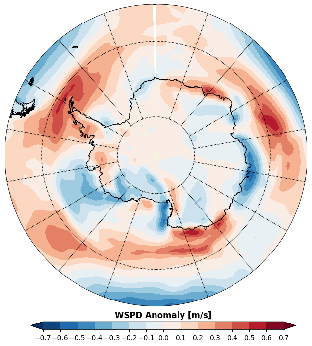
    


```python
fig = plt.figure(figsize=[16,15])


clev  = np.linspace(-0.75,0.75,14)

ax = plt.subplot(1,2,1,projection = ccrs.SouthPolarStereo())
ax.add_feature(cfeature.LAND,zorder=100,edgecolor='k')
ax.set_extent([0.005, 360, -90, -50], crs=ccrs.PlateCarree())
dmeridian = 30  # spacing for lines of meridian
dparallel = 15  # spacing for lines of parallel 
num_merid = int(360/dmeridian + 1)
num_parra = int(90/dparallel + 1)

gl = ax.gridlines(crs=ccrs.PlateCarree(), \
                  xlocs=np.linspace(-180, 180, num_merid), \
                  ylocs=np.linspace(0, -90, num_parra), \
                  linestyle="--", linewidth=1, color='k', alpha=0.5)

theta = np.linspace(0, 2*np.pi, 120)
verts = np.vstack([np.sin(theta), np.cos(theta)]).T
center, radius = [0.5, 0.5], 0.5
circle = mpath.Path(verts * radius + center)
ax.set_boundary(circle, transform=ax.transAxes)  #without this; get rect bound

data = HExt_CESM_WSPD_Anom_M.sfcWind

CS = ax.contourf(data.lon,data.lat,data,clev,
                   transform=ccrs.PlateCarree(),cmap = plt.cm.RdBu_r, extend='both')

cbar_ax = fig.add_axes([0.15, 0.25, 0.3, 0.02]) #[left, bottom, width, height]
cbar = fig.colorbar(CS, cax=cbar_ax,  orientation='horizontal',extend='both')
cbar.ax.tick_params(labelsize=10)
cbar.ax.set_title('WSPD Anomaly [m/s]',fontsize=12,fontweight='bold')

plt.show()
```


    

    


```python
# #Using va from CESM2:

cat_wind  = dataframe.search(experiment_id=['piControl'], table_id=['Amon'],source_id=['CESM2'], 
                         variable_id=['ua','va'],
                 member_id = ['r1i1p1f1'], grid_label=['gn'])

z_kwargs = {'consolidated': True, 'use_cftime':True}

with dask.config.set(**{'array.slicing.split_large_chunks': True}):
    dset_dict_wind = cat_wind.to_dataset_dict(zarr_kwargs=z_kwargs)
```

    
    --> The keys in the returned dictionary of datasets are constructed as follows:
    	'activity_id.institution_id.source_id.experiment_id.table_id.grid_label'


<style>
    /* Turns off some styling */
    progress {
        /* gets rid of default border in Firefox and Opera. */
        border: none;
        /* Needs to be in here for Safari polyfill so background images work as expected. */
        background-size: auto;
    }
    progress:not([value]), progress:not([value])::-webkit-progress-bar {
        background: repeating-linear-gradient(45deg, #7e7e7e, #7e7e7e 10px, #5c5c5c 10px, #5c5c5c 20px);
    }
    .progress-bar-interrupted, .progress-bar-interrupted::-webkit-progress-bar {
        background: #F44336;
    }
</style>


<div>
  <progress value='1' class='' max='1' style='width:300px; height:20px; vertical-align: middle;'></progress>
  100.00% [1/1 00:00&lt;00:00]
</div>


```python
WSPD = dset_dict_wind['CMIP.NCAR.CESM2.piControl.Amon.gn']
WSPD = WSPD.sel(plev=85000)
WSPD_SH = WSPD.where((WSPD.lat<-10)&(WSPD.lat>-90),drop=True).squeeze()#.load()
```


```python
HExt_CESM_WSPD = WSPD_SH.sel(time=High_extremes_Dates.time)
# LExt_CESM_WSPD = WSPD_SH.sel(time=Low_extremes_Dates.time)

# LExt_CESM_WSPD_Anom = LExt_CESM_WSPD.groupby('time.month') - WSPD_SH.groupby('time.month').mean(dim='time')
HExt_CESM_WSPD_Anom = HExt_CESM_WSPD.groupby('time.month') - WSPD_SH.groupby('time.month').mean(dim='time')

# LExt_CESM_WSPD_Anom_M = LExt_CESM_WSPD_Anom.mean('time')
HExt_CESM_WSPD_Anom_M = HExt_CESM_WSPD_Anom.mean('time')#.load()
```


```python
ax = plt.subplot(1,1,1,projection = ccrs.SouthPolarStereo())
ax.add_feature(cfeature.LAND,zorder=100,edgecolor='k')
ax.set_extent([0.005, 360, -90, -45], crs=ccrs.PlateCarree())
dmeridian = 30  # spacing for lines of meridian
dparallel = 15  # spacing for lines of parallel 
num_merid = int(360/dmeridian + 1)
num_parra = int(90/dparallel + 1)

gl = ax.gridlines(crs=ccrs.PlateCarree(), \
                  xlocs=np.linspace(-180, 180, num_merid), \
                  ylocs=np.linspace(0, -90, num_parra), \
                  linestyle="--", linewidth=1, color='k', alpha=0.5)

theta = np.linspace(0, 2*np.pi, 120)
verts = np.vstack([np.sin(theta), np.cos(theta)]).T
center, radius = [0.5, 0.5], 0.5
circle = mpath.Path(verts * radius + center)
ax.set_boundary(circle, transform=ax.transAxes)  #without this; get rect bound

data = HExt_ENV_SIT_Anom.where(HExt_ENV_SIT_Anom!=0)

CS = ax.pcolormesh(SIT.lon,SIT.lat,SIT.sea_ice_thickness.mean('time'),cmap=plt.cm.get_cmap('RdBu_r'),
                   transform=ccrs.PlateCarree(),vmin=-1.5,vmax=1.5);


# Defining the quiver plot
data = HExt_WindVec_Anom2.mean('time').isel(longitude=slice(None, None, 5),
                              latitude=slice(None, None, 5))

data.plot.quiver(x='longitude', y='latitude', u='u', v='v',cmap=plt.cm.get_cmap('gray'), angles = "xy",pivot='mid',
          scale=50,units='width',alpha=0.5,transform=ccrs.PlateCarree()) 

plt.title("High ZW3 Extremes",fontsize=12,fontweight="bold")
```


```python
#For using the colored winds based on windspeeds: 
color_array = np.sqrt((LEx_vAnom[0,0,:,:])**2 + (LEx_uAnom[0,0,:,:])**2) #wspd
ax.xaxis.set_ticks([])
ax.yaxis.set_ticks([])
ax.set_aspect('equal')

m.contourf(a,b,SIC,40, cmap=plt.cm.get_cmap('seismic_r'),
           levels=[-0.6,-0.5,-0.4,-0.3,-0.2,-0.1,0,0.1,0.2,0.3,0.4,0.5,0.6],alpha=1.0);
plt.colorbar(label="SIC Anomaly (%)",ax=[ax])

skip=(slice(None,None,2),slice(None,None,4))
u_rot, v_rot, x, y = m.rotate_vector(u,v, lon, lat, returnxy=True)
vecplot = m.quiver(x[skip], y[skip], u_rot[skip], v_rot[skip],color_array[skip],cmap=plt.cm.get_cmap('coolwarm_r'), 
                   angles = "xy",scale=15,pivot='mid',units='inches',alpha=0.8)
plt.title("Wind Vectors and SIC Anomaly: Average-{} ZW3 Extremes (2002-2011)".format(time),fontsize=15)
plt.colorbar(vecplot,label="Windspeed Anomaly (m/s)",ax=[ax],location='left')
```
